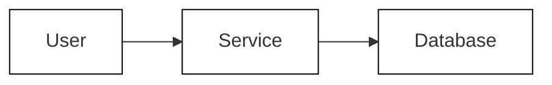
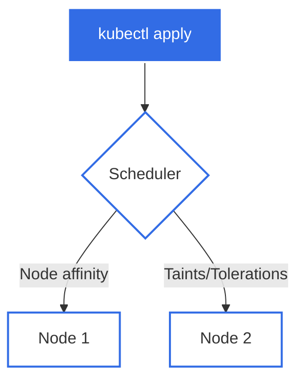

# Phase 2: Content Infrastructure - Research

**Researched:** 2026-02-08
**Domain:** Docusaurus content authoring, templates, and diagram workflows
**Confidence:** HIGH

## Summary

Phase 2 focuses on building reusable templates and tooling to enable consistent, efficient content creation across all 10 course modules. The research confirms Docusaurus 3.9.2 provides robust support for the required infrastructure: admonitions, code blocks, Mermaid diagrams, and static asset management. The user has made clear decisions about lab structure, diagram workflow, quiz format, and authoring guidelines that constrain implementation choices.

Key findings: (1) Mermaid integration requires `@docusaurus/theme-mermaid` package installation and config changes, (2) Excalidraw export workflow should preserve embedded scene data for editability, (3) quiz preparation uses Markdown format for later TutorLMS conversion via spreadsheet import, (4) lab templates follow eight-section structure from objectives through key takeaways.

**Primary recommendation:** Create template files (lab.md, content.md, quiz.md) with documented structure, install and configure Mermaid theme, establish diagram folder organization with naming conventions, and document authoring guidelines for admonitions and code blocks.

---

<user_constraints>
## User Constraints (from CONTEXT.md)

### Locked Decisions

**Lab Template Structure:**
- Single file per module: one `lab.md` file containing all lab content
- Template sections (in order):
  - Objectives - clear learning outcomes
  - Prerequisites - what must be completed first
  - Setup - environment preparation steps
  - Tasks - step-by-step instructions
  - Verification - how to confirm successful completion
  - Cleanup - resource teardown steps
  - Troubleshooting - common issues and solutions
  - Key Takeaways - learning summary
- Task instructions: step-by-step with full commands (copy-pasteable)
- Format: Plain Markdown (.md) files, not MDX components

**Diagram Workflow:**
- Storage: Centralized `diagrams/` folder at project root with organized subfolders
- Embedding: Export diagrams to images (PNG/SVG), reference in docs with ``
- Export management: Manual export by author (commits both source and images)
- Naming convention: Module-prefixed (e.g., `01-pod-scheduling.mmd`, `03-gateway-routing.excalidraw`)
- Source files are version-controlled alongside exported images

**Quiz Preparation:**
- Purpose: Create quizzes for TutorLMS import (not embedded in Docusaurus)
- Question types: Multiple choice (single answer), True/False, Scenario-based
- Volume: 10-15 questions per module
- Format: Markdown files that can be converted to TutorLMS format later
- Organization: Single `quiz.md` file per module containing all questions
- Storage location: Module-specific (e.g., `docs/section-N/quiz.md` or centralized `quizzes/` folder)

**Content Authoring Guidelines:**
- Template approach: Flexible framework - suggested sections, authors adapt to module needs
- Code block conventions:
  - Language tags always specified (```yaml, ```bash, never plain ```)
  - Consistent formatting with standard indentation
  - Copy-friendly commands (single lines when possible, avoid line wraps)
- Voice and tone: Conversational and friendly (direct address with you/we, approachable teaching style)

### Claude's Discretion

- Callout/admonition usage patterns
- Exact quiz storage location (docs/section-N/ vs centralized quizzes/)
- Diagram subfolder organization within diagrams/
- Content template specifics (suggested H2/H3 patterns)
- Code comment density in examples
- Line length limits for code blocks

### Deferred Ideas (OUT OF SCOPE)

None - discussion stayed within phase scope.

</user_constraints>

---

## Standard Stack

### Core Dependencies

| Library | Version | Purpose | Why Standard |
|---------|---------|---------|--------------|
| @docusaurus/core | 3.9.2 | Static site generation | Already installed, project foundation |
| @docusaurus/preset-classic | 3.9.2 | Default theme/plugins | Already installed, provides admonitions, code blocks |
| @docusaurus/theme-mermaid | 3.9.2 | Mermaid diagram rendering | Official Docusaurus package for diagram integration |
| prism-react-renderer | ^2.3.0 | Syntax highlighting | Already installed, powers code blocks |

### Supporting Tools

| Tool | Version | Purpose | When to Use |
|------|---------|---------|-------------|
| Mermaid.js | bundled | Diagram creation (flowcharts, sequences) | Conceptual workflows, state transitions |
| Excalidraw | Web-based | Diagram creation (architecture, hand-drawn) | System architecture, component relationships |
| Mermaid Live Editor | Web | Diagram development/testing | Creating and testing Mermaid diagrams before embedding |

### Installation

Mermaid theme is NOT currently installed. Required installation:

```bash
npm install --save @docusaurus/theme-mermaid@3.9.2
```

**Configuration required in `docusaurus.config.ts`:**

```typescript
export default {
  themes: ['@docusaurus/theme-mermaid'],
  markdown: {
    mermaid: true,
  },
  themeConfig: {
    mermaid: {
      theme: {light: 'neutral', dark: 'dark'},
    },
  },
};
```

## Architecture Patterns

### Project Structure

Based on Docusaurus best practices and user decisions:

```
kubernetes-intermediate/
├── diagrams/                    # Centralized diagram storage
│   ├── section-0/              # Organized by module
│   │   ├── 00-kind-setup.mmd
│   │   ├── 00-kind-setup.svg
│   │   └── 00-voting-app-arch.excalidraw
│   ├── section-1/
│   └── shared/                 # Cross-module diagrams
├── docs/
│   ├── section-0/
│   │   ├── 01-overview.mdx
│   │   ├── 02-reading.md
│   │   ├── 03-lab.md          # Lab content
│   │   └── 04-quiz.md         # Quiz preparation (optional location)
│   └── section-1/
├── templates/                   # Content authoring templates
│   ├── lab-template.md
│   ├── content-template.md
│   ├── quiz-template.md
│   └── AUTHORING-GUIDE.md
└── static/
    └── diagrams/               # Exported diagram images (alternative)
```

**Key architectural decisions:**

1. **Diagram organization**: Centralized `diagrams/` folder with module-based subfolders keeps source files separate from rendered docs
2. **Template location**: Dedicated `templates/` folder provides single source of truth for content patterns
3. **Quiz location**: Claude's discretion - recommend `docs/section-N/quiz.md` (co-located) for easier content management per module

### Pattern 1: Lab Content Structure

**What:** Eight-section template for hands-on lab documentation

**When to use:** Every module lab (10 total)

**Structure:**

```markdown
# Module N: [Topic] - Lab

## Objectives

- [Learning outcome 1]
- [Learning outcome 2]
- [Learning outcome 3]

## Prerequisites

- [Required previous lab or knowledge]
- [Required tools/setup]

## Setup

Step-by-step environment preparation with full commands.

## Tasks

### Task 1: [Action]

Step-by-step instructions with copy-pasteable commands.

```bash
kubectl apply -f resource.yaml
```

### Task 2: [Action]

Continue with numbered tasks...

## Verification

How to confirm successful completion with expected outputs.

```bash
kubectl get pods
# Expected output: pods running
```

## Cleanup

Resource teardown steps.

```bash
kubectl delete -f resource.yaml
```

## Troubleshooting

### Issue: [Problem]

**Symptom:** [What user sees]
**Cause:** [Why it happens]
**Solution:** [How to fix]

## Key Takeaways

- [Learning 1]
- [Learning 2]
- [Learning 3]
```

**Source:** User decision in CONTEXT.md, aligned with [Google Technical Writing best practices](https://developers.google.com/tech-writing/resources) for step-by-step instructions.

### Pattern 2: Content Reading Material Structure

**What:** Flexible template for reading content with suggested sections

**When to use:** Main content pages for each module

**Structure:**

```markdown
# Module N: [Topic]

## Overview

Brief introduction (1-2 paragraphs) explaining what this module covers and why it matters.

## Key Concepts

### Concept 1: [Name]

Explanation with examples.

### Concept 2: [Name]

Explanation with examples.

## Practical Examples

Real-world scenarios using Example Voting App.

```yaml
# Code example with language tag
apiVersion: v1
kind: Pod
```

## Common Patterns

Best practices and recommended approaches.

:::tip
Use admonitions to highlight important points.
:::

## Gotchas and Pitfalls

What to avoid and why.

:::warning
Common mistakes to watch out for.
:::

## Summary

Key takeaways (3-5 bullet points).

## Further Reading

- [Resource 1]
- [Resource 2]
```

**Rationale:** Balances structure with flexibility. Authors can adapt sections to module needs while maintaining consistency.

### Pattern 3: Admonition Usage Guidelines

**What:** Semantic guidelines for Docusaurus admonitions

**Available types in Docusaurus 3.9.2:**
- `note` - Standard informational content
- `tip` - Helpful suggestions, best practices
- `info` - General information, FYI content
- `caution` - Warnings about potential issues (alias: `warning` - being deprecated in v4)
- `danger` - Critical issues, data loss risks

**Usage recommendations:**

```markdown
:::note
Background information or context that enhances understanding.
:::

:::tip Pro Tip
Shortcuts, best practices, or expert insights.
:::

:::info
Supplementary information, version notes, compatibility details.
:::

:::caution
Potential issues, deprecated features, or breaking changes.
:::

:::danger
Critical warnings: data loss, security risks, irreversible actions.
:::
```

**Best practices:**
- Use titles `:::note[Custom Title]` to clarify context
- Nest admonitions with additional colons (4+ for child, 3 for parent)
- Leave blank lines around admonitions to prevent Prettier formatting issues
- Limit to 1-2 admonitions per section (avoid callout fatigue)

**Source:** [Docusaurus Admonitions Documentation](https://docusaurus.io/docs/markdown-features/admonitions)

### Pattern 4: Code Block Best Practices

**What:** Consistent code formatting and presentation

**Language tags (always required):**

Common languages already configured in `docusaurus.config.ts`:
- `bash` - Shell commands
- `yaml` - Kubernetes manifests
- `json` - Configuration files
- `typescript` - Code examples
- `docker` - Dockerfiles
- `go`, `python` - Application code
- `hcl` - Terraform/infrastructure

**Code block features:**

```markdown
```bash title="commands.sh"
# Use title attribute for context
kubectl apply -f deployment.yaml
```

```yaml {3-5}
# Highlight specific lines with metadata
apiVersion: v1
kind: Pod
metadata:
  name: example
  namespace: default
```

```bash
# Use magic comments for maintainable highlighting
kubectl get pods
# highlight-next-line
kubectl describe pod voting-app
kubectl logs voting-app
```
```

**Guidelines:**
- Always specify language tag (never plain triple backticks)
- Use `title` attribute for file names or context
- Prefer comment-based highlighting over metadata ranges
- Keep commands copy-pasteable (single line when possible)
- Add inline comments for complex commands
- Use consistent indentation (2 spaces for YAML)

**Source:** [Docusaurus Code Blocks Documentation](https://docusaurus.io/docs/markdown-features/code-blocks)

### Pattern 5: Diagram Embedding Workflow

**What:** Process for creating, exporting, and embedding diagrams

**Mermaid workflow:**

1. Create diagram in [Mermaid Live Editor](https://mermaid.live/)
2. Save source as `diagrams/section-N/NN-topic-name.mmd`
3. Export as SVG to `diagrams/section-N/NN-topic-name.svg`
4. Embed in Markdown:

```markdown
## Architecture Overview


```

**Excalidraw workflow:**

1. Create diagram at [excalidraw.com](https://excalidraw.com)
2. Save source as `diagrams/section-N/NN-topic-name.excalidraw`
3. Export to SVG/PNG with "Embed scene" enabled (preserves editability)
4. Save exported image as `diagrams/section-N/NN-topic-name.svg`
5. Embed in Markdown using image syntax:

```markdown

```

**Naming conventions:**
- Format: `NN-topic-description.{mmd,excalidraw,svg,png}`
- Module prefix: `00-` through `09-`
- Descriptive names: `01-affinity-workflow.mmd`, `03-gateway-routing.excalidraw`

**Version control:**
- Commit both source files (.mmd, .excalidraw) AND exported images
- Manual export by author (no automated build step)
- Update both files when diagrams change

**Source:** [Kubernetes Diagram Guide](https://kubernetes.io/docs/contribute/style/diagram-guide/), [Excalidraw Export Documentation](https://docs.excalidraw.com/docs/@excalidraw/excalidraw/api/utils/export)

### Pattern 6: Quiz Markdown Format

**What:** Structured markdown format for quiz questions that can be converted to TutorLMS spreadsheet import

**Question types:**
- Multiple choice (single answer)
- True/False
- Scenario-based

**Recommended format:**

```markdown
# Module N: [Topic] - Quiz

## Question 1

**Type:** Multiple Choice

**Question:** What is the primary purpose of node affinity in Kubernetes?

A) To distribute pods evenly across all nodes
B) To constrain pods to specific nodes based on labels
C) To prevent pods from being scheduled
D) To automatically scale nodes

**Correct Answer:** B

**Explanation:** Node affinity allows you to constrain which nodes your pod can be scheduled on based on node labels.

---

## Question 2

**Type:** True/False

**Question:** Taints and tolerations guarantee that pods will be scheduled on specific nodes.

**Correct Answer:** False

**Explanation:** Taints and tolerations only prevent pods from being scheduled on nodes. They do not guarantee placement (that requires node affinity).

---

## Question 3

**Type:** Scenario

**Question:** You have a 3-node cluster. You want to ensure database pods only run on nodes with SSD storage and never run on the same node together. Which approach should you use?

A) Node selector only
B) Node affinity + pod anti-affinity
C) Taints and tolerations only
D) DaemonSet

**Correct Answer:** B

**Explanation:** Node affinity ensures SSD placement, while pod anti-affinity prevents co-location on the same node.
```

**Volume:** 10-15 questions per module

**Storage location:** `docs/section-N/quiz.md` (recommended for co-location)

**Conversion process:** User will manually convert to TutorLMS spreadsheet format (XLS/XLSX). TutorLMS does not support direct Markdown import; it uses CSV/Excel with columns for question type, question text, options, correct answer, and explanation.

**Source:** [TutorLMS Quiz Import/Export Documentation](https://wooninjas.com/docs/tutorlms-addons/tutorlms-quiz-import-export/)

### Anti-Patterns to Avoid

**Don't:** Create MDX quiz components for Docusaurus embedding
**Why:** User decision specifies quizzes are for TutorLMS import, not Docusaurus display
**Do instead:** Use simple Markdown format optimized for manual conversion

**Don't:** Use plain triple backticks without language tags
**Why:** Loses syntax highlighting, inconsistent with project standards
**Do instead:** Always specify language (```yaml, ```bash, etc.)

**Don't:** Inline diagrams as code when complexity is high
**Why:** Becomes unreadable in source, hard to maintain
**Do instead:** Use Mermaid Live Editor, save source files, embed via code blocks or images

**Don't:** Store diagram exports separately from source files
**Why:** Sync issues, lost editability, difficult updates
**Do instead:** Co-locate source (.mmd, .excalidraw) with exports (.svg, .png) in same folder

**Don't:** Use custom admonition types without configuration
**Why:** Docusaurus won't render them, requires theme swizzling
**Do instead:** Stick to built-in types (note, tip, info, caution, danger)

## Don't Hand-Roll

| Problem | Don't Build | Use Instead | Why |
|---------|-------------|-------------|-----|
| Syntax highlighting | Custom code formatters | Prism React Renderer (built-in) | Handles 300+ languages, themes, line highlighting |
| Diagram rendering | Custom SVG generators | Mermaid.js + Excalidraw | Industry standard, collaborative, version-controlled |
| Quiz validation | Custom quiz framework | TutorLMS import + manual review | User has TutorLMS platform, avoid unnecessary complexity |
| Static asset processing | Custom build scripts | Docusaurus static folder + webpack | Automatic hashing, optimization, base URL handling |
| Admonitions/callouts | Custom React components | Built-in Docusaurus admonitions | Styled, semantic, accessible, no custom code |
| Search functionality | Custom search index | @cmfcmf/docusaurus-search-local (already installed) | Already working, no build needed |

**Key insight:** Docusaurus 3.9.2 provides battle-tested solutions for all content infrastructure needs. Custom solutions add maintenance burden and break ecosystem compatibility.

## Common Pitfalls

### Pitfall 1: Hardcoding Base URLs in Static Asset Paths

**What goes wrong:** Links break when deploying to GitHub Pages or changing base URL

**Why it happens:** Developers write absolute paths like `/img/diagram.svg` assuming root deployment, but GitHub Pages uses `/kubernetes-intermediate/` base path

**How to avoid:**
- In Markdown: Use relative paths `../../diagrams/section-1/diagram.svg` or absolute paths without leading slash `diagrams/section-1/diagram.svg` (Docusaurus converts to `require()`)
- In JSX/TSX: Use `useBaseUrl()` utility or `import` statements
- Never hardcode full URLs with domain

**Warning signs:** 404 errors on images when testing `npm run build && npm run serve`, broken images on GitHub Pages but working in `npm start`

**Source:** [Docusaurus Static Assets Documentation](https://docusaurus.io/docs/static-assets)

### Pitfall 2: Forgetting to Enable Mermaid in Config

**What goes wrong:** Mermaid code blocks render as plain text, diagrams don't appear

**Why it happens:** Installing `@docusaurus/theme-mermaid` package is not enough - requires TWO config changes: adding to themes array AND setting `markdown.mermaid: true`

**How to avoid:**
```typescript
// docusaurus.config.ts - BOTH required
export default {
  themes: ['@docusaurus/theme-mermaid'],  // ✅ Add theme
  markdown: {
    mermaid: true,  // ✅ Enable Remark plugin
  },
};
```

**Warning signs:** Mermaid syntax visible as code block on page, no diagram rendering, no console errors

**Source:** [Docusaurus Theme Mermaid Documentation](https://docusaurus.io/docs/api/themes/@docusaurus/theme-mermaid)

### Pitfall 3: Prettier Breaking Admonition Syntax

**What goes wrong:** Prettier reformats admonition blocks, breaking the `:::` syntax by removing blank lines

**Why it happens:** Prettier applies markdown formatting rules that conflict with Docusaurus admonition syntax

**How to avoid:**
- Add blank lines before and after admonition blocks
- Configure `.prettierignore` if needed for specific files
- Example:

```markdown
Regular paragraph.

:::note
Content here.
:::

Next paragraph.
```

**Warning signs:** Admonitions render as plain text after running Prettier, content appears in code blocks instead of callouts

**Source:** [Docusaurus Admonitions Documentation](https://docusaurus.io/docs/markdown-features/admonitions)

### Pitfall 4: Losing Excalidraw Editability on Export

**What goes wrong:** Exported PNG/SVG cannot be re-imported into Excalidraw for editing

**Why it happens:** Export option "Embed scene" is disabled by default, stripping source data from file

**How to avoid:**
- Always enable "Embed scene" checkbox when exporting
- This increases file size but preserves full editability
- Commit both `.excalidraw` source AND exported image to git

**Warning signs:** Need to recreate diagrams from scratch when making updates, cannot find scene data in exported files

**Source:** [Excalidraw Export Utilities Documentation](https://docs.excalidraw.com/docs/@excalidraw/excalidraw/api/utils/export)

### Pitfall 5: Code Block Line Length Breaking Copy-Paste

**What goes wrong:** Long commands wrap awkwardly, users copy partial commands, errors result

**Why it happens:** No line length enforcement, long kubectl commands with multiple flags written on one line

**How to avoid:**
- Break long commands with backslash continuation:

```bash
kubectl create deployment voting-app \
  --image=schoolofdevops/vote:v1 \
  --replicas=3 \
  --namespace=voting
```

- Or use YAML manifests instead of imperative commands
- Recommended max line length: 80 characters for readability

**Warning signs:** Horizontal scrolling in code blocks, user feedback about copy-paste issues

**Source:** [Google Developer Documentation Style Guide](https://developers.google.com/tech-writing/resources)

### Pitfall 6: Quiz Markdown Not Convertible to TutorLMS Format

**What goes wrong:** Manual conversion to TutorLMS spreadsheet becomes time-consuming and error-prone

**Why it happens:** Quiz markdown structure doesn't align with TutorLMS import column requirements

**How to avoid:**
- Use consistent format matching TutorLMS fields:
  - Question type (multiple_choice, true_false)
  - Question text
  - Options (A/B/C/D for MCQ)
  - Correct answer
  - Explanation
- Document mapping between markdown format and TutorLMS columns
- Consider creating conversion script if volume is high

**Warning signs:** Difficulty extracting data for spreadsheet import, inconsistent question formats across modules

**Source:** [TutorLMS Quiz Import Documentation](https://wooninjas.com/docs/tutorlms-addons/tutorlms-quiz-import-export/)

## Code Examples

Verified patterns from official sources:

### Admonition with Title and Nesting

```markdown
:::tip Best Practice
Always use resource limits in production.

:::note Nested Note
Resource limits prevent a single pod from consuming all node resources.
::::
:::
```

**Source:** [Docusaurus Admonitions](https://docusaurus.io/docs/markdown-features/admonitions)

### Code Block with Title and Line Highlighting

```markdown
```yaml title="deployment.yaml" {8-11}
apiVersion: apps/v1
kind: Deployment
metadata:
  name: voting-app
spec:
  replicas: 3
  template:
    spec:
      containers:
      - name: vote
        image: schoolofdevops/vote:v1
```
```

**Source:** [Docusaurus Code Blocks](https://docusaurus.io/docs/markdown-features/code-blocks)

### Mermaid Flowchart with Styling

```markdown

```

**Source:** [Kubernetes Diagram Guide](https://kubernetes.io/docs/contribute/style/diagram-guide/)

### Magic Comment Highlighting (Recommended)

```markdown
```bash
# Check current pods
kubectl get pods -n voting

# highlight-next-line
kubectl describe pod voting-app-7d4f8c9b5-x7k2m

# Verify the logs
kubectl logs voting-app-7d4f8c9b5-x7k2m
```
```

**Source:** [Docusaurus Code Blocks - Line Highlighting](https://docusaurus.io/docs/markdown-features/code-blocks)

### Image Reference (Relative Path)

```markdown

```

**Source:** [Docusaurus Static Assets](https://docusaurus.io/docs/static-assets)

## State of the Art

| Old Approach | Current Approach | When Changed | Impact |
|--------------|------------------|--------------|--------|
| Custom diagram plugins | Built-in Mermaid theme | Docusaurus 3.0 (2023) | Official support, no custom maintenance |
| Manual syntax highlighting | Prism React Renderer 2.x | Docusaurus 2.0 (2022) | 300+ languages, better themes |
| Custom admonition components | Built-in admonitions | Docusaurus 2.0 (2022) | Semantic, accessible, standardized |
| `warning` admonition type | `caution` admonition type | Docusaurus 3.x (2024) | `warning` deprecated, use `caution` |
| Static folder only | Asset co-location + static folder | Docusaurus 2.4 (2022) | Better organization, automatic require() |

**Deprecated/outdated:**
- `warning` admonition type: Being removed in Docusaurus v4, use `caution` instead
- Hardcoded base URLs: Always caused deployment issues, use `useBaseUrl()` or relative paths
- MDX v1: Docusaurus 3.x uses MDX v3 with React 19 compatibility

**Emerging patterns:**
- Architecture diagrams in Mermaid: New `architecture-beta` diagram type available (as of 2024), but still in beta
- Diagrams-as-code: Growing preference for text-based formats (Mermaid, PlantUML) over binary tools for version control

**Source:** [Docusaurus Changelog](https://docusaurus.io/blog), [Mermaid Architecture Diagrams](https://mermaid.js.org/syntax/architecture.html)

## Open Questions

### Question 1: Exact Quiz Storage Location

**What we know:** User specified two options: `docs/section-N/quiz.md` OR centralized `quizzes/` folder

**What's unclear:** Which approach is preferred for this specific project

**Recommendation:** Use `docs/section-N/quiz.md` (co-located with module content)

**Rationale:**
- Easier to maintain quiz alongside related content
- Authors work in single folder per module
- Mirrors lab co-location pattern (`lab.md` in same folder)
- TutorLMS import is manual anyway (no automated workflow benefit from centralization)

**Confidence:** MEDIUM (based on general co-location best practices, not explicit user requirement)

### Question 2: Diagram Subfolder Organization Detail

**What we know:** Centralized `diagrams/` folder with module-based organization

**What's unclear:** Should further subdivision exist (by diagram type, by topic)?

**Recommendation:** Flat structure within each module folder

```
diagrams/
├── section-0/
│   ├── 00-kind-setup.mmd
│   ├── 00-kind-setup.svg
│   ├── 00-voting-app.excalidraw
│   └── 00-voting-app.svg
└── section-1/
    ├── 01-affinity-workflow.mmd
    ├── 01-affinity-workflow.svg
    ├── 01-scheduling-arch.excalidraw
    └── 01-scheduling-arch.svg
```

**Rationale:**
- Each module has 1-3 diagrams (per requirements), no need for deep hierarchy
- Flat structure easier to navigate
- Naming conventions provide sufficient organization (prefix + descriptive name)

**Confidence:** MEDIUM (based on typical documentation project scale)

### Question 3: Code Comment Density

**What we know:** User wants "conversational and friendly" tone with "copy-friendly commands"

**What's unclear:** How many inline comments in code examples? Every line? Only complex operations?

**Recommendation:** Selective commenting - annotate non-obvious operations only

```yaml
# Good: Selective comments
apiVersion: v1
kind: Pod
metadata:
  name: voting-app
spec:
  affinity:
    # Require scheduling on nodes with SSD storage
    nodeAffinity:
      requiredDuringSchedulingIgnoredDuringExecution:
        nodeSelectorTerms:
        - matchExpressions:
          - key: disktype
            operator: In
            values:
            - ssd
  containers:
  - name: vote
    image: schoolofdevops/vote:v1
```

**Rationale:**
- Over-commenting creates noise, reduces copy-paste friendliness
- Intermediate audience understands basic Kubernetes YAML structure
- Comments should explain "why" not "what" (e.g., why this affinity rule, not what `kind: Pod` means)

**Confidence:** LOW (stylistic choice, depends on target audience perception)

## Sources

### Primary (HIGH confidence)

- [Docusaurus Admonitions Documentation](https://docusaurus.io/docs/markdown-features/admonitions) - Complete syntax, types, features
- [Docusaurus Code Blocks Documentation](https://docusaurus.io/docs/markdown-features/code-blocks) - Highlighting, titles, languages
- [Docusaurus Static Assets Documentation](https://docusaurus.io/docs/static-assets) - Asset organization, path handling
- [Docusaurus Theme Mermaid Documentation](https://docusaurus.io/docs/api/themes/@docusaurus/theme-mermaid) - Installation, configuration
- [Excalidraw Export Utilities Documentation](https://docs.excalidraw.com/docs/@excalidraw/excalidraw/api/utils/export) - Export options, embedded scene data
- [Kubernetes Diagram Guide](https://kubernetes.io/docs/contribute/style/diagram-guide/) - Mermaid best practices for technical docs

### Secondary (MEDIUM confidence)

- [Google Developer Documentation Style Guide](https://developers.google.com/tech-writing/resources) - Technical writing best practices
- [TutorLMS Quiz Import/Export Documentation](https://wooninjas.com/docs/tutorlms-addons/tutorlms-quiz-import-export/) - Import format requirements
- [Mermaid Architecture Diagrams](https://mermaid.js.org/syntax/architecture.html) - New diagram type (beta)

### Tertiary (LOW confidence)

- Community discussions on diagram organization - various approaches, no single standard
- Quiz markdown format examples - multiple formats exist, none specifically for TutorLMS conversion

## Metadata

**Confidence breakdown:**
- Standard stack: HIGH - All packages verified via official documentation and current package.json
- Architecture: HIGH - User decisions explicit, Docusaurus patterns well-documented
- Pitfalls: HIGH - Based on official docs and common issues documented in GitHub discussions
- Quiz format: MEDIUM - Markdown format is recommendation, TutorLMS uses spreadsheet import (manual conversion)
- Code commenting: LOW - Stylistic decision, minimal guidance from user constraints

**Research date:** 2026-02-08
**Valid until:** 2026-03-10 (30 days - Docusaurus stable, content patterns evergreen)

**Requirements covered:**
- TEMPLATE-01: ✅ Docusaurus structure documented
- TEMPLATE-02: ✅ Lab format template structure defined
- TEMPLATE-03: ✅ Content structure, callouts, code blocks documented
- TEMPLATE-04: ⏭️ Deferred to Phase 1 (already exists in 01-02)
- TEMPLATE-05: ✅ Diagram creation workflow documented (Mermaid + Excalidraw)
- TEMPLATE-06: ✅ Quiz template structure defined
- DIAGRAM-01: ✅ Mermaid workflow researched
- DIAGRAM-02: ✅ Excalidraw workflow researched
- DIAGRAM-03: ✅ Export process documented (source + images)
- DIAGRAM-04: ✅ Source file version control confirmed
- DIAGRAM-05: ✅ Rendering approach verified (Mermaid code blocks + image embeds)
