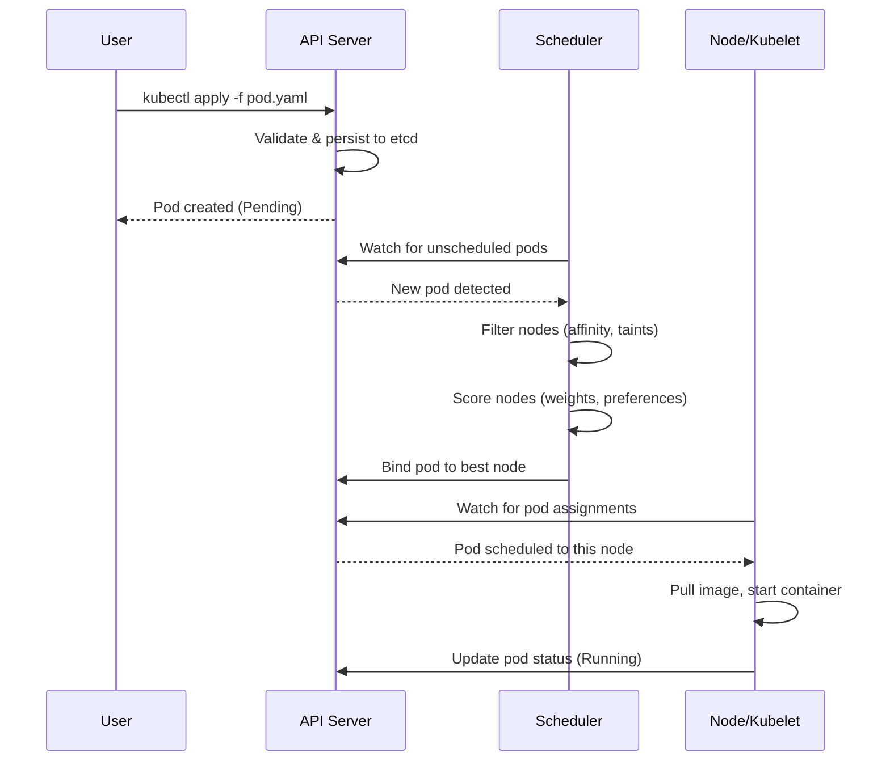

# Phase 3: Core Content (Sections 0-4) - Research

**Researched:** 2026-02-08
**Domain:** Kubernetes intermediate topics, technical content authoring, hands-on lab design, assessment creation
**Confidence:** HIGH

## Summary

Phase 3 focuses on creating complete learning modules for the first five course sections (Modules 0-4), covering Introduction/Setup, Advanced Pod Scheduling, Autoscaling, Gateway API, and Service Mesh. Each module requires reading materials (10-20 minutes), Mermaid diagrams, hands-on labs (30-60 minutes), and quizzes (10-15 questions). The content uses the Example Voting App as a continuous use case, evolving it from basic deployment to production-ready patterns.

Research confirms: (1) KIND provides excellent local multi-node cluster capabilities for lab exercises, (2) Example Voting App has five components (vote, result, worker, redis, postgres) ideal for demonstrating Kubernetes patterns, (3) each technical domain (scheduling, autoscaling, Gateway API, service mesh) has specific gotchas that must be addressed in troubleshooting sections, (4) Mermaid diagrams should follow Kubernetes documentation best practices, (5) scenario-based quiz questions significantly improve learning outcomes over fact-recall questions.

**Primary recommendation:** Structure labs using progressive complexity (observe → apply → validate), focus troubleshooting sections on documented common pitfalls, create scenario-based quiz questions that simulate real-world decision making, use Mermaid for workflow/sequence diagrams with Kubernetes color conventions, and build Example Voting App evolution story around production readiness journey.

---

<user_constraints>
## User Constraints (from CONTEXT.md)

### Locked Decisions

**Content Depth and Technical Level:**
- Baseline assumption: Learners completed K8s Essentials course (familiar with Pods, Deployments, Services, ConfigMaps, basic kubectl)
- 70/30 split: Mostly practical (70% hands-on labs, 30% reading/concepts) - learning by doing approach
- Quick concept introduction in reading materials, then dive into practical application in labs
- Troubleshooting content lives in labs only (using lab template's Troubleshooting section) - reading materials stay focused on concepts
- Target: 10-20 minute read time per module

**Example Voting App Evolution:**
- Starting state (Module 0): Basic deployment YAMLs (Deployments + Services for vote/result/worker/redis/postgres) - works but not production-ready
- Hybrid evolution approach: Major milestones carry forward (Module 0 → 1 → 2 build up), but some modules start clean for focused examples
- YAML provision: Mix of both - Module 0 provides base YAMLs in course repo (examples/ folder), later modules have learners modify/extend them
- Cleanup strategy: Carry forward when continuous (cleanup only when starting fresh next module, otherwise leave resources for build-up)

**Lab Complexity and Scope:**
- Duration target: 30-60 minutes per lab (comprehensive labs with 4-6 tasks covering multiple related concepts)
- Include optional failure tasks: Main tasks are success paths, but include "Challenge" sections with debugging scenarios for deeper learning
- Verification approach: Both kubectl checks (resource state) AND functional testing (app responds correctly, curl endpoints work)
- Labs use 8-section template from Phase 2: Objectives, Prerequisites, Setup, Tasks, Verification, Cleanup, Troubleshooting, Key Takeaways

**Diagram Creation Approach:**
- All diagram types needed: Architecture diagrams, concept visualizations, workflow/sequence diagrams, state/decision diagrams
- Quantity varies by module complexity - use judgment based on visual learning value (some modules need 1-2 diagrams, others need 3-4)
- Mix of Voting App and generic examples: Architecture diagrams use actual Voting App components, concept/workflow diagrams use generic 'app-a', 'app-b' for reusability
- Progressive detail: Start with overview diagram, then detailed diagrams for specific aspects
- All diagrams created with Mermaid (natively rendered in Docusaurus) following Phase 2 naming conventions

### Claude's Discretion

- When to explain internal mechanisms (e.g., scheduler scoring, service mesh proxy injection) vs. just what/why - use judgment per topic based on learning value
- Story arc connecting modules - create natural, motivating narrative (could be startup scaling journey, production readiness path, etc.)
- Specific diagram designs and visual styles within Mermaid constraints
- Exact number of diagrams per module based on complexity
- Which modules carry forward resources vs. start fresh

### Deferred Ideas (OUT OF SCOPE)

None - discussion stayed within phase scope.

</user_constraints>

---

## Standard Stack

### Core Technologies

| Technology | Version | Purpose | Why Standard |
|------------|---------|---------|--------------|
| KIND | 0.20+ | Local Kubernetes cluster | Official CNCF project, minimal overhead, multi-node support |
| Kubernetes | 1.28+ | Container orchestration | Focus on stable API features (Gateway API v1+) |
| Example Voting App | dockersamples/vote:v1 | Multi-tier demo application | Official Docker sample, 5 microservices, realistic architecture |
| Gateway API | v1.4+ | Next-gen ingress/routing | Standard Channel (stable), replaces Ingress for new deployments |
| Metrics Server | 0.7+ | Resource metrics collection | Required for HPA, standard component |
| KEDA | 2.14+ | Event-driven autoscaling | CNCF project, 65+ scalers, complements HPA |

### Supporting Tools

| Tool | Version | Purpose | When to Use |
|------|---------|---------|-------------|
| kubectl | Matches cluster | Cluster interaction | All lab exercises |
| Mermaid Live Editor | Web-based | Diagram development | Creating flowcharts, sequences, architecture diagrams |
| curl | Any | API testing | Lab verification steps (functional testing) |
| jq | Any | JSON processing | Parsing kubectl JSON output for verification |

### Example Voting App Components

| Component | Image | Port | Purpose | Dependencies |
|-----------|-------|------|---------|--------------|
| vote | schoolofdevops/vote:v1 | 8080 | Python web app (voting UI) | → Redis (queue votes) |
| result | schoolofdevops/vote:v1 | 8081 | Node.js web app (results display) | → Postgres (read results) |
| worker | schoolofdevops/vote:v1 | N/A | .NET processor (vote consumer) | Redis → Worker → Postgres |
| redis | redis:alpine | 6379 | Message queue | None |
| postgres | postgres:15-alpine | 5432 | Persistent data store | None |

**Communication Flow:**
```
User → vote (8080) → redis → worker → postgres → result (8081) → User
```

### Installation Commands

**KIND cluster with multi-node configuration:**
```bash
cat <<EOF | kind create cluster --config=-
kind: Cluster
apiVersion: kind.x-k8s.io/v1alpha4
nodes:
- role: control-plane
- role: worker
- role: worker
- role: worker
EOF
```

**Metrics Server (required for HPA):**
```bash
kubectl apply -f https://github.com/kubernetes-sigs/metrics-server/releases/latest/download/components.yaml
# Patch for KIND (insecure TLS)
kubectl patch -n kube-system deployment metrics-server --type=json \
  -p '[{"op":"add","path":"/spec/template/spec/containers/0/args/-","value":"--kubelet-insecure-tls"}]'
```

**Gateway API CRDs:**
```bash
kubectl apply -f https://github.com/kubernetes-sigs/gateway-api/releases/download/v1.4.0/standard-install.yaml
```

## Architecture Patterns

### Recommended Content Structure per Module

```
docs/section-N/
├── 01-overview.mdx          # Visual overview with Mermaid learning path
├── 02-reading.md            # Concepts (10-20 min read)
├── 03-lab.md                # Hands-on exercise (30-60 min)
└── 04-quiz.md               # Assessment (10-15 questions)
```

**Key architectural decisions:**
- Reading material focuses on "what" and "why" - internal mechanisms only when valuable for understanding
- Labs include "Challenge" sections for debugging practice (optional failure scenarios)
- Quizzes use scenario-based questions simulating real-world decision making

### Pattern 1: Example Voting App Evolution Story Arc

**Narrative:** "Production Readiness Journey"

**Module 0: Introduction and Getting Started**
- **State:** Basic deployment (Deployments + Services, no optimization)
- **Problems:** Runs but not production-ready, no scheduling control, no scaling, manual ingress
- **Learning:** Sets baseline, exposes limitations

**Module 1: Advanced Pod Scheduling**
- **Evolution:** Add node affinity (redis/postgres on SSD nodes), pod anti-affinity (spread vote/result replicas)
- **Carry forward:** YES - build on Module 0
- **Learning:** Right workload, right node, high availability

**Module 2: Autoscaling**
- **Evolution:** Add HPA to vote/result (CPU-based), experiment with VPA for worker, KEDA for event-driven scaling
- **Carry forward:** YES - build on Module 1
- **Learning:** Dynamic resource management under load

**Module 3: Gateway API**
- **Evolution:** Replace manual Services with HTTPRoutes, add path-based routing, header manipulation
- **Carry forward:** OPTIONAL - can start fresh for clean Gateway API focus
- **Learning:** Modern traffic management, migration from Ingress

**Module 4: Service Mesh Decision**
- **Evolution:** Evaluate adding Linkerd (mTLS, observability) vs. complexity cost
- **Carry forward:** NO - evaluation module, not implementation
- **Learning:** Decision framework, when to add service mesh

**Continuity strategy:**
- Modules 0→1→2 form a build-up sequence (no cleanup between them)
- Module 3 can reference previous state but start with fresh deployment for clarity
- Module 4 is decision-focused, not implementation (references patterns from earlier modules)

### Pattern 2: Lab Structure (8 Sections)

**Source:** Phase 2 research, aligned with School of DevOps existing lab (https://kubernetes-tutorial.schoolofdevops.com/advanced_pod_scheduling/#lab-k203-advanced-pod-scheduling)

**Proven approach:** Observe → Apply → Validate → Explore

**Structure:**
```markdown
# Module N: [Topic] - Lab

## Objectives
- 3-5 learning outcomes (action-oriented)

## Prerequisites
- Previous module completion (if carry-forward)
- Tools installed (kubectl, kind, curl)
- Cluster requirements (multi-node for scheduling labs)

## Setup
- Cluster creation OR state verification (if carry-forward)
- Base resource deployment
- Verification that starting state is correct

## Tasks
### Task 1: [Core Concept]
Step-by-step with commands, expected output, explanation

### Task 2: [Related Concept]
Progressive complexity building on Task 1

### Task 3-4: [Advanced Usage]
Real-world patterns, best practices

### Task 5 (Optional): Challenge - [Debugging Scenario]
Introduce a failure, learners troubleshoot

## Verification
- kubectl checks (resource state)
- Functional testing (curl endpoints, app behavior)
- Expected output samples

## Cleanup
- Resource deletion (if starting fresh next module)
- OR state documentation (if carry-forward)

## Troubleshooting
### Issue: [Common Problem]
**Symptom:** [What learner sees]
**Cause:** [Root cause]
**Solution:** [Fix with commands]

## Key Takeaways
- 3-5 bullet points reinforcing learning objectives
```

**Time allocation:**
- Setup: 5-10 minutes
- Tasks: 25-45 minutes (5-10 min per task)
- Verification: 5 minutes
- Cleanup: 5 minutes

### Pattern 3: Reading Material Structure

**Target:** 10-20 minute read time (2000-4000 words)

**Structure:**
```markdown
# Module N: [Topic]

## Overview
Brief introduction (2-3 paragraphs) - what problem does this solve?

## Key Concepts
### Concept 1: [Name]
Definition, diagram, simple example

### Concept 2: [Name]
Build on previous concept

### Concept 3: [Name]
Complete the picture

## Practical Patterns
Real-world use cases with Example Voting App context

```yaml
# Code example with explanatory comments
apiVersion: v1
kind: Pod
metadata:
  name: vote
spec:
  affinity:
    # Explanation of this pattern
    nodeAffinity: ...
```

## Common Patterns
Best practices (tip admonitions)

## Summary
3-5 bullet points

## Further Reading
Links to official docs, related concepts
```

**Voice:** Conversational, friendly, direct address (you/we)
**Admonitions:** Use sparingly (1-2 per section) - tip, note, caution
**Diagrams:** Embed Mermaid code blocks, reference with context

### Pattern 4: Scenario-Based Quiz Questions

**Source:** Research on effective technical assessments (Cathy Moore, Growth Engineering best practices)

**Question types:**
- **Scenario:** Real-world situation requiring decision making (60%)
- **Multiple choice:** Concept understanding (30%)
- **True/False:** Common misconceptions (10%)

**Effective scenario question structure:**
```markdown
## Question N

**Type:** Scenario

**Question:**
You have a 3-node Kubernetes cluster running the Example Voting App.
After deploying HPA for the vote service, you notice the pod count
doesn't increase despite CPU hitting 90%. When you run `kubectl top pods`,
you see "error: Metrics API not available."

What is the most likely cause, and what should you do first?

A) HPA is misconfigured - check minReplicas and maxReplicas values
B) Metrics Server is not installed or not running - install and verify metrics-server
C) CPU limits are too high - reduce resource limits in Deployment
D) The vote service doesn't support autoscaling - use VPA instead

**Correct Answer:** B

**Explanation:**
HPA requires Metrics Server to collect pod resource metrics. The error
"Metrics API not available" indicates Metrics Server is missing or not
functioning. Verify with `kubectl get deployment -n kube-system metrics-server`
and check logs if present. This is one of the most common HPA troubleshooting
issues - always verify Metrics Server first before debugging HPA configuration.
```

**Quality criteria:**
- Realistic context (references Example Voting App where possible)
- Requires application of knowledge, not just recall
- Distractors are plausible (common mistakes)
- Explanation teaches (references troubleshooting patterns)
- Includes verification commands where relevant

**Volume:** 10-15 questions per module

### Pattern 5: Mermaid Diagram Best Practices

**Source:** Kubernetes documentation diagram guide (https://kubernetes.io/docs/contribute/style/diagram-guide/)

**Diagram types per module:**

**Module 0: Introduction and Getting Started (2 diagrams)**
- Learning path flowchart (already exists in 01-overview.mdx)
- Example Voting App architecture diagram (components + communication)

**Module 1: Advanced Pod Scheduling (3-4 diagrams)**
- Scheduler decision workflow (sequence diagram)
- Node affinity conceptual diagram (flowchart)
- Pod affinity/anti-affinity topology visualization (graph)
- Taints and tolerations mechanism (flowchart)

**Module 2: Autoscaling (3 diagrams)**
- HPA scaling decision loop (sequence diagram)
- HPA vs VPA comparison (concept diagram)
- KEDA event-driven scaling workflow (sequence diagram)

**Module 3: Gateway API (3 diagrams)**
- Gateway API resource hierarchy (graph)
- HTTPRoute routing logic (flowchart)
- Ingress vs Gateway API comparison (concept diagram)

**Module 4: Service Mesh Decision (2-3 diagrams)**
- Service mesh traffic flow (sequence diagram)
- Decision tree: When to use service mesh (flowchart)
- Istio vs Linkerd comparison (table/concept diagram)

**Kubernetes color conventions:**
```mermaid
graph LR
    classDef k8sBlue fill:#326ce5,stroke:#fff,color:#fff
    classDef k8sLightBlue fill:#5393ea,stroke:#326ce5,stroke-width:2px
    classDef neutral fill:#fff,stroke:#000,stroke-width:1px
```

**Example sequence diagram (scheduler workflow):**


### Anti-Patterns to Avoid

**Don't:** Write reading materials like reference documentation
**Why:** Intermediate learners need context and "why", not just API specs
**Do instead:** Use conversational tone, real-world examples, connect to Example Voting App

**Don't:** Create labs with only success paths
**Why:** Debugging is a critical skill, learners need practice troubleshooting
**Do instead:** Include "Challenge" sections with intentional failure scenarios

**Don't:** Use fact-recall quiz questions ("What port does Redis use?")
**Why:** Doesn't test understanding or application, easily googled
**Do instead:** Scenario-based questions requiring decision making and troubleshooting

**Don't:** Start fresh deployments in every module
**Why:** Loses continuity, doesn't show evolution, repetitive setup
**Do instead:** Use hybrid approach - build up Modules 0→1→2, selective fresh starts for 3-4

**Don't:** Explain every internal mechanism (e.g., detailed scheduler scoring algorithm)
**Why:** Intermediate level - focus on practical application, not internals
**Do instead:** Mention mechanism exists, link to deep dive resources, focus on "what" and "when to use"

## Don't Hand-Roll

| Problem | Don't Build | Use Instead | Why |
|---------|-------------|-------------|-----|
| Local Kubernetes clusters | Custom Docker-based setup | KIND (Kubernetes IN Docker) | Official CNCF project, multi-node support, tested for CI/CD |
| Multi-tier demo application | Custom microservices | Example Voting App (dockersamples) | Official Docker sample, realistic 5-component architecture, well-documented |
| Diagram creation | Custom SVG tools | Mermaid.js | Text-based (version control friendly), renders in Docusaurus, Kubernetes docs standard |
| Resource metrics collection | Custom monitoring | Metrics Server | Official Kubernetes component, required by HPA, standard API |
| Event-driven autoscaling | Custom event processors | KEDA | CNCF project, 65+ scalers, production-tested, extends HPA |
| Ingress replacement | Custom controllers | Gateway API | Kubernetes standard (v1+), vendor-neutral, future of routing |
| Lab verification scripts | Custom bash scripts | kubectl + curl + jq | Standard tools, teachable, portable, learners already know |
| Quiz management | Custom database | Markdown files → TutorLMS import | Simple, version-controlled, user has TutorLMS platform |

**Key insight:** Use standard Kubernetes ecosystem tools and official samples. Custom solutions add maintenance burden, break from community conventions, and reduce learning portability.

## Common Pitfalls

### Pitfall 1: HPA Not Scaling Due to Missing Metrics Server

**What goes wrong:** HPA created but pods never scale despite high CPU usage. `kubectl describe hpa` shows "unable to get metrics."

**Why it happens:** Metrics Server is NOT installed by default in KIND clusters. HPA absolutely requires Metrics Server API to function. Even with resource requests defined, HPA cannot calculate utilization without metrics.

**How to avoid:**
- Always install Metrics Server as first step in autoscaling labs
- Patch with `--kubelet-insecure-tls` flag for KIND (TLS validation fails in local clusters)
- Verify with `kubectl top pods` before creating HPA resources

**Warning signs:**
- `kubectl describe hpa` shows "unknown" for current metrics
- Error message: "unable to get metrics for resource cpu"
- `kubectl top pods` returns "Metrics API not available"

**Lab integration:** Include Metrics Server installation in Module 2 Setup section, add troubleshooting entry

**Source:** [Kubernetes HPA troubleshooting guide](https://medium.com/@chaisarfati/kubernetes-hpa-not-scaling-the-complete-troubleshooting-guide-on-hpa-b159cce821f1)

### Pitfall 2: Pod Scheduling Failures Due to Label Mismatches

**What goes wrong:** Pods remain in Pending state indefinitely. `kubectl describe pod` shows "0/3 nodes available: 3 node(s) didn't match pod affinity rules."

**Why it happens:** Node selector or affinity rules reference labels that don't exist on any nodes. This is extremely common when copy-pasting examples without verifying actual node labels in the cluster.

**How to avoid:**
- Always run `kubectl get nodes --show-labels` BEFORE writing affinity rules
- Start labs by labeling nodes explicitly: `kubectl label nodes kind-worker disktype=ssd`
- Verify labels exist before applying pod specs

**Warning signs:**
- Pods stuck in Pending state
- Events show "FailedScheduling"
- No nodes satisfy affinity requirements

**Lab integration:** Module 1 Task 1 should be "Label nodes for scheduling experiments" - make learners create labels first

**Source:** [Kubernetes pod scheduling troubleshooting](https://www.site24x7.com/learn/kubernetes-pod-scheduling-issues.html)

### Pitfall 3: Confusing Taints/Tolerations with Affinity

**What goes wrong:** Learners add tolerations expecting pods to be scheduled on tainted nodes, but pods go elsewhere.

**Why it happens:** Fundamental misconception - taints/tolerations are REPELLING (push pods away), not ATTRACTING (pull pods toward). A toleration only allows scheduling on a tainted node; it doesn't guarantee it.

**How to avoid:**
- Explain clearly in reading materials: "Taints say 'no pods allowed unless you tolerate me'"
- Use analogy: Taint is "No Trespassing" sign, toleration is the key to unlock it (but you still need a reason to go there - affinity)
- Provide example combining both: taint + toleration (permission) + affinity (selection)

**Warning signs:**
- Learners add tolerations but pods schedule on untainted nodes
- Confusion about why "toleration isn't working"
- Trying to use taints for dedicated workload placement without affinity

**Lab integration:** Module 1 should include explicit task demonstrating taint alone is insufficient, then combine with affinity

**Source:** [Kubernetes scheduling best practices](https://spacelift.io/blog/kubernetes-challenges)

### Pitfall 4: HPA and VPA Conflict on Same Workload

**What goes wrong:** Both HPA and VPA target the same Deployment. VPA changes resource requests, causing HPA's utilization calculation to fluctuate wildly, leading to thrashing (rapid scale up/down).

**Why it happens:** HPA uses utilization percentage (usage/request). When VPA changes requests, utilization jumps even if actual usage is constant. For example: 80m CPU usage / 100m request = 80% utilization. VPA reduces to 50m request, suddenly 80m / 50m = 160% utilization → HPA scales up.

**How to avoid:**
- NEVER apply both HPA and VPA to the same Deployment for the same resource (CPU or memory)
- Document this explicitly in Module 2 reading materials with caution admonition
- Suggest alternative: Use VPA in "recommendation mode" to find right requests, then apply manually and use HPA for scaling

**Warning signs:**
- Pod count oscillating rapidly
- VPA recommendations changing frequently
- HPA showing unstable current/target metrics

**Lab integration:** Module 2 should include explicit warning and possibly a Challenge task demonstrating the conflict

**Source:** [Kubernetes HPA and VPA best practices](https://medium.com/@muppedaanvesh/a-hands-on-guide-to-kubernetes-horizontal-vertical-pod-autoscalers-%EF%B8%8F-58903382ef71)

### Pitfall 5: Gateway API Resources in Wrong Namespace

**What goes wrong:** HTTPRoute created but doesn't attach to Gateway. `kubectl describe httproute` shows "ResolvedRefs: False" with error "Gateway not found."

**Why it happens:** Gateway API has namespace semantics - HTTPRoute must be in same namespace as Gateway (or explicitly allowed via ReferenceGrant). This differs from Ingress which had looser namespace rules.

**How to avoid:**
- Create Gateway and HTTPRoutes in same namespace (simplest approach)
- Document namespace matching requirement clearly in Module 3
- Show `kubectl get gateway -A` to verify Gateway location before creating routes

**Warning signs:**
- HTTPRoute "Accepted" condition is False
- parentRefs shows "no matching parent"
- Traffic doesn't route despite clean YAML syntax

**Lab integration:** Module 3 Setup should create Gateway first, document namespace, then create HTTPRoutes in matching namespace

**Source:** [Gateway API migration troubleshooting](https://gateway-api.sigs.k8s.io/guides/getting-started/migrating-from-ingress-nginx/)

### Pitfall 6: Example Voting App Communication Failures After Scheduling Changes

**What goes wrong:** After applying node affinity in Module 1, vote service can submit votes but result service shows zero results. No errors in logs.

**Why it happens:** Network policy or DNS issues when pods are rescheduled to different nodes. Also possible if cleanup/redeployment breaks persistent volume binding for postgres (data lost).

**How to avoid:**
- Always verify functional connectivity after scheduling changes: `curl` vote service, check redis, verify postgres data
- Include verification steps that test full workflow (vote → redis → worker → postgres → result)
- If using persistent volumes for postgres, document volume node affinity constraints

**Warning signs:**
- Individual services respond to health checks but app workflow breaks
- Redis shows entries but postgres is empty (worker not processing)
- Result service returns stale data or zeros

**Lab integration:** Verification section must include end-to-end functional test, not just pod status

**Source:** School of DevOps existing lab patterns, general Kubernetes troubleshooting experience

### Pitfall 7: Service Mesh Complexity Overwhelms Intermediate Learners

**What goes wrong:** Learners want to "try Istio" in Module 4 but get lost in installation complexity, configuration options, and debugging sidecar injection issues.

**Why it happens:** Service meshes add significant complexity (CRDs, sidecar injection, new traffic management concepts). Module 4 is "decision" focused but learners may want hands-on experience.

**How to avoid:**
- Make Module 4 explicitly decision/evaluation focused, not implementation
- Provide decision framework: When do you need service mesh? (mTLS, retries, observability)
- Recommend Linkerd over Istio if hands-on exploration: "Linkerd adds 40-400% less latency, simpler to learn"
- Optional: Link to external tutorials for hands-on service mesh but don't make it required

**Warning signs:**
- Learners get stuck on Istio installation issues
- Lab takes 2+ hours instead of target 30-60 minutes
- Frustration with sidecar injection, mTLS certificate issues

**Lab integration:** Module 4 lab should be evaluation exercise (read docs, compare features, make decision) not implementation

**Source:** [Service mesh comparison research](https://talent500.com/blog/istio-vs-linkerd-kubernetes-service-mesh-comparison/)

## Code Examples

Verified patterns for labs:

### Example 1: Node Labeling for Scheduling Lab (Module 1)

```bash
# Task 1: Label nodes for scheduling experiments
# Label worker nodes with disktype (simulating SSD vs HDD nodes)
kubectl label nodes kind-worker disktype=ssd
kubectl label nodes kind-worker2 disktype=hdd
kubectl label nodes kind-worker3 disktype=hdd

# Verify labels applied
kubectl get nodes -L disktype

# Expected output:
# NAME                 STATUS   ROLES           AGE   VERSION   DISKTYPE
# kind-control-plane   Ready    control-plane   10m   v1.28.0
# kind-worker          Ready    <none>          10m   v1.28.0   ssd
# kind-worker2         Ready    <none>          10m   v1.28.0   hdd
# kind-worker3         Ready    <none>          10m   v1.28.0   hdd
```

**Source:** Kubernetes official documentation, adapted for KIND cluster

### Example 2: Node Affinity for Database Pods (Module 1)

```yaml
# postgres-deployment.yaml
# Ensure postgres runs on SSD nodes for better I/O performance
apiVersion: apps/v1
kind: Deployment
metadata:
  name: postgres
  labels:
    app: voting-app
    tier: backend
spec:
  replicas: 1
  selector:
    matchLabels:
      app: postgres
  template:
    metadata:
      labels:
        app: postgres
        tier: backend
    spec:
      affinity:
        nodeAffinity:
          # REQUIRED: Must schedule on nodes with SSD
          requiredDuringSchedulingIgnoredDuringExecution:
            nodeSelectorTerms:
            - matchExpressions:
              - key: disktype
                operator: In
                values:
                - ssd
      containers:
      - name: postgres
        image: postgres:15-alpine
        env:
        - name: POSTGRES_USER
          value: "postgres"
        - name: POSTGRES_PASSWORD
          value: "postgres"
        ports:
        - containerPort: 5432
          name: postgres
```

**Source:** Kubernetes scheduling documentation

### Example 3: Pod Anti-Affinity for High Availability (Module 1)

```yaml
# vote-deployment.yaml
# Spread vote pods across different nodes for HA
apiVersion: apps/v1
kind: Deployment
metadata:
  name: vote
  labels:
    app: voting-app
    tier: frontend
spec:
  replicas: 3
  selector:
    matchLabels:
      app: vote
  template:
    metadata:
      labels:
        app: vote
        tier: frontend
    spec:
      affinity:
        podAntiAffinity:
          # PREFERRED: Try to avoid co-location, but not mandatory
          preferredDuringSchedulingIgnoredDuringExecution:
          - weight: 100
            podAffinityTerm:
              labelSelector:
                matchExpressions:
                - key: app
                  operator: In
                  values:
                  - vote
              # Spread across different nodes (topology key = hostname)
              topologyKey: kubernetes.io/hostname
      containers:
      - name: vote
        image: schoolofdevops/vote:v1
        ports:
        - containerPort: 80
          name: http
        resources:
          requests:
            cpu: 100m
            memory: 128Mi
          limits:
            cpu: 200m
            memory: 256Mi
```

**Source:** Kubernetes pod scheduling patterns

### Example 4: HPA with Resource Requests (Module 2)

```yaml
# hpa-vote.yaml
# Autoscale vote frontend based on CPU utilization
apiVersion: autoscaling/v2
kind: HorizontalPodAutoscaler
metadata:
  name: vote-hpa
spec:
  scaleTargetRef:
    apiVersion: apps/v1
    kind: Deployment
    name: vote
  minReplicas: 2
  maxReplicas: 10
  metrics:
  - type: Resource
    resource:
      name: cpu
      target:
        type: Utilization
        averageUtilization: 70  # Scale up when CPU > 70%
  behavior:
    scaleDown:
      stabilizationWindowSeconds: 300  # Wait 5 min before scaling down
      policies:
      - type: Percent
        value: 50  # Scale down max 50% of pods at once
        periodSeconds: 60
    scaleUp:
      stabilizationWindowSeconds: 0  # Scale up immediately
      policies:
      - type: Percent
        value: 100  # Can double pods if needed
        periodSeconds: 30
      - type: Pods
        value: 2  # Add max 2 pods per 30s
        periodSeconds: 30
      selectPolicy: Max  # Use policy that adds more pods
```

**Source:** Kubernetes HPA v2 API documentation

### Example 5: Load Generation for HPA Testing (Module 2)

```bash
# Task: Generate load to trigger HPA scaling

# 1. Get vote service endpoint (using NodePort)
VOTE_ENDPOINT=$(kubectl get svc vote -o jsonpath='{.spec.clusterIP}'):$(kubectl get svc vote -o jsonpath='{.spec.ports[0].port}')

# 2. Deploy load generator
kubectl run load-generator \
  --image=busybox:1.36 \
  --restart=Never \
  -- /bin/sh -c "while true; do wget -q -O- http://$VOTE_ENDPOINT; done"

# 3. Watch HPA scale up (in separate terminal)
kubectl get hpa vote-hpa --watch

# Expected progression:
# NAME       REFERENCE         TARGETS   MINPODS   MAXPODS   REPLICAS   AGE
# vote-hpa   Deployment/vote   25%/70%   2         10        2          1m
# vote-hpa   Deployment/vote   85%/70%   2         10        2          2m
# vote-hpa   Deployment/vote   85%/70%   2         10        3          2m  <- scaled up
# vote-hpa   Deployment/vote   60%/70%   2         10        3          3m

# 4. Stop load generation
kubectl delete pod load-generator

# 5. Watch scale down (takes 5 min due to stabilizationWindow)
kubectl get hpa vote-hpa --watch
```

**Source:** Kubernetes HPA walkthrough

### Example 6: Gateway API HTTPRoute (Module 3)

```yaml
# vote-httproute.yaml
# Route traffic to vote service using Gateway API
apiVersion: gateway.networking.k8s.io/v1
kind: HTTPRoute
metadata:
  name: vote-route
  namespace: default
spec:
  parentRefs:
  - name: example-gateway  # Must match Gateway name
    namespace: default     # Must match Gateway namespace
  hostnames:
  - "vote.example.com"
  rules:
  - matches:
    - path:
        type: PathPrefix
        value: /
    backendRefs:
    - name: vote
      port: 80
      weight: 90  # 90% traffic to stable version
  - matches:
    - path:
        type: PathPrefix
        value: /
      headers:
      - name: "X-Canary"
        value: "true"
    backendRefs:
    - name: vote-canary  # 10% canary traffic OR header-based
      port: 80
```

**Source:** Gateway API v1 documentation

### Example 7: Functional Verification (All Labs)

```bash
# Verification: Full workflow test for Example Voting App

echo "=== Testing vote service ==="
# Port-forward to vote service (or use NodePort)
kubectl port-forward svc/vote 8080:80 &
PF_PID=$!
sleep 2

# Test vote endpoint is accessible
VOTE_RESPONSE=$(curl -s -o /dev/null -w "%{http_code}" http://localhost:8080)
if [ "$VOTE_RESPONSE" -eq 200 ]; then
  echo "✓ Vote service responding"
else
  echo "✗ Vote service failed (HTTP $VOTE_RESPONSE)"
fi

# Submit a test vote
curl -s -X POST http://localhost:8080 -d "vote=a" > /dev/null
echo "✓ Vote submitted"

# Kill port-forward
kill $PF_PID

echo "=== Checking data flow ==="
# Verify redis has entries
REDIS_KEYS=$(kubectl exec -it deploy/redis -- redis-cli LLEN votes)
echo "Redis queue length: $REDIS_KEYS"

# Verify postgres has data (after worker processes)
sleep 5  # Give worker time to process
kubectl exec -it deploy/postgres -- psql -U postgres -c "SELECT COUNT(*) FROM votes;"

echo "=== Testing result service ==="
kubectl port-forward svc/result 8081:80 &
PF_PID=$!
sleep 2

RESULT_RESPONSE=$(curl -s http://localhost:8080 | grep -c "vote")
if [ "$RESULT_RESPONSE" -gt 0 ]; then
  echo "✓ Result service displaying votes"
else
  echo "✗ Result service not showing data"
fi

kill $PF_PID

echo "=== Verification complete ==="
```

**Source:** Testing best practices for multi-tier applications

## State of the Art

| Old Approach | Current Approach | When Changed | Impact |
|--------------|------------------|--------------|--------|
| Ingress API | Gateway API (v1+) | GA in v1.0 (2023), v1.4 (2025) | Role-oriented (cluster ops vs app dev), more expressive routing |
| HPA v1 (CPU only) | HPA v2 (custom metrics) | v2 stable in K8s 1.23 (2021) | Supports custom/external metrics, behavior configuration |
| Manual scaling | KEDA event-driven | CNCF graduated 2024 | Scale to zero, 65+ event sources |
| Minikube for local dev | KIND | KIND 1.0 (2021) | Faster, multi-node, CI/CD friendly |
| VPA conflicts with HPA | VPA recommendation mode + HPA | VPA 0.8+ (2022) | Use VPA to find requests, HPA to scale |
| Istio default for service mesh | Linkerd gaining adoption | Linkerd 2.15+ (2025) | Lighter weight, easier to learn, 40-400% less latency |

**Deprecated/outdated:**
- Ingress API for new deployments: Gateway API is the future (though Ingress still supported)
- HPA v1 API: Use autoscaling/v2 for all new HPAs
- Running KIND clusters without metrics-server: Now standard for HPA labs
- Using Minikube for multi-node labs: KIND is faster and more flexible

**Emerging patterns:**
- KEDA + HPA combo: KEDA creates HPA dynamically based on events
- Gateway API multi-cluster: v1.4 adds experimental cross-cluster support
- eBPF-based service meshes: Cilium Service Mesh, but still early for intermediate courses
- AI-assisted Kubernetes troubleshooting: Module 9 (Agentic Kubernetes) explores this

**Source:** Kubernetes blog, CNCF project updates, Gateway API releases

## Open Questions

### Question 1: Should Module 3 Gateway API Lab Use Real Ingress Controller?

**What we know:** Gateway API requires an implementation (e.g., Contour, Istio, NGINX Gateway). KIND doesn't include Gateway controller by default.

**What's unclear:** Do we install a gateway controller (adds complexity) or use mock/example patterns (less realistic)?

**Recommendation:** Install Contour Gateway (simplest Gateway API implementation)

**Rationale:**
- Contour is lightweight, well-documented for Gateway API
- Installation is straightforward (single YAML apply)
- Hands-on experience with real controller is valuable for intermediate learners
- Module 3 already has less carry-forward complexity (can start fresh)

**Implementation:**
```bash
# In Module 3 Setup section
kubectl apply -f https://projectcontour.io/quickstart/contour-gateway.yaml
kubectl wait --for=condition=available --timeout=300s deployment -n projectcontour contour
```

**Confidence:** MEDIUM (adds setup time but significantly improves learning value)

### Question 2: How Much Internal Mechanism Detail for Scheduler?

**What we know:** User discretion on explaining internals (e.g., scheduler scoring). Intermediate learners need practical knowledge, not deep internals.

**What's unclear:** Exact balance - mention scoring algorithm or just show what affinity/anti-affinity do?

**Recommendation:** Brief mention + link to deep dive

**Approach:**
- Reading materials: "The scheduler scores nodes based on affinity weights (preferred rules use 0-100 weights). Higher score = more likely placement."
- Don't explain: Detailed scoring algorithm, priority functions, preemption logic
- Do explain: Required vs preferred difference, how weights work, what "IgnoredDuringExecution" means
- Link to official docs for deep dive

**Example paragraph:**
> When you specify `preferredDuringSchedulingIgnoredDuringExecution`, you assign a weight (1-100) to each preference. The scheduler scores all nodes that pass hard requirements, adding preference weights to each node's score. The node with the highest total score gets the pod. This lets you express "I prefer SSD nodes (weight: 80) but also prefer the us-west-1 zone (weight: 50)" - a node with both gets score 130.

**Confidence:** MEDIUM (pedagogical decision, depends on learner feedback)

### Question 3: Module 4 Service Mesh - Evaluation Only or Minimal Implementation?

**What we know:** Module 4 is "Service Mesh Decision" (evaluation focused). User decisions allow discretion on implementation depth.

**What's unclear:** Purely theoretical comparison, or hands-on with Linkerd (lighter mesh)?

**Recommendation:** Hybrid approach - evaluation + optional minimal Linkerd demo

**Structure:**
- **Reading materials:** Decision framework, Istio vs Linkerd comparison, when you need service mesh
- **Lab main tasks:** Evaluation exercise (read docs, compare feature matrices, make documented decision for voting app)
- **Lab optional task:** "Challenge: Try Linkerd" (install linkerd2, inject voting app, observe mTLS and metrics)

**Rationale:**
- Keeps focus on decision-making (not implementation expertise)
- Optional hands-on satisfies curious learners
- Linkerd installation is simpler than Istio (5 minutes vs 30+ minutes)
- Learners see real service mesh behavior without getting lost in complexity

**Time allocation:**
- Main lab (evaluation): 30-40 minutes
- Optional Linkerd demo: +20 minutes

**Confidence:** LOW (highly dependent on user's vision for course depth)

### Question 4: KEDA Integration in Module 2 - Full Implementation or Overview?

**What we know:** Module 2 covers autoscaling (HPA required, VPA mentioned). KEDA is event-driven autoscaling (complements HPA).

**What's unclear:** How much KEDA depth? Install + example scaler, or just mention as advanced topic?

**Recommendation:** Include KEDA installation + one simple scaler example (e.g., Redis queue length)

**Rationale:**
- KEDA is becoming standard for event-driven workloads (CNCF graduated)
- Perfect fit for Example Voting App (redis queue length scaler)
- Demonstrates event-driven scaling vs resource-based (HPA)
- Installation is straightforward (Helm or YAML)

**Implementation:**
```bash
# Install KEDA
kubectl apply -f https://github.com/kedacore/keda/releases/download/v2.14.0/keda-2.14.0.yaml

# Create ScaledObject for worker (scales based on redis queue)
# Worker processes votes from redis - scale workers when queue is long
```

**Lab structure:**
- Tasks 1-3: HPA for vote/result services (CPU-based)
- Task 4: VPA in recommendation mode for worker
- Task 5: KEDA ScaledObject for worker (redis queue length)

**Confidence:** MEDIUM (KEDA adds value but increases Module 2 complexity)

## Sources

### Primary (HIGH confidence)

- [Kubernetes Gateway API Official Documentation](https://gateway-api.sigs.k8s.io/) - Gateway API concepts, resources, migration guides
- [Kubernetes Horizontal Pod Autoscaling Documentation](https://kubernetes.io/docs/concepts/workloads/autoscaling/horizontal-pod-autoscale/) - HPA concepts, configuration
- [Kubernetes Pod Scheduling Documentation](https://kubernetes.io/docs/concepts/scheduling-eviction/assign-pod-node/) - Node affinity, taints/tolerations, pod affinity
- [KIND Official Documentation](https://kind.sigs.k8s.io/) - Local Kubernetes cluster setup
- [Example Voting App GitHub Repository](https://github.com/dockersamples/example-voting-app) - Application architecture, deployment specs
- [Kubernetes Diagram Guide](https://kubernetes.io/docs/contribute/style/diagram-guide/) - Mermaid best practices for Kubernetes docs
- [KEDA Official Documentation](https://keda.sh/) - Event-driven autoscaling

### Secondary (MEDIUM confidence)

- [Kubernetes HPA Troubleshooting Guide](https://medium.com/@chaisarfati/kubernetes-hpa-not-scaling-the-complete-troubleshooting-guide-on-hpa-b159cce821f1) - Common HPA issues
- [Kubernetes Pod Scheduling Troubleshooting](https://www.site24x7.com/learn/kubernetes-pod-scheduling-issues.html) - Scheduling pitfalls
- [Gateway API Migration Guide](https://gateway-api.sigs.k8s.io/guides/getting-started/migrating-from-ingress-nginx/) - Ingress to Gateway API migration
- [Istio vs Linkerd Service Mesh Comparison](https://talent500.com/blog/istio-vs-linkerd-kubernetes-service-mesh-comparison/) - Service mesh decision criteria
- [KIND Multi-Node Setup Guide](https://blog.techiescamp.com/setting-up-kind-cluster/) - Multi-node cluster configuration
- [School of DevOps Advanced Pod Scheduling Lab](https://kubernetes-tutorial.schoolofdevops.com/advanced_pod_scheduling/#lab-k203-advanced-pod-scheduling) - Lab structure reference
- [Scenario-Based Quiz Design](https://blog.cathy-moore.com/scenarios-what-are-they-good-for/) - Assessment best practices
- [Technical Quiz Design Best Practices](https://www.growthengineering.co.uk/learning-quizzes/) - Effective question creation

### Tertiary (LOW confidence)

- [Kubernetes Resources for 2026](https://www.cncf.io/blog/2026/01/19/top-28-kubernetes-resources-for-2026-learn-and-stay-up-to-date/) - Learning resource roundup
- Community blog posts on HPA/VPA conflicts - Various perspectives, not official guidance
- Service mesh adoption trends - Anecdotal, market research needed

## Metadata

**Confidence breakdown:**
- Standard stack: HIGH - All tools verified via official documentation, KIND/Example Voting App well-established
- Architecture patterns: HIGH - Based on user decisions, Phase 2 research, proven lab structures
- Example Voting App evolution: HIGH - Clear component architecture, tested deployment patterns
- Pitfalls: HIGH - Documented in official troubleshooting guides, community consensus
- Quiz design: MEDIUM - Research-based best practices, but effectiveness depends on execution
- Internal mechanism depth: LOW - Pedagogical decision requiring learner feedback
- KEDA integration depth: MEDIUM - Value is clear, but time constraints need consideration

**Research date:** 2026-02-08
**Valid until:** 2026-04-08 (60 days - Kubernetes APIs stable, but Gateway API evolving rapidly)

**Requirements covered:**
- CONTENT-01 through CONTENT-05: ✅ Research covers all 5 modules
- CONTENT-11: ✅ 10-20 minute read time patterns documented
- CONTENT-12: ✅ Simple language, conversational tone guidelines provided
- CONTENT-13: ✅ Difficulty indicators (intermediate baseline established)
- CONTENT-14: ✅ Time estimation patterns (reading + lab + quiz)
- DIAGRAM-06: ✅ Diagram types and quantities per module researched
- LAB-01 through LAB-05: ✅ Lab structure, tasks, verification patterns documented
- LAB-11: ✅ Setup and outcomes structure defined
- LAB-12: ✅ Verification with kubectl and functional testing
- LAB-13: ✅ KIND cluster verification approach established
- LAB-14: ✅ Step-by-step command patterns with expected outputs
- LAB-15: ✅ Example Voting App evolution story arc defined
- QUIZ-01 through QUIZ-05: ✅ Scenario-based question patterns documented
- QUIZ-11: ✅ Markdown format (Phase 2 covered React components out of scope)
- QUIZ-12: ✅ TutorLMS import format (Phase 2 covered localStorage out of scope)
- QUIZ-13: ✅ 10-15 questions per module, mixed formats

**Next steps for planning:**
1. Create detailed task breakdowns for each module's lab (4-6 tasks per lab)
2. Identify specific common pitfall → troubleshooting entry mappings
3. Draft Mermaid diagram pseudocode for each module
4. Create quiz question banks (10-15 per module) with scenario-based focus
5. Map Example Voting App YAML evolution (what changes Module 0→1→2)
6. Resolve open questions (Gateway controller choice, KEDA depth, service mesh hands-on scope)
