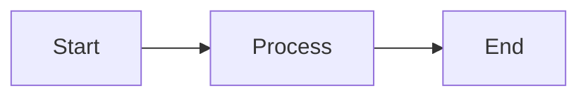
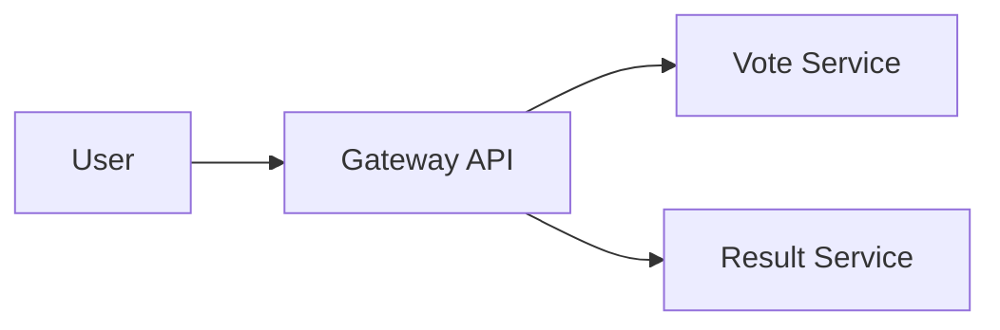

# Diagram Workflow Guide

This directory contains all diagram source files and exported images for the Kubernetes Intermediate (SFD301) course.

## Folder Structure

```
diagrams/
├── section-0/     # Module 0: Introduction and Getting Started
├── section-1/     # Module 1: Advanced Pod Scheduling
├── section-2/     # Module 2: Autoscaling
├── section-3/     # Module 3: Gateway API
├── section-4/     # Module 4: Service Mesh
├── section-5/     # Module 5: Security (NetworkPolicy, PSA, RBAC)
├── section-6/     # Module 6: Writing Helm Charts
├── section-7/     # Module 7: CRDs
├── section-8/     # Module 8: Building K8s Operators (Workflow)
├── section-9/     # Module 9: Agentic Kubernetes
└── shared/        # Cross-module diagrams and reusable assets
```

Each module uses a flat structure (no further subdirectories) since modules typically contain 1-3 diagrams.

## Naming Convention

All diagram files MUST use module-prefixed naming:

**Format**: `NN-topic-description.{mmd,excalidraw,svg,png}`

- `NN-` = Module prefix (`00-` through `09-`)
- `topic-description` = Lowercase, hyphen-separated descriptive name
- Extension = File type (`.mmd` for Mermaid source, `.excalidraw` for Excalidraw source, `.svg`/`.png` for exports)

**Examples**:
- `00-kind-setup.mmd` (Mermaid source for Module 0)
- `03-gateway-routing.excalidraw` (Excalidraw source for Module 3)
- `03-gateway-routing.svg` (Exported SVG from Excalidraw)
- `05-network-policy-flow.mmd` (Mermaid for Module 5)

## Mermaid Workflow

Mermaid diagrams are rendered natively by Docusaurus using the `@docusaurus/theme-mermaid` plugin.

### Creating Mermaid Diagrams

1. **Design**: Use [Mermaid Live Editor](https://mermaid.live) for interactive editing and preview
2. **Save Source**: Save the `.mmd` source file to the appropriate `diagrams/section-N/` folder
3. **Embed**: Copy the Mermaid code into your MDX file using a fenced code block with `mermaid` language tag

### Embedding in Docs

Embed Mermaid diagrams directly in MDX files using code blocks:

````markdown

````

**No image exports needed** - Docusaurus renders Mermaid live on the page with automatic theme switching.

## Excalidraw Workflow

Excalidraw diagrams require manual export to image formats for embedding in docs.

### Creating Excalidraw Diagrams

1. **Design**: Create your diagram at [excalidraw.com](https://excalidraw.com)
2. **Save Source**:
   - Click the menu (hamburger icon) → "Save to disk"
   - Enable "Embed scene into exported file" option
   - Save as `.excalidraw` to `diagrams/section-N/NN-name.excalidraw`
3. **Export Image**:
   - Export as SVG (preferred for scalability) or PNG (for raster graphics)
   - Save to `diagrams/section-N/NN-name.svg` (or `.png`)
4. **Commit Both**: Always commit BOTH the `.excalidraw` source and the exported image

### Embedding in Docs

Use standard Markdown image syntax with relative paths:

```markdown

```

**Path structure**: From `docs/section-N/page.mdx`, use `../../diagrams/section-N/filename.svg`

## Version Control Rules

**Always commit both source files AND exported images.**

- Mermaid: Commit `.mmd` source files (optional - code blocks are source of truth)
- Excalidraw: Commit BOTH `.excalidraw` source AND `.svg`/`.png` exports
- Manual export by author - no automated build-time exports

This ensures:
- Diagrams can be edited later by anyone
- Images render correctly in documentation
- Git history tracks diagram evolution

## Video Animation Optimization

When creating diagrams for video-based learning (screencasts, animations, walkthroughs), design for **incremental build-up** and **progressive disclosure**.

### Design Principles

**1. Layered Reveals**
- Structure diagrams so concepts can be introduced one element at a time
- Avoid showing the entire complex diagram upfront
- Each layer should be explainable in 10-30 seconds during video narration

**2. Mermaid for Sequential Flow**
- Use top-down (`TB`) or left-right (`LR`) flowcharts for natural reading order
- Design node sequences that align with explanation flow
- Example: API Gateway → Routing → Backend Services (revealed left-to-right)

**3. Excalidraw for Grouped Concepts**
- Use separate layers or groups for each concept/component
- Group related elements so they can be shown/hidden together during recording
- Label groups clearly (e.g., "Control Plane", "Data Plane", "User Traffic Flow")

**4. Simplicity Over Density**
- Keep diagrams focused: prefer 2-3 simple diagrams over 1 complex diagram
- Overly dense diagrams overwhelm viewers and are hard to narrate
- Split complex systems into stages (e.g., "Before" and "After" diagrams)

**5. Consistent Visual Language**
- Use consistent color coding across modules for cohesive animations:
  - **Blue**: Compute resources (Pods, Deployments, StatefulSets)
  - **Green**: Networking (Services, Ingress, Gateway API)
  - **Orange**: Storage (PVs, PVCs, StorageClasses)
  - **Purple**: Security (RBAC, NetworkPolicies, PSA)
  - **Gray**: Infrastructure (Nodes, Clusters)
- Consistent shapes for similar concepts (rectangles for services, circles for external systems)

### Example: Good vs. Bad for Video

**Bad** (too dense for video):
```
Single diagram with: 5 microservices + 3 databases + 2 message queues +
load balancer + ingress + network policies + RBAC rules all at once
```

**Good** (staged for video):
1. Diagram 1: Basic service topology (3 microservices + load balancer)
2. Diagram 2: Add data layer (3 databases connected to services)
3. Diagram 3: Add networking layer (ingress + gateway routing)
4. Diagram 4: Add security layer (network policies + RBAC overlay)

Each diagram builds on the previous, allowing the instructor to explain incrementally during video recording.

### Workflow Integration

When creating diagrams:
1. Ask: "Will this be explained in a video?"
2. If yes: Sketch the progression (what gets revealed when?)
3. Design for that progression (use layers in Excalidraw, sequential nodes in Mermaid)
4. Test: Can each element be explained in <30 seconds?

## Embedding Examples

### From docs/section-3/02-routing.mdx

**Mermaid** (inline code block):
````markdown
## Traffic Flow


````

**Excalidraw** (image reference):
```markdown
## Gateway Architecture


*Figure 1: Gateway API routing architecture showing HTTPRoute and backend services*
```

## Tips

- **Mermaid**: Best for flowcharts, sequence diagrams, state diagrams, and simple architecture diagrams
- **Excalidraw**: Best for hand-drawn style diagrams, complex multi-layer architectures, and detailed technical illustrations
- **Accessibility**: Always include descriptive alt text for Excalidraw images
- **Consistency**: Use the same style and color palette within a module
- **Video-first**: If creating content for video lessons, prioritize incremental build-up over completeness

## Resources

- [Mermaid Documentation](https://mermaid.js.org)
- [Mermaid Live Editor](https://mermaid.live)
- [Excalidraw](https://excalidraw.com)
- [Docusaurus Mermaid Plugin](https://docusaurus.io/docs/markdown-features/diagrams)
