# Section 0: Essentials Refresh

## Course Learning Path

```mermaid
flowchart LR
    A[Module 0: Setup] --> B[Module 1: Scheduling]
    B --> C[Module 2: Autoscaling]
    C --> D[Module 3: Gateway API]
    D --> E[Module 4: Service Mesh]
    E --> F[Module 5: Security]
    F --> G[Module 6: Helm]
    G --> H[Module 7: CRDs]
    H --> I[Module 8: Operators]
    I --> J[Module 9: Agentic K8s]
```



## Overview

This section refreshes core Kubernetes concepts and sets up KIND (Kubernetes IN Docker) for all lab exercises.

### Key Concepts

- Kubernetes cluster architecture fundamentals
- KIND cluster creation and management
- kubectl configuration and basic operations
- Pod, Deployment, and Service basics review

### Example

```yaml
apiVersion: v1
kind: Pod
metadata:
  name: nginx-pod
  labels:
    app: nginx
spec:
  containers:
  - name: nginx
    image: nginx:1.25
    ports:
    - containerPort: 80
```

## Coming Soon

Full content will be added in later phases of this project.
