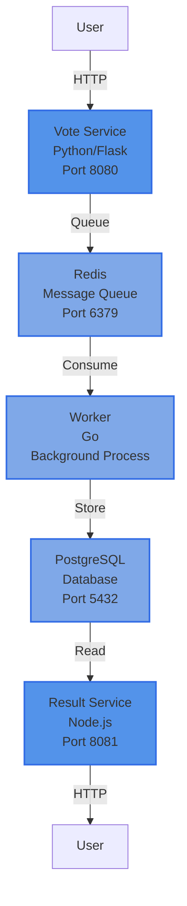
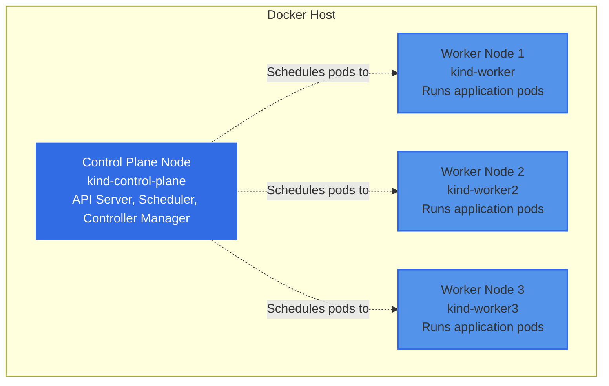

# Introduction and Getting Started

## Overview

You've learned the basics of Kubernetes - creating pods, managing deployments, exposing services. You've deployed applications that work. But there's a crucial difference between an application that works in development and one that's ready for production.

Welcome to your Production Readiness Journey. This course follows a realistic scenario: a startup has just deployed their first application to Kubernetes. It's running, users can interact with it, and the team is celebrating. But beneath the surface, there are gaps. No scheduling controls mean workloads land randomly on nodes. Single replicas create availability risks. Manual scaling means someone gets paged at 3 AM when traffic spikes. No security policies leave the cluster vulnerable.

Over the next nine modules, you'll transform a basic deployment into a production-ready system. Module 0 establishes the baseline - the "works but not ready" state that many teams start from. You'll deploy the Example Voting App, understand its architecture, and identify exactly what's missing. Then, module by module, you'll fix each gap until you have a deployment you'd confidently run in production.

## The Example Voting App

The Example Voting App is a five-component microservices application that demonstrates real-world Kubernetes patterns. It's a simple voting system where users vote for their preference (cats vs dogs), and results are displayed in real-time. Behind this simple interface is a complete data processing pipeline that moves through queues, workers, and persistent storage.

### Architecture

### Component Roles

**Vote Service (Python/Flask):** The frontend where users cast their votes. It's a web application that presents two options and captures user selections. When you vote, the service doesn't directly save to a database - instead, it pushes the vote onto a Redis queue for asynchronous processing. This decoupling allows the frontend to respond quickly regardless of backend load. The service includes health check endpoints (`/health`, `/ready`) and Prometheus metrics (`/metrics`) that we'll use in later modules for scheduling and autoscaling.

**Redis (Message Queue):** Acts as a buffer between vote submission and processing. Votes pile up in the queue when traffic is high, and the worker processes them at its own pace. This pattern (producer-consumer with a queue) is fundamental to building resilient microservices. If the worker crashes, votes stay in Redis until it recovers.

**Worker (Go):** A background process that continuously monitors the Redis queue. When it finds a vote, it pulls it from Redis, processes it (validation, transformation), and writes it to PostgreSQL. The worker exposes health and metrics endpoints on port 8081 for observability, but has no user-facing interface - it's a pure background processor. This separation of concerns is key to scalable architecture.

**PostgreSQL (Database):** Persistent storage for all processed votes. Once the worker writes a vote here, it's permanently recorded. The database is configured with default credentials for simplicity (not production-ready - we'll address security in Module 5).

**Result Service (Node.js):** The results dashboard where users see voting tallies in real-time. It reads from PostgreSQL and displays aggregated counts with WebSocket support for live updates. Like the vote service, it includes health, readiness, and metrics endpoints. This service demonstrates read-heavy workload patterns - it queries the database frequently but never writes.

:::info Enhanced Application
The Example Voting App used in this course is a modernized, production-ready version built specifically for cloud-native learning. Each service includes health checks, Prometheus metrics, structured logging, and graceful shutdown handling. The source code is available at [github.com/schoolofdevops/instavote](https://github.com/schoolofdevops/instavote) - you can explore how these observability features are implemented, but for this course, you'll use pre-built container images.
:::

### Communication Flow

The data flow follows a left-to-right pipeline:

1. User visits the Vote service in their browser
2. Vote service queues the selection in Redis (fire and forget)
3. Worker detects new item in Redis queue
4. Worker consumes the vote, validates it, and inserts into PostgreSQL
5. Result service queries PostgreSQL for current tallies
6. User visits Result service to see updated counts

This architecture showcases three common patterns: synchronous HTTP (user to services), asynchronous queuing (vote to redis), and background processing (worker). Understanding how these components interact is essential as we add scheduling rules, autoscaling policies, and traffic management in later modules.

## Kubernetes Essentials Review

You already know these concepts from the Kubernetes Essentials course. Here's a quick refresher to align terminology before we dive into intermediate topics.

**Pods:** The smallest deployable unit in Kubernetes. A pod wraps one or more containers with shared storage and network. In the Example Voting App, each component (vote, redis, worker, postgres, result) runs in its own pod. Pods are ephemeral - they can be deleted and recreated at any time.

**Deployments:** Controllers that manage ReplicaSets and provide declarative updates. When you create a Deployment for the vote service with 3 replicas, Kubernetes ensures 3 vote pods are always running. If a pod crashes, the Deployment creates a replacement. Deployments handle rolling updates, allowing you to change images without downtime.

**Services:** Stable network endpoints for accessing pods. Pods have ephemeral IPs that change when they restart, but Services provide a consistent DNS name and IP. ClusterIP services (like redis-service) are only accessible within the cluster. NodePort services (like vote-service) expose applications externally for local development.

**Namespaces:** Virtual clusters for organizing resources. The default namespace is where resources go unless you specify otherwise. In Module 0, we'll deploy everything to the default namespace for simplicity. Later modules introduce namespace-based isolation for security.

**Labels and Selectors:** Key-value pairs for grouping and selecting resources. Every pod created by the vote Deployment has a label like `app: vote`. The vote Service uses a selector `app: vote` to find which pods should receive traffic. This loose coupling allows Deployments and Services to work together without hard-coded references.

:::tip[Refresher Needed?]
If any of these feel unfamiliar, consider reviewing the Kubernetes Essentials course before continuing. This course assumes you're comfortable creating these resources and troubleshooting basic issues. We build directly on this foundation.
:::

## KIND: Kubernetes IN Docker

KIND (Kubernetes IN Docker) is a tool for running local Kubernetes clusters using Docker containers as nodes. Instead of spinning up virtual machines or configuring cloud infrastructure, KIND creates a complete Kubernetes cluster in seconds using only Docker.

### Why KIND for This Course

**Multi-node clusters:** KIND easily creates clusters with multiple worker nodes, essential for testing scheduling, affinity rules, and high availability patterns. Modules 1 and 2 specifically require multi-node clusters to demonstrate node-to-node concepts.

**Fast and lightweight:** Creating a KIND cluster takes 30-60 seconds. Tearing it down is instant. This speed makes experimentation safe - if something breaks, delete the cluster and start fresh without waiting for cloud provisioning.

**CI/CD friendly:** KIND was designed for testing Kubernetes itself in CI pipelines. The same characteristics that make it great for CI make it perfect for learning - reproducible, isolated, and self-contained.

**Real Kubernetes:** KIND runs actual Kubernetes, not a simulation. The API, scheduler, and controllers are identical to production clusters. Skills you develop in KIND transfer directly to production environments.

### KIND Cluster Topology

For this course, we'll create a four-node cluster: one control plane node and three worker nodes. Here's what that looks like:

**Control Plane Node:** Runs the Kubernetes API server, scheduler, and controller manager. This node orchestrates the cluster but typically doesn't run application workloads. When you run `kubectl` commands, you're talking to the API server on this node.

**Worker Nodes:** Run application pods. The Example Voting App components will be scheduled across these three workers. Having multiple workers lets us demonstrate pod distribution, affinity rules, and what happens when a node fails.

All four nodes are actually Docker containers on your local machine. They're networked together to simulate a real cluster topology. This is why KIND requires Docker to be running - each "node" is a Docker container running systemd and kubelet.

### Alternatives to KIND

You might be familiar with other local Kubernetes tools:

**Minikube:** Creates single-node clusters (or multi-node with extra configuration). Great for basics, but KIND is faster and better suited for multi-node scenarios we'll explore in this course.

**k3s:** Lightweight Kubernetes distribution designed for edge and IoT. Excellent for resource-constrained environments, but it modifies Kubernetes defaults (removes cloud-provider code, uses SQLite instead of etcd). KIND gives you standard Kubernetes.

**Docker Desktop Kubernetes:** Built-in Kubernetes in Docker Desktop. Convenient, but single-node only and harder to reset cleanly. KIND gives you more control and supports the multi-node scenarios we need.

We chose KIND because it strikes the perfect balance: fast enough for rapid experimentation, flexible enough for multi-node scenarios, and standard enough that everything you learn transfers directly to production clusters.

## What Makes a Deployment "Production Ready"?

Your Example Voting App deployment will work perfectly in Module 0. Users can vote, results display correctly, and all pods are running. So why isn't it production-ready?

:::caution[Working vs Ready]
A deployment that works is not the same as a deployment that is production-ready. The gap between them is what causes 3 AM pages, outages during traffic spikes, and security incidents.
:::

Here are the gaps in a basic deployment, and how this course addresses each one:

**Gap 1: No Scheduling Control**
Your pods land on random nodes. Database pods might end up on nodes without fast storage. Frontend and backend pods might cluster on one node, leaving others idle. Production systems need precise control over workload placement. **Module 1** teaches advanced scheduling with node affinity, pod anti-affinity, and taints/tolerations.

**Gap 2: No Autoscaling**
You manually set replica counts. When traffic spikes, your 2 vote service replicas get overwhelmed, and users see slow responses. When traffic drops, you waste resources running unnecessary replicas. **Module 2** introduces HPA (Horizontal Pod Autoscaler) for CPU-based scaling, VPA (Vertical Pod Autoscaler) for right-sizing requests, and KEDA for event-driven scaling.

**Gap 3: No Traffic Management**
You expose services with simple NodePort or LoadBalancer configurations. No path-based routing, no header-based routing, no traffic splitting for canary deployments. **Module 3** covers Gateway API, the modern replacement for Ingress, with sophisticated routing rules and traffic control.

**Gap 4: No Service Mesh**
Services communicate in plain text with no encryption, no automatic retries, and no circuit breaking. You have no visibility into service-to-service communication. **Module 4** explores when and why to add a service mesh (spoiler: not always necessary), and evaluates Linkerd vs Istio trade-offs.

**Gap 5: No Security Policies**
Pods can talk to any other pod. No network isolation, no pod security standards, no RBAC rules limiting access. **Module 5** hardens the cluster with NetworkPolicies, Pod Security Admission, and RBAC.

**Gap 6: No Packaging or Versioning**
You apply individual YAML files manually. No version control for configurations, no templating for different environments, no dependency management. **Module 6** packages the application with Helm, including values files for dev/staging/prod.

**Gap 7: No Custom Resources**
You're limited to built-in Kubernetes resources. Complex configurations require multiple resources managed separately. **Module 7** introduces Custom Resource Definitions (CRDs) to extend Kubernetes with domain-specific resources.

**Gap 8: No Automation**
When you need to scale, reconfigure, or respond to events, you run kubectl commands manually or write brittle scripts. **Module 8** builds a Kubernetes Operator that automates operational tasks using the controller pattern.

**Gap 9: No AI-Assisted Operations**
Troubleshooting relies on manual investigation and human expertise. Scaling decisions are reactive, not predictive. **Module 9** explores agentic AI patterns for Kubernetes, from chatbot assistants to autonomous remediation.

Each gap represents a layer of production readiness. By Module 9, your Example Voting App will have evolved from a basic deployment to a fully production-ready system with all these capabilities.

## Summary

- The Production Readiness Journey is a progressive evolution from "works" to "production-ready," addressing nine categories of gaps over nine modules
- The Example Voting App is a five-component microservices application (vote, redis, worker, postgres, result) demonstrating real-world communication patterns
- KIND provides fast, multi-node local Kubernetes clusters perfect for learning intermediate concepts
- Kubernetes Essentials review covers pods, deployments, services, namespaces, and labels - the foundation we build upon
- Production readiness requires scheduling control, autoscaling, traffic management, security, packaging, extensibility, automation, and intelligent operations

## Further Reading

- [KIND Quick Start Guide](https://kind.sigs.k8s.io/docs/user/quick-start/) - Official documentation for local cluster setup
- [Example Voting App GitHub Repository](https://github.com/dockersamples/example-voting-app) - Source code and additional deployment options
- [Kubernetes Concepts Documentation](https://kubernetes.io/docs/concepts/) - Deep dive into Kubernetes fundamentals
- [Kubernetes Production Best Practices](https://learnk8s.io/production-best-practices) - Comprehensive checklist for production readiness

:::info[Next Steps]
You're ready to set up your cluster and deploy the Example Voting App in the lab. You'll create a KIND multi-node cluster, deploy all five components, and verify the complete workflow from vote submission to results display.
:::
