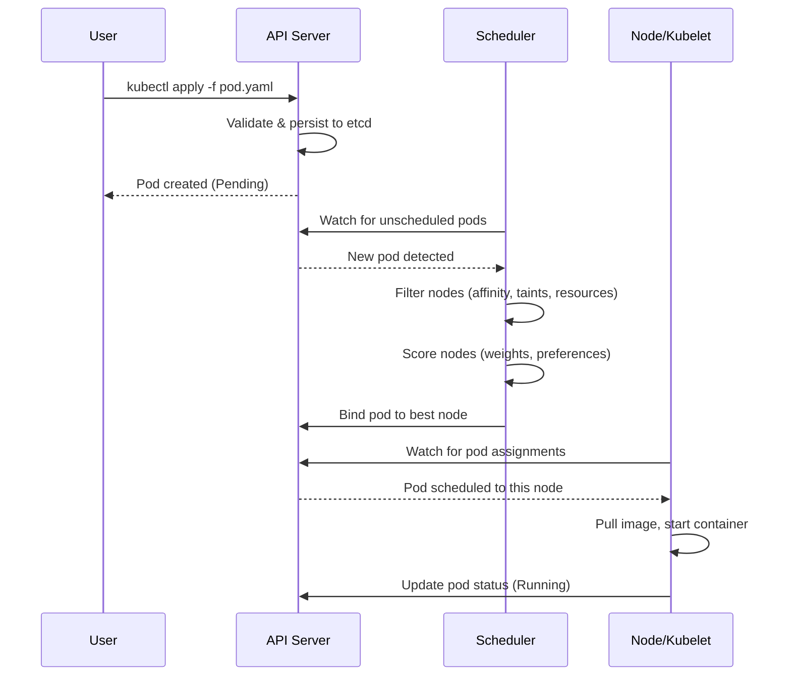
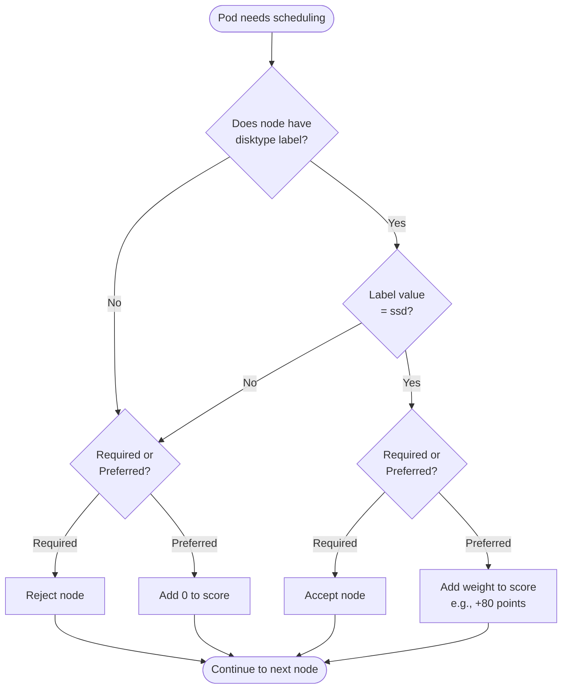
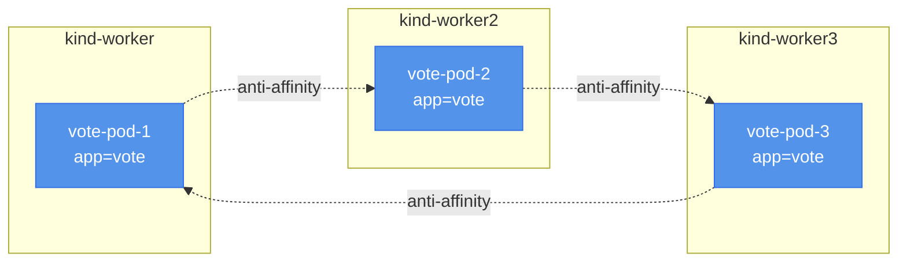

# Module 1: Advanced Pod Scheduling

## Overview

When you deployed the Voting App in Module 0, Kubernetes placed your pods wherever it found available resources. The scheduler picked nodes automatically, and you had no control over the placement decisions. For a learning environment, that's fine. For production, it's risky.

Imagine your postgres database landing on a node with slow disk I/O. Query performance tanks. Or picture all three vote service replicas scheduled to the same node. When that node goes down for maintenance, your entire voting frontend becomes unavailable. These scenarios happen in production when you let the scheduler make all decisions without guidance.

Advanced pod scheduling gives you control. You can place databases on fast storage, spread frontend replicas across availability zones, and dedicate specific nodes to resource-intensive workloads. This module teaches you three scheduling mechanisms: node affinity (attracting pods to specific nodes), pod affinity and anti-affinity (controlling pod co-location), and taints and tolerations (repelling pods from nodes unless explicitly allowed).

## How the Scheduler Works

The Kubernetes scheduler assigns pods to nodes in two phases: filtering and scoring.

In the **filtering phase**, the scheduler eliminates nodes that cannot run the pod. A node fails filtering if it lacks sufficient CPU or memory, has a taint the pod doesn't tolerate, or doesn't match required affinity rules. Only nodes that pass all hard requirements move to the scoring phase.

In the **scoring phase**, the scheduler assigns each remaining node a score based on preferences. Nodes with more available resources score higher. Nodes matching preferred affinity rules get bonus points (weights from 1-100). The scheduler totals the scores and picks the highest-scoring node.



One critical detail: scheduling happens once. The phrase "IgnoredDuringExecution" appears throughout scheduling APIs. It means once a pod lands on a node, it stays there even if conditions change. If you add a new node with faster storage after postgres is already running, the scheduler won't move the postgres pod. Scheduling is a one-time decision, not continuous optimization.

## Node Affinity

Node affinity attracts pods to nodes based on node labels. It replaces the older `nodeSelector` field with a more expressive syntax that supports operators and weights.

There are two types of node affinity:

**requiredDuringSchedulingIgnoredDuringExecution** creates hard requirements. The pod will NOT schedule unless a node matches. Use this when placement is mandatory, like placing databases on SSD nodes.

**preferredDuringSchedulingIgnoredDuringExecution** creates soft preferences with weights (1-100). The scheduler tries to honor these preferences but will place the pod elsewhere if necessary. Use this when you have a preference but can tolerate exceptions.

Here's how you would configure postgres to require SSD nodes:

```yaml title="postgres-deployment.yaml"
apiVersion: apps/v1
kind: Deployment
metadata:
  name: postgres
spec:
  replicas: 1
  selector:
    matchLabels:
      app: postgres
  template:
    metadata:
      labels:
        app: postgres
    spec:
      affinity:
        nodeAffinity:
          # REQUIRED: Must schedule on nodes with SSD
          requiredDuringSchedulingIgnoredDuringExecution:
            nodeSelectorTerms:
            - matchExpressions:
              - key: disktype
                operator: In
                values:
                - ssd
      containers:
      - name: postgres
        image: postgres:15-alpine
        env:
        - name: POSTGRES_PASSWORD
          value: "postgres"
```

The `matchExpressions` field supports several operators:

- **In**: Label value must be in the list
- **NotIn**: Label value must not be in the list
- **Exists**: Label key must exist (value doesn't matter)
- **DoesNotExist**: Label key must not exist
- **Gt**: Label value must be greater than (numeric comparison)
- **Lt**: Label value must be less than (numeric comparison)



:::tip[Always Verify Labels First]
The most common scheduling mistake is writing affinity rules for labels that don't exist. Always run `kubectl get nodes --show-labels` before writing affinity rules. If the label isn't there, your pod stays Pending forever.
:::

You can combine multiple preferences with different weights. For example, you might prefer SSD nodes (weight 80) but also prefer nodes in the us-west-1 zone (weight 50). A node with both labels scores 130 points. A node with just SSD scores 80. The scheduler picks the highest total.

## Pod Affinity and Anti-Affinity

While node affinity controls pod-to-node relationships, pod affinity controls pod-to-pod relationships. Pod affinity attracts pods to nodes where certain other pods are already running. Pod anti-affinity repels pods from nodes where certain other pods are running.

The most common use case for pod anti-affinity is spreading replicas for high availability. You don't want all vote replicas on the same node because if that node crashes, your entire frontend goes down.

Here's how to configure pod anti-affinity for the vote service:

```yaml title="vote-deployment.yaml"
apiVersion: apps/v1
kind: Deployment
metadata:
  name: vote
spec:
  replicas: 3
  selector:
    matchLabels:
      app: vote
  template:
    metadata:
      labels:
        app: vote
    spec:
      affinity:
        podAntiAffinity:
          # PREFERRED: Try to spread replicas across different nodes
          preferredDuringSchedulingIgnoredDuringExecution:
          - weight: 100
            podAffinityTerm:
              labelSelector:
                matchExpressions:
                - key: app
                  operator: In
                  values:
                  - vote
              # Spread across different nodes
              topologyKey: kubernetes.io/hostname
      containers:
      - name: vote
        image: schoolofdevops/vote:v1
        ports:
        - containerPort: 80
```

The `topologyKey` is crucial. It defines the boundary for spreading. Common topology keys:

- **kubernetes.io/hostname**: Spread across different nodes
- **topology.kubernetes.io/zone**: Spread across different availability zones
- **topology.kubernetes.io/region**: Spread across different cloud regions

With `topologyKey: kubernetes.io/hostname`, the anti-affinity rule means "avoid nodes where another pod with label app=vote is already running." The scheduler tries to put each vote replica on a different node.



Pod affinity (without the "anti") does the opposite. You might use it to co-locate a worker pod with redis for lower latency. If worker processes votes from a redis queue, placing them on the same node reduces network hops.

The syntax is identical to anti-affinity, just using `podAffinity` instead of `podAntiAffinity`:

```yaml
podAffinity:
  preferredDuringSchedulingIgnoredDuringExecution:
  - weight: 80
    podAffinityTerm:
      labelSelector:
        matchLabels:
          app: redis
      topologyKey: kubernetes.io/hostname
```

## Taints and Tolerations

Taints and tolerations work together to repel pods from nodes. A taint is like a "No Trespassing" sign on a node. A toleration is the key that allows specific pods to ignore the sign.

Think of it this way: node affinity is a magnet that attracts pods. Taints are a force field that repels them. The key distinction is direction. Affinity rules live in pod specs and pull pods toward nodes. Taints live on nodes and push pods away.

You apply taints to nodes using kubectl:

```bash
kubectl taint nodes kind-worker dedicated=database:NoSchedule
```

This taint has three parts:

- **Key**: `dedicated`
- **Value**: `database`
- **Effect**: `NoSchedule`

The effect determines what happens to pods without a matching toleration:

**NoSchedule**: New pods cannot schedule on this node unless they tolerate the taint. Existing pods continue running.

**PreferNoSchedule**: Kubernetes tries to avoid scheduling pods here but will do so if no other options exist. This is a soft version of NoSchedule.

**NoExecute**: New pods cannot schedule, and existing pods without tolerations are evicted. This is the most aggressive effect.

To allow postgres to run on the tainted node, add a toleration to the pod spec:

```yaml
spec:
  tolerations:
  - key: dedicated
    operator: Equal
    value: database
    effect: NoSchedule
  containers:
  - name: postgres
    image: postgres:15-alpine
```

The toleration matches the taint. Now postgres pods can schedule on kind-worker even though it's tainted.

:::caution[Critical Misconception]
A toleration alone does NOT guarantee the pod will schedule on the tainted node. Tolerations only grant permission. Without node affinity, a pod with a toleration might still land on an untainted node.

Think of it this way: having a key to a building doesn't mean you MUST go there. It just means you CAN go there if you choose.
:::

To dedicate a node to databases, you need THREE things:

1. **Taint the node** (keep other pods off)
2. **Add toleration to database pods** (grant permission)
3. **Add node affinity to database pods** (attract them there)

Here's the complete pattern:

```bash
# Step 1: Taint the node
kubectl taint nodes kind-worker dedicated=database:NoSchedule

# Step 2: Label the node
kubectl label nodes kind-worker workload=database
```

```yaml
# Step 3: Configure postgres deployment
spec:
  tolerations:
  - key: dedicated
    operator: Equal
    value: database
    effect: NoSchedule
  affinity:
    nodeAffinity:
      preferredDuringSchedulingIgnoredDuringExecution:
      - weight: 100
        preference:
          matchExpressions:
          - key: workload
            operator: In
            values:
            - database
  containers:
  - name: postgres
    image: postgres:15-alpine
```

Now kind-worker is effectively dedicated to databases. Other pods can't schedule there (blocked by the taint). Postgres pods prefer to go there (attracted by affinity) and are allowed (toleration grants permission).

## Combining Strategies

Real-world scheduling usually combines multiple strategies. Let's walk through a complete example for the Voting App.

**Requirement**: Place postgres on SSD nodes that are dedicated to databases. Spread vote replicas across different nodes for high availability. Allow worker pods to co-locate with redis for low latency.

**Solution**:

```bash
# Label one node as having SSD storage
kubectl label nodes kind-worker disktype=ssd

# Taint it to dedicate it to databases
kubectl taint nodes kind-worker dedicated=database:NoSchedule
```

Postgres configuration:

```yaml
apiVersion: apps/v1
kind: Deployment
metadata:
  name: postgres
spec:
  template:
    spec:
      tolerations:
      - key: dedicated
        value: database
        effect: NoSchedule
      affinity:
        nodeAffinity:
          requiredDuringSchedulingIgnoredDuringExecution:
            nodeSelectorTerms:
            - matchExpressions:
              - key: disktype
                operator: In
                values:
                - ssd
```

Vote configuration:

```yaml
apiVersion: apps/v1
kind: Deployment
metadata:
  name: vote
spec:
  replicas: 3
  template:
    spec:
      affinity:
        podAntiAffinity:
          preferredDuringSchedulingIgnoredDuringExecution:
          - weight: 100
            podAffinityTerm:
              labelSelector:
                matchLabels:
                  app: vote
              topologyKey: kubernetes.io/hostname
```

Worker configuration:

```yaml
apiVersion: apps/v1
kind: Deployment
metadata:
  name: worker
spec:
  template:
    spec:
      affinity:
        podAffinity:
          preferredDuringSchedulingIgnoredDuringExecution:
          - weight: 80
            podAffinityTerm:
              labelSelector:
                matchLabels:
                  app: redis
              topologyKey: kubernetes.io/hostname
```

This configuration ensures:

- Postgres runs on the SSD node (required)
- No other pods compete with postgres (taint)
- Vote replicas spread across nodes (anti-affinity)
- Worker pods prefer to co-locate with redis (affinity)

## Summary

Key takeaways from this module:

- **The scheduler filters then scores nodes** - hard requirements eliminate candidates, preferences add weights
- **Node affinity attracts pods to specific nodes** based on node labels, with required (hard) and preferred (soft) rules
- **Pod anti-affinity spreads replicas** across topology domains (nodes, zones, regions) for high availability
- **Taints repel pods from nodes** - they don't attract, they push away - combine with affinity for dedicated nodes
- **Production deployments combine strategies** - node affinity for hardware requirements, anti-affinity for HA, taints for isolation

## Further Reading

- [Kubernetes Official Docs: Assigning Pods to Nodes](https://kubernetes.io/docs/concepts/scheduling-eviction/assign-pod-node/)
- [Kubernetes API Reference: Affinity](https://kubernetes.io/docs/reference/kubernetes-api/workload-resources/pod-v1/#scheduling)
- [Kubernetes Official Docs: Taints and Tolerations](https://kubernetes.io/docs/concepts/scheduling-eviction/taint-and-toleration/)
- [School of DevOps: Advanced Pod Scheduling Lab](https://kubernetes-tutorial.schoolofdevops.com/advanced_pod_scheduling/)

:::info[Next Steps]
Time to apply these scheduling strategies to your Voting App in the lab. You'll label nodes, configure affinity rules, and use taints to create dedicated database nodes.
:::
