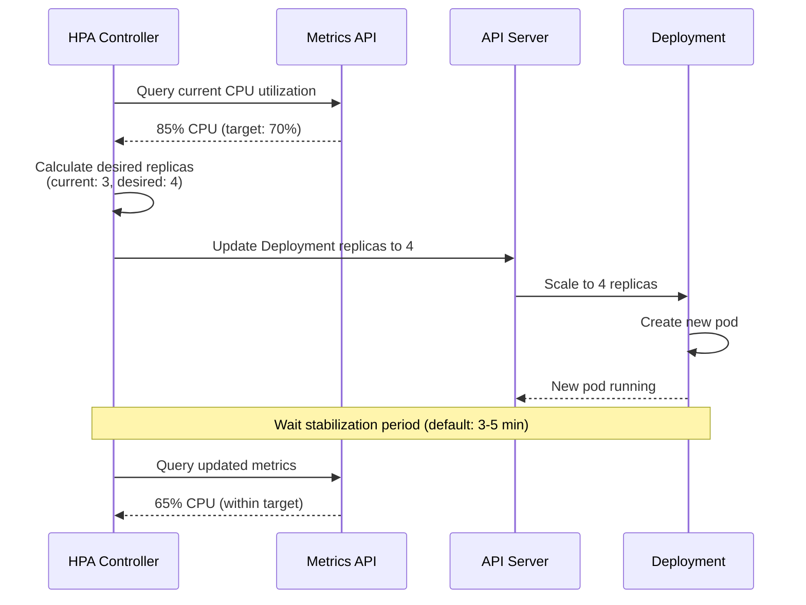
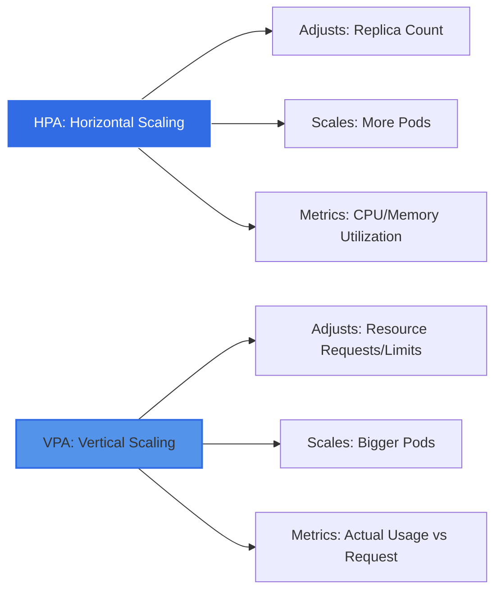
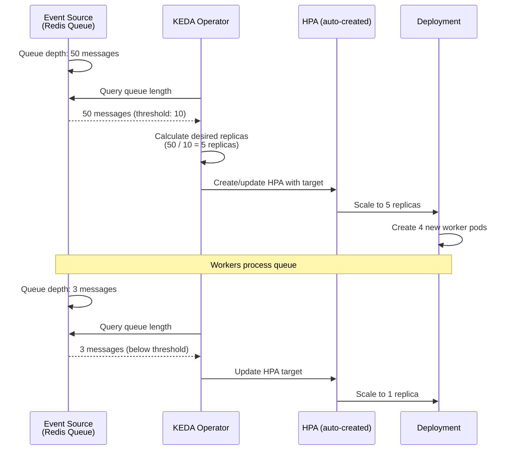

# Module 2: Autoscaling

## Overview

Static replicas create problems for real-world applications. Your Voting App runs fine with one replica per service during normal traffic. But what happens when a marketing campaign drives thousands of concurrent users? The single vote pod becomes overwhelmed, response times spike, and users abandon the app.

Manual scaling with `kubectl scale deployment vote --replicas=10` solves the immediate problem, but it is reactive. You have to notice the issue, decide on the right replica count, and execute the command. By the time you act, users have already suffered. Even worse, you have to remember to scale back down when traffic subsides, or you waste cluster resources.

Autoscaling makes the app self-adjusting. Kubernetes watches metrics, compares them to targets you define, and automatically adjusts replicas or resource allocations. Your Voting App becomes resilient to traffic spikes without manual intervention.

## Horizontal Pod Autoscaling (HPA)

### What HPA Does

The Horizontal Pod Autoscaler watches resource metrics for your Deployments and adjusts replica counts automatically. When CPU utilization exceeds your target, HPA adds replicas. When utilization drops, HPA removes replicas. This keeps your application responsive while minimizing resource waste.

HPA operates in a continuous loop:

1. Check current metrics via the Metrics API
2. Calculate desired replica count based on target utilization
3. Update the Deployment's replica count via the API Server
4. Wait for a stabilization period
5. Repeat



### The autoscaling/v2 API

Kubernetes introduced the autoscaling/v2 API to support more than just CPU metrics. You can now scale based on:

- **Resource metrics**: CPU and memory utilization
- **Custom metrics**: Application-specific metrics from your pods (e.g., request queue length, cache hit rate)
- **External metrics**: Metrics from outside the cluster (e.g., cloud provider queue length, CDN traffic)

The v2 API also adds behavior configuration, giving you fine-grained control over scaling policies.

### Key Configuration

An HPA resource requires:

- **scaleTargetRef**: Which Deployment to scale
- **minReplicas**: Minimum replica count (prevents scaling to zero)
- **maxReplicas**: Maximum replica count (prevents runaway scaling)
- **metrics**: What to measure and target value
- **behavior** (optional): Stabilization windows and scaling policies

Here is an example HPA for the vote service:

```yaml
apiVersion: autoscaling/v2
kind: HorizontalPodAutoscaler
metadata:
  name: vote-hpa
spec:
  scaleTargetRef:
    apiVersion: apps/v1
    kind: Deployment
    name: vote
  minReplicas: 2
  maxReplicas: 10
  metrics:
  - type: Resource
    resource:
      name: cpu
      target:
        type: Utilization
        averageUtilization: 70  # Scale when CPU > 70%
  behavior:
    scaleDown:
      stabilizationWindowSeconds: 300  # Wait 5 min before scaling down
      policies:
      - type: Percent
        value: 50  # Scale down max 50% of pods at once
        periodSeconds: 60
    scaleUp:
      stabilizationWindowSeconds: 0  # Scale up immediately
      policies:
      - type: Percent
        value: 100  # Can double pods if needed
        periodSeconds: 30
      - type: Pods
        value: 2  # Add max 2 pods per 30s
        periodSeconds: 30
      selectPolicy: Max  # Use policy that adds more pods
```

### Stabilization Windows: Scale Up Fast, Scale Down Slow

The behavior section prevents flapping (rapid scale up and down cycles). Imagine CPU spikes to 90%, HPA adds replicas, CPU drops to 50%, HPA removes replicas, CPU spikes again. This wastes resources and creates instability.

Stabilization windows solve this:

- **scaleUp stabilizationWindowSeconds: 0** means scale up immediately when the target is exceeded. Response times matter, so you want fast scale-up.
- **scaleDown stabilizationWindowSeconds: 300** means wait 5 minutes before scaling down. This prevents removing pods during temporary traffic dips.

The policies control how aggressively HPA scales. In the example above, scale-up can double the pod count (100% increase) or add 2 pods, whichever is more. Scale-down removes at most 50% of pods per minute, preventing sudden capacity loss.

:::tip[Best Practice]
Always set resource requests on pods using HPA. Without requests, HPA cannot calculate utilization percentage. If your pod has no CPU request, HPA has no baseline to compare against, and scaling will not work.
:::

## Metrics Server: The Missing Piece

HPA absolutely requires the Metrics API to function. The Metrics API provides real-time resource usage data (CPU and memory) for nodes and pods. Kubernetes does not include a Metrics API implementation by default in most distributions. You must install Metrics Server.

### What Metrics Server Provides

Metrics Server is a cluster-wide aggregator of resource usage data. It collects metrics from the kubelet on each node and exposes them via the Metrics API. This enables:

- `kubectl top nodes` and `kubectl top pods` commands
- HPA to calculate current resource utilization
- VPA to gather usage data for recommendations

### Why It Is Not Installed by Default in KIND

KIND (Kubernetes IN Docker) is a minimal Kubernetes distribution for local development and testing. It omits optional components like Metrics Server to keep the installation lightweight. You must install Metrics Server manually for HPA labs.

### How HPA Uses Metrics Server

HPA calculates utilization as a percentage:

```
Utilization = (Current Usage / Resource Request) × 100
```

For example, if a pod requests 100m CPU and currently uses 80m CPU, utilization is 80%. If your HPA target is 70%, HPA will add replicas to bring utilization back below the target.

This formula explains why resource requests are mandatory for HPA. Without a request, there is no denominator, and the utilization percentage is undefined.

:::caution[Critical Dependency]
HPA absolutely requires Metrics Server. No Metrics Server means no scaling. If you create an HPA without Metrics Server installed, `kubectl get hpa` will show TARGETS as `<unknown>`, and scaling will never occur. Always verify Metrics Server is running before creating HPA resources.
:::

## Vertical Pod Autoscaler (VPA)

### What VPA Does

While HPA adjusts the number of replicas, VPA adjusts the resource requests and limits on individual pods. If your worker pod requests 100m CPU but consistently uses 300m CPU, VPA can increase the request to 300m. This prevents resource starvation and improves scheduling decisions.

VPA operates in three modes:

- **Off**: VPA generates recommendations but does not apply them. You review the recommendations and update your Deployment manually. This is the safest mode for production.
- **Initial**: VPA sets resource requests when a pod is first created. It does not modify running pods. Useful for new deployments where you have no usage history.
- **Auto**: VPA modifies resource requests on running pods. This requires evicting and recreating the pod, which causes downtime. Use with caution for stateful workloads.



### The HPA/VPA Conflict: A Critical Pitfall

:::danger[Never Run HPA and VPA Together on the Same Resource]
Running HPA and VPA on the same Deployment for the same resource metric (CPU or memory) causes thrashing. Here is why:

1. VPA observes the pod uses 150m CPU but requests only 100m CPU
2. VPA increases the request to 150m CPU and recreates the pod
3. HPA calculates utilization: 150m usage / 150m request = 100% (was 150%)
4. HPA thinks utilization dropped and scales down replicas
5. Now fewer pods handle the same load, so CPU usage per pod increases
6. VPA sees high usage again and increases requests further
7. This cycle repeats, causing instability

The problem is that HPA uses the request as the baseline for utilization. When VPA changes the request, HPA's utilization calculation jumps even though actual usage is constant.
:::

### Practical Pattern: VPA Recommendations + HPA Scaling

Use VPA in Off mode to gather recommendations. Review the recommended resource requests, update your Deployment manually, and then apply HPA for scaling. This gives you right-sized pods with dynamic replica counts.

Example workflow:

1. Deploy the worker with initial resource requests (e.g., 100m CPU)
2. Create a VPA in Off mode targeting the worker
3. Run the app under realistic load for several days
4. Check VPA recommendations: `kubectl describe vpa worker-vpa`
5. Update the worker Deployment with recommended requests
6. Create HPA for horizontal scaling based on the new requests

## Event-Driven Scaling with KEDA

HPA scales based on resource metrics like CPU and memory. But what if your workload depends on external events? The worker service in the Voting App consumes votes from a Redis queue. CPU usage is a poor proxy for actual work. If the queue has 10,000 votes but the worker is idle (waiting for Redis), HPA will not scale up.

KEDA (Kubernetes Event-Driven Autoscaling) solves this by scaling based on event sources. For the worker, KEDA can scale based on Redis queue depth. If the queue has more than 10 messages, KEDA adds worker replicas. If the queue is empty, KEDA scales to zero.

### KEDA Workflow

KEDA is a CNCF graduated project with 65+ scalers for different event sources:

- Message queues (RabbitMQ, Kafka, Azure Queue, SQS)
- Databases (PostgreSQL, MySQL, Redis)
- Cloud services (AWS CloudWatch, GCP Pub/Sub)
- HTTP metrics (Prometheus queries, external APIs)
- Cron schedules (time-based scaling)



KEDA creates and manages HPA resources automatically. You define a ScaledObject that connects an event source to a Deployment. KEDA translates the event metric into an HPA target.

### ScaledObject Concept

A ScaledObject is the KEDA custom resource that defines scaling behavior:

```yaml
apiVersion: keda.sh/v1alpha1
kind: ScaledObject
metadata:
  name: worker-scaledobject
spec:
  scaleTargetRef:
    name: worker  # Target Deployment
  minReplicaCount: 1
  maxReplicaCount: 10
  triggers:
  - type: redis
    metadata:
      address: redis:6379
      listName: votes
      listLength: "5"  # Scale when queue > 5 messages
```

KEDA monitors the Redis list length. When it exceeds 5 messages, KEDA creates an HPA that scales the worker Deployment. KEDA handles the complexity of translating queue depth into replica count.

:::info[KEDA is a CNCF Graduated Project]
KEDA graduated from the Cloud Native Computing Foundation in 2024, indicating maturity and production readiness. It complements HPA rather than replacing it. HPA handles resource metrics, KEDA handles event metrics.
:::

## Choosing the Right Scaling Strategy

Different workloads require different scaling approaches:

| Workload Type | Scaling Strategy | Why |
|---------------|------------------|-----|
| Stateless web frontend (vote, result) | HPA with CPU/memory metrics | CPU usage correlates with request load. HPA scales replicas to handle more concurrent requests. |
| Queue consumer (worker) | KEDA with queue length | Worker scales based on actual work in the queue, not CPU. Can scale to zero when queue is empty. |
| Database (postgres, redis) | Manual scaling or VPA recommendations | Databases are stateful. Use VPA to right-size resources, then scale manually if needed. |
| Batch jobs | KEDA with cron trigger or job queue | Scale up before expected load (cron) or based on job queue depth. |
| API gateway | HPA with custom metrics (requests per second) | Use HPA with Prometheus metrics for request rate, not just CPU. |

**Decision guide:**

1. Does CPU/memory usage correlate with the work being done? Use HPA.
2. Does the workload depend on external events (queues, schedules)? Use KEDA.
3. Are resource requests wildly incorrect? Use VPA in Off mode to get recommendations, then apply HPA.
4. Is the workload stateful? Avoid autoscaling or use VPA in recommendation mode only.

## Summary

- HPA watches metrics and adjusts replica counts automatically based on target utilization
- Metrics Server provides the Metrics API required by HPA for CPU and memory data
- Stabilization windows prevent flapping by scaling up fast and scaling down slowly
- VPA adjusts resource requests and limits instead of replica count
- Never run HPA and VPA together on the same resource metric to avoid thrashing
- KEDA extends HPA with event-driven scaling for queue consumers and scheduled workloads
- Choose HPA for resource-based scaling, KEDA for event-driven scaling, and VPA for right-sizing

## Further Reading

- [Kubernetes HPA Documentation](https://kubernetes.io/docs/tasks/run-application/horizontal-pod-autoscale/)
- [Metrics Server Official Docs](https://github.com/kubernetes-sigs/metrics-server)
- [KEDA Documentation](https://keda.sh/docs/)
- [Vertical Pod Autoscaler GitHub](https://github.com/kubernetes/autoscaler/tree/master/vertical-pod-autoscaler)

:::info[Next Steps]
Time to make your Voting App auto-scale in the lab. You will install Metrics Server, configure HPA for vote and result services, generate load to trigger scaling, and set up KEDA for event-driven worker scaling.
:::
