# Gateway API

## Overview

You've deployed the Voting App with Services, scheduled pods intelligently with affinity rules, and autoscaled your workloads. But there's still a problem: how do users actually access your application? Port-forwarding is fine for development, and NodePort services work in testing, but production applications need real HTTP routing.

This is where traffic management APIs come in. For years, Kubernetes used the Ingress API to expose HTTP and HTTPS routes from outside the cluster to services inside. But Ingress had fundamental limitations - everything crammed into a single resource, controller-specific annotations scattered throughout your configs, and limited routing expressiveness.

Gateway API is the modern replacement. It provides explicit resource separation (GatewayClass, Gateway, HTTPRoute), role-oriented design (infrastructure providers, cluster operators, app developers each manage their own resources), and rich routing capabilities (path matching, header matching, traffic splitting, and more). In this module, you'll learn why Gateway API is replacing Ingress for new deployments and how to use it to route traffic to your Voting App.

## Why Gateway API Replaced Ingress

### Problems with Ingress

The Ingress API, introduced in Kubernetes 1.1, was revolutionary for its time. It provided a simple way to expose HTTP services without managing load balancers manually. But as Kubernetes matured and use cases became more complex, Ingress showed its age:

**Everything in one resource:** An Ingress resource mixes infrastructure concerns (which load balancer to use), operational concerns (which ports to listen on), and application concerns (which paths route to which services). This makes it hard to delegate responsibility - either one team controls everything, or everyone steps on each other's toes.

**Controller-specific annotations:** Want to configure CORS? Add `nginx.ingress.kubernetes.io/cors-allow-origin`. Using Traefik? That's `traefik.ingress.kubernetes.io/cors-allow-origin`. Different controller, different annotation. Your Ingress configs become tightly coupled to your controller implementation, breaking portability.

**Limited expressiveness:** Ingress can match on hosts and path prefixes. That's about it. Need header-based routing? Traffic splitting for canary deployments? Query parameter matching? You're writing controller-specific annotations again, if your controller even supports it.

### Gateway API Design Principles

Gateway API, which reached v1.0 GA in 2023, was designed from the ground up to address these limitations:

**Role-oriented resources:** Infrastructure providers install GatewayClasses (like "use AWS Load Balancer" or "use NGINX"). Cluster operators create Gateways (listen on port 80/443, accept HTTP traffic). Application developers create HTTPRoutes (route `/vote` to the vote service). Clean separation of concerns, clear ownership boundaries.

**Typed routing:** Instead of one generic Ingress resource, you have HTTPRoute for HTTP traffic, TLSRoute for TLS configuration, GRPCRoute for gRPC services, and TCPRoute for raw TCP. Each route type has fields specific to its protocol - no more shoehorning HTTP headers into YAML annotations.

**Portable configuration:** Gateway API is an API standard, not an implementation. Your HTTPRoutes work with any compliant controller - Contour, NGINX Gateway Fabric, Istio, Envoy Gateway. No vendor lock-in, no controller-specific annotations (well, mostly - advanced features may still need annotations, but the core is portable).

Here's how the two APIs compare visually:


:::info[Gateway API Timeline]
Gateway API reached v1.0 GA in October 2023 (Kubernetes 1.28). While Ingress is still supported and widely used, Gateway API is the recommended path for new deployments. Many organizations are actively migrating from Ingress to Gateway API for new projects.
:::

## The Gateway API Resource Model

Gateway API consists of three core resources, each with a distinct role and ownership model.

### GatewayClass

A GatewayClass defines the controller implementation - like StorageClass for storage, but for traffic management. It's created by the infrastructure provider (typically cluster admins or platform teams) and specifies which Gateway controller will process Gateway resources.

```yaml
apiVersion: gateway.networking.k8s.io/v1
kind: GatewayClass
metadata:
  name: contour
spec:
  controllerName: projectcontour.io/gateway-controller
```

When you install a Gateway controller like Contour or NGINX Gateway Fabric, it typically creates its own GatewayClass. You reference this GatewayClass when creating Gateways.

**Who manages it:** Infrastructure providers, platform teams

**What it defines:** Which controller implementation to use

### Gateway

A Gateway configures listeners - what ports are open, what protocols they accept, what hostnames they serve. It's managed by cluster operators (SREs, platform teams) and references a GatewayClass.

```yaml
apiVersion: gateway.networking.k8s.io/v1
kind: Gateway
metadata:
  name: production-gateway
  namespace: default
spec:
  gatewayClassName: contour
  listeners:
  - name: http
    protocol: HTTP
    port: 80
    allowedRoutes:
      namespaces:
        from: Same
```

This Gateway says: "I'm using the Contour controller (via GatewayClass), I'm listening on port 80 for HTTP traffic, and I'll accept HTTPRoutes from the same namespace."

**Who manages it:** Cluster operators, SRE teams

**What it defines:** Ports, protocols, hostnames, which routes can attach

### HTTPRoute

An HTTPRoute defines routing rules - match requests by path, headers, or query parameters, and send them to backend services. It's managed by application developers.

```yaml
apiVersion: gateway.networking.k8s.io/v1
kind: HTTPRoute
metadata:
  name: vote-route
  namespace: default
spec:
  parentRefs:
  - name: production-gateway
  hostnames:
  - "vote.example.com"
  rules:
  - matches:
    - path:
        type: PathPrefix
        value: /
    backendRefs:
    - name: vote
      port: 80
```

This HTTPRoute says: "Attach to production-gateway, handle requests for vote.example.com, match paths starting with /, and send traffic to the vote service on port 80."

**Who manages it:** Application developers, app teams

**What it defines:** Routing rules, backend services, traffic splitting

### Resource Hierarchy

Here's how these resources connect:

```mermaid
graph TD
    GC[GatewayClass<br/>Role: Infrastructure Provider<br/>Example: contour]
    GW[Gateway<br/>Role: Cluster Operator<br/>Example: production-gateway<br/>Listeners: HTTP:80, HTTPS:443]
    HR[HTTPRoute<br/>Role: App Developer<br/>Example: vote-route<br/>Rules: /vote → vote service]
    SVC[Service<br/>Example: vote]
    PODS[Pods<br/>Example: vote-xxxx]

    GC -->|referenced by| GW
    GW -->|parent of| HR
    HR -->|routes to| SVC
    SVC -->|selects| PODS

    classDef infra fill:#e1f5ff,stroke:#326ce5,stroke-width:2px
    classDef ops fill:#fff4e1,stroke:#ff9900,stroke-width:2px
    classDef dev fill:#e8f5e9,stroke:#4caf50,stroke-width:2px
    class GC infra
    class GW ops
    class HR,SVC,PODS dev
```



This separation is Gateway API's superpower. Platform teams manage the Gateway (what ports are open, security policies), but app teams manage HTTPRoutes (where their traffic goes). No coordination needed for every routing change.

## HTTPRoute Routing Rules

HTTPRoutes are where the routing magic happens. You define matches (what requests should use this rule) and backend references (where to send them).

### Path Matching

The most common match type is path matching:

```yaml
rules:
- matches:
  - path:
      type: PathPrefix
      value: /vote
  backendRefs:
  - name: vote
    port: 80
- matches:
  - path:
      type: PathPrefix
      value: /result
  backendRefs:
  - name: result
    port: 80
```

This routes `/vote` requests to the vote service and `/result` requests to the result service. **PathPrefix** matches any path that starts with the value - `/vote`, `/vote/`, `/vote/cats` all match.

For exact matches, use **Exact**:

```yaml
- matches:
  - path:
      type: Exact
      value: /healthz
  backendRefs:
  - name: health-check-service
    port: 80
```

This only matches `/healthz` - not `/healthz/` or `/healthz/ready`.

### Header Matching

You can route based on HTTP headers:

```yaml
- matches:
  - headers:
    - name: X-Canary
      value: "true"
  backendRefs:
  - name: vote-canary
    port: 80
- matches:
  - path:
      type: PathPrefix
      value: /
  backendRefs:
  - name: vote
    port: 80
```

Requests with the `X-Canary: true` header go to vote-canary. All other requests go to the stable vote service. This enables header-based canary deployments - give your testers a browser extension that sets the header, and they see the canary version while normal users see stable.

### Backend References and Weights

Each backend reference specifies a service name, port, and optional weight:

```yaml
backendRefs:
- name: vote-v1
  port: 80
  weight: 90
- name: vote-v2
  port: 80
  weight: 10
```

This sends 90% of traffic to vote-v1 and 10% to vote-v2. Weights are relative - `weight: 9` and `weight: 1` would have the same effect as 90/10.

Traffic splitting enables canary deployments and blue-green migrations. Start with 95/5, monitor error rates and latency, gradually shift to 50/50, then 0/100.

### HTTPRoute Matching Logic

When a request arrives, the Gateway evaluates it like this:


Rules are evaluated in order. The first rule that matches all conditions (hostname, path, headers) wins. If a rule matches but has multiple backends with weights, the Gateway randomly selects one backend based on the weight distribution.

## Namespace Considerations

Gateway API enforces namespace boundaries to prevent security issues. An HTTPRoute can only reference a Gateway in the same namespace - unless explicitly allowed.

**Same namespace (works by default):**
```yaml
# In namespace: default
apiVersion: gateway.networking.k8s.io/v1
kind: Gateway
metadata:
  name: shared-gateway
  namespace: default
---
# In namespace: default
apiVersion: gateway.networking.k8s.io/v1
kind: HTTPRoute
metadata:
  name: vote-route
  namespace: default
spec:
  parentRefs:
  - name: shared-gateway  # Same namespace, no problem
```

**Cross-namespace (blocked by default):**
```yaml
# In namespace: team-a
apiVersion: gateway.networking.k8s.io/v1
kind: HTTPRoute
metadata:
  name: vote-route
  namespace: team-a
spec:
  parentRefs:
  - name: shared-gateway
    namespace: default  # Different namespace, blocked!
```

This HTTPRoute won't attach. You'll see `Accepted: False` in the route status with an error about namespace mismatch.

To allow cross-namespace references, the Gateway's namespace needs a **ReferenceGrant**:

```yaml
# In namespace: default (where Gateway lives)
apiVersion: gateway.networking.k8s.io/v1beta1
kind: ReferenceGrant
metadata:
  name: allow-team-a-routes
  namespace: default
spec:
  from:
  - group: gateway.networking.k8s.io
    kind: HTTPRoute
    namespace: team-a
  to:
  - group: gateway.networking.k8s.io
    kind: Gateway
```

Now team-a's HTTPRoutes can reference the Gateway in default. ReferenceGrants enable platform teams to manage shared Gateways while allowing app teams in different namespaces to create routes.

:::caution[Namespace Debugging]
If your HTTPRoute doesn't attach to a Gateway, check namespaces first. Run `kubectl describe httproute <name>` and look for "ResolvedRefs: False" errors. Nine times out of ten, it's a namespace mismatch or missing ReferenceGrant.
:::

## Gateway Controller Implementations

Gateway API is a specification, not an implementation. You need a Gateway controller to actually process Gateway and HTTPRoute resources and route traffic. Think of Gateway API like the SQL standard - the API defines what you can do, but you need a database (or in this case, a controller) to actually execute it.

**Popular implementations:**

- **Contour** - CNCF project by VMware, lightweight, excellent Gateway API support, easy to install. Great choice for getting started with Gateway API or for straightforward ingress needs. Installs quickly in KIND, production-ready for AWS/GCP/Azure.

- **NGINX Gateway Fabric** - NGINX's purpose-built Gateway API implementation (distinct from the older NGINX Ingress Controller). Leverages NGINX's battle-tested reverse proxy capabilities with Gateway API's modern resource model. Good choice if you're already invested in NGINX ecosystem.

- **Istio** - Full-featured service mesh that also implements Gateway API for ingress traffic. If you need service mesh capabilities (mTLS between services, advanced observability, circuit breakers), Istio provides Gateway API as part of a broader platform. More complex than standalone controllers.

- **Envoy Gateway** - Official Gateway API implementation built on Envoy proxy. Backed by the Envoy project (used by Istio, Contour, and many others under the hood). Good for organizations standardizing on Envoy.

- **Cilium** - eBPF-based networking and security platform that includes Gateway API support. Provides additional network policy and observability features beyond basic routing. Excellent choice for performance-critical workloads.

This course uses **Contour** because it's straightforward to install, well-documented, and focuses purely on Gateway API (no legacy Ingress baggage). Installation is a single YAML apply, it works great in KIND clusters, and the concepts you learn transfer directly to other implementations.

:::tip[Controller Portability]
The beauty of Gateway API is portability. Your HTTPRoutes and Gateways work with any compliant controller. Start with Contour locally, deploy with NGINX Gateway Fabric in staging, run Istio in production - the core routing configs stay the same. This is a huge improvement over Ingress's controller-specific annotations.
:::

### Choosing a Controller

How do you pick a Gateway controller for production? Consider:

**Complexity vs features:** Standalone controllers like Contour and NGINX Gateway Fabric are simpler to operate. Service meshes like Istio provide more features (mTLS, retries, circuit breakers) but add operational complexity. Start simple unless you specifically need mesh features.

**Cloud integration:** If you're on AWS, controllers that integrate with AWS Load Balancer Controller may provide better cloud integration. GCP and Azure have similar considerations. Check your cloud provider's recommendations.

**Team expertise:** Already running NGINX? NGINX Gateway Fabric has a shallower learning curve. Already running Envoy? Envoy Gateway or Contour (both use Envoy) make sense. Leverage what your team knows.

**Performance requirements:** Most controllers perform well for typical workloads. Cilium's eBPF approach provides lower latency and higher throughput for very high-traffic scenarios. Benchmark if performance is critical.

The good news: you're not locked in. Gateway API's portability means you can migrate between controllers by changing GatewayClasses and redeploying Gateways. Your HTTPRoutes stay the same.

## Migrating from Ingress to Gateway API

If you have existing applications using Ingress, migrating to Gateway API follows a predictable pattern. Gateway API was designed with migration in mind - the concepts map cleanly even if the resources look different.

**Ingress to Gateway translation:**

An Ingress resource like this:

```yaml
apiVersion: networking.k8s.io/v1
kind: Ingress
metadata:
  name: voting-app-ingress
  annotations:
    nginx.ingress.kubernetes.io/rewrite-target: /
spec:
  rules:
  - host: vote.example.com
    http:
      paths:
      - path: /
        pathType: Prefix
        backend:
          service:
            name: vote
            port:
              number: 80
```

Becomes a Gateway and HTTPRoute:

```yaml
apiVersion: gateway.networking.k8s.io/v1
kind: Gateway
metadata:
  name: production-gateway
spec:
  gatewayClassName: contour
  listeners:
  - name: http
    protocol: HTTP
    port: 80
---
apiVersion: gateway.networking.k8s.io/v1
kind: HTTPRoute
metadata:
  name: vote-route
spec:
  parentRefs:
  - name: production-gateway
  hostnames:
  - "vote.example.com"
  rules:
  - matches:
    - path:
        type: PathPrefix
        value: /
    backendRefs:
    - name: vote
      port: 80
```

**Key differences:**

1. **Resource separation** - One Ingress becomes one Gateway (infrastructure config) and one or more HTTPRoutes (application routing). This enables better separation of concerns.

2. **No rewrite annotations** - The `nginx.ingress.kubernetes.io/rewrite-target` annotation becomes a standard `filters` field on HTTPRoute (not shown above, but available when needed). No controller-specific syntax.

3. **Explicit controller selection** - Instead of an `ingressClassName`, you reference a `gatewayClassName`. Same concept, clearer naming.

**Migration strategy:**

- **Phase 1:** Install Gateway controller alongside existing Ingress controller. Both can run simultaneously.
- **Phase 2:** Create Gateway resources (one per environment or shared across apps, depending on your architecture).
- **Phase 3:** Migrate one application at a time - create HTTPRoutes, test, then delete old Ingress resources.
- **Phase 4:** Once all apps migrated, remove old Ingress controller.

This gradual migration minimizes risk. You can even route some traffic through Ingress and some through Gateway API during the transition.

## Summary

Gateway API is Kubernetes' modern traffic management solution:

- **Role-oriented design** - GatewayClass for infrastructure providers, Gateway for cluster operators, HTTPRoute for app developers. Clean separation of concerns.
- **Rich routing capabilities** - Path matching (Prefix and Exact), header matching, query parameters, traffic splitting with weights. No vendor-specific annotations for common use cases.
- **Namespace-aware security** - HTTPRoutes reference Gateways in the same namespace by default. ReferenceGrants enable controlled cross-namespace access.
- **Controller portability** - Gateway API is a standard. Your configs work across Contour, NGINX, Istio, and other implementations.
- **Future of Kubernetes networking** - GA since v1.0 (2023), actively developed, recommended for new deployments over Ingress.

## Further Reading

- [Gateway API Official Documentation](https://gateway.networking.k8s.io/) - Concepts, guides, API reference
- [Gateway API Migration Guide](https://gateway.networking.k8s.io/guides/migrating-from-ingress/) - Moving from Ingress to Gateway API
- [Contour Gateway API Guide](https://projectcontour.io/docs/main/guides/gateway-api/) - Contour-specific implementation details
- [Gateway API Use Cases](https://gateway.networking.k8s.io/guides/) - Real-world routing patterns

:::info[Next Steps]
You've learned the Gateway API resource model and routing concepts. Time to route traffic to your Voting App using Gateway API in the lab. You'll install Contour, create Gateways and HTTPRoutes, implement path-based routing, and experiment with traffic splitting for canary deployments.
:::
