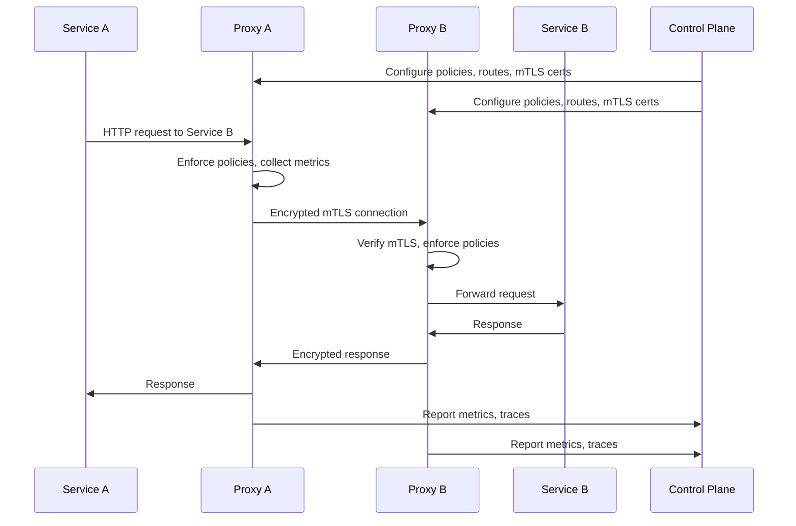
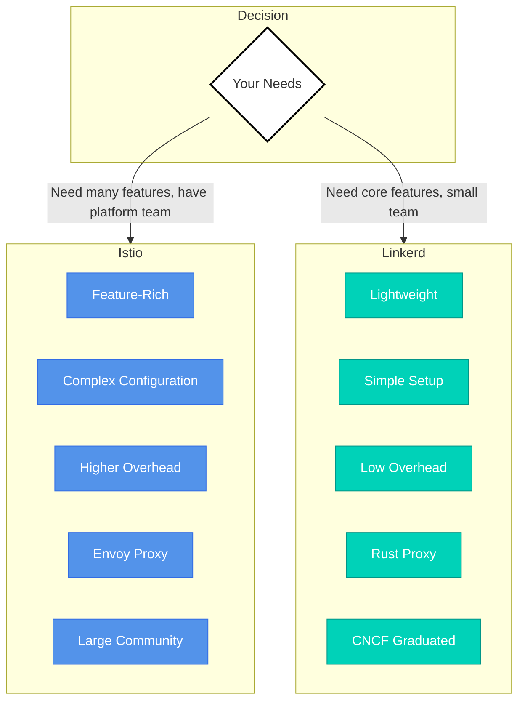
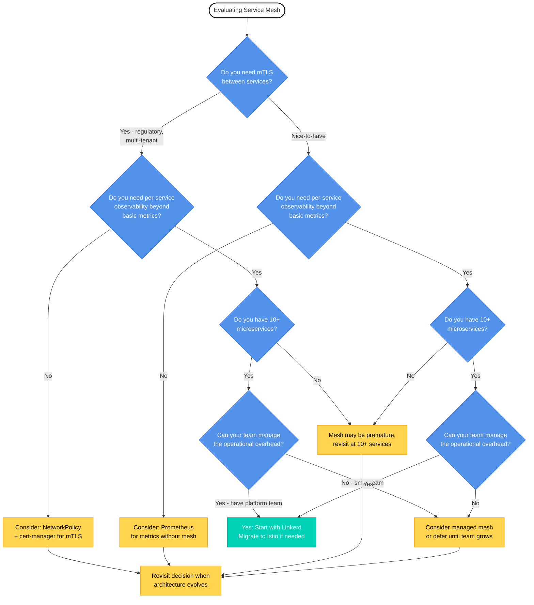

# Service Mesh: When to Adopt

## Overview

Every production team eventually asks: "Do we need a service mesh?" The answer is nuanced - it depends on your scale, security requirements, and operational maturity. This module helps you make that decision for the Voting App and future projects.

Service mesh is powerful infrastructure. It provides mTLS encryption between services, deep observability into service-to-service communication, and advanced traffic management like retries and circuit breaking. But it also adds complexity: sidecar proxies consuming resources, new configuration models to learn, and additional operational overhead.

The key is knowing when the benefits outweigh the costs. Adding a service mesh to a team of 3 managing 5 services is like hiring a personal assistant to manage your grocery list. It works, but the overhead exceeds the benefit. This module builds your judgment about when service mesh is the right choice.

## What is a Service Mesh?

A service mesh is a dedicated infrastructure layer for managing service-to-service communication. Instead of services talking directly to each other, they communicate through lightweight proxy containers deployed alongside every application container.

**The Sidecar Pattern:**

Every pod gets two containers: your application container and a proxy sidecar. The proxy intercepts all inbound and outbound traffic, enforcing policies, collecting metrics, and managing connections. Your application code doesn't change - it still makes normal HTTP requests. The proxy handles the complexity transparently.



**What a Service Mesh Provides:**

1. **mTLS (Mutual TLS Encryption):** Automatic encryption of all service-to-service traffic with certificate rotation. Services authenticate each other cryptographically, preventing man-in-the-middle attacks and eavesdropping.

2. **Observability:** Per-service metrics (request rate, success rate, latency percentiles), distributed tracing across service boundaries, and detailed access logs. You can see exactly how services communicate without instrumenting application code.

3. **Traffic Management:** Automatic retries for failed requests, timeouts to prevent cascade failures, circuit breaking to isolate unhealthy services, and load balancing algorithms (round-robin, least-request, etc.).

4. **Authorization Policies:** Fine-grained access control between services. For example: "Only the vote service can write to redis" or "Only the worker can read from redis and write to postgres."

**Analogy:**

Think of a service mesh like a phone network. Without it, services yell across the room using plain HTTP - everyone can hear, and communication is unreliable. With a service mesh, services have private lines with encryption (mTLS), call logs showing who talked to whom (observability), and automatic redialing if calls drop (retries). The phone network (control plane) manages all the infrastructure, so services just pick up the phone and talk.

## Istio vs Linkerd

The two most popular service meshes are Istio and Linkerd. Both provide the core service mesh capabilities, but they differ significantly in complexity, resource usage, and learning curve.

**Istio: The Swiss Army Knife**

Istio is feature-rich and highly configurable. It uses Envoy proxy (written in C++) as the sidecar and provides extensive traffic management, security, and observability features. Istio supports complex scenarios like multi-cluster deployments, virtual machine integration, and advanced traffic routing with dozens of configuration options.

**Pros:**
- Most comprehensive feature set
- Large community and ecosystem
- Extensive documentation and commercial support
- Integrates with many observability platforms

**Cons:**
- Steep learning curve with many CRDs and concepts
- Higher resource overhead (CPU and memory per sidecar)
- Complex installation and configuration
- More moving parts to debug when things go wrong

**Linkerd: The Scalpel**

Linkerd is lightweight and purpose-built for simplicity. It uses a custom Rust-based proxy that is significantly smaller and faster than Envoy. Linkerd focuses on doing the core service mesh capabilities exceptionally well without the configuration complexity.

**Pros:**
- Minimal resource overhead (40-400% less latency than Istio)
- Simple installation (single command, automatic sidecar injection)
- Smaller learning curve with fewer concepts
- Faster startup time and lower memory footprint
- CNCF graduated project with strong security focus

**Cons:**
- Fewer advanced features (no virtual machine support, limited multi-cluster)
- Smaller ecosystem and fewer integrations
- Less flexibility in configuration options

**Comparison Summary:**



**Key Difference:**

Istio is a Swiss Army knife - it has a tool for every scenario, but you need to learn which tool to use when. Linkerd is a scalpel - it does one job exceptionally well. Choose based on what you actually need, not what sounds impressive.

:::info[Performance Impact]
Linkerd's lightweight approach adds 40-400% less latency than Istio in benchmarks. For many intermediate-complexity applications, Linkerd provides everything you need without the overhead. If you're unsure which to choose, start with Linkerd and migrate to Istio only if you hit specific feature limitations.
:::

## The Decision Framework

Should you add a service mesh to your cluster? Use this framework to evaluate your actual needs versus the operational overhead.



**Evaluating Each Question:**

**1. Do you need mTLS between services?**

Ask: Is your cluster handling sensitive data (PII, financial, healthcare)? Do you have regulatory compliance requirements (HIPAA, PCI-DSS, SOC 2)? Is the cluster multi-tenant with different security zones?

If yes, mTLS is a requirement, not a nice-to-have. A service mesh provides automatic mTLS with certificate rotation.

If no, mTLS is nice-to-have but not critical. NetworkPolicy can provide network-level isolation, and application-level encryption (HTTPS) handles external traffic.

**2. Do you need per-service observability beyond basic metrics?**

Ask: Can you debug issues with kubectl logs and basic Prometheus metrics (CPU, memory, request count)? Do you need to trace requests across service boundaries? Do you need latency percentiles per service pair (e.g., vote → redis latency vs worker → postgres latency)?

If yes, service mesh provides detailed observability out-of-the-box.

If no, Prometheus with application-level metrics and centralized logging may be sufficient.

**3. Do you have 10+ microservices?**

This is the complexity threshold. With 5 services, you can manage mTLS certificates, observability, and traffic policies manually or with simpler tools. With 50 services, manual management doesn't scale - service mesh automation becomes valuable.

The Voting App has 5 services. It's below the complexity threshold where mesh benefits outweigh costs.

**4. Can your team manage the operational overhead?**

Service mesh adds:
- New CRDs to learn (VirtualService, DestinationRule, etc. for Istio; ServiceProfile for Linkerd)
- Sidecar injection troubleshooting (pods failing due to proxy init issues)
- Certificate management debugging (mTLS failures)
- Proxy resource tuning (memory/CPU limits)
- Control plane upgrades and monitoring

Ask: Does your team have platform engineering capacity? Have you already mastered Kubernetes fundamentals? Are you comfortable debugging sidecar containers?

If yes, proceed with service mesh.

If no, defer until team grows or use managed service mesh (GKE/EKS/AKS integrated meshes).

**For the Voting App Specifically:**

- **5 services** (vote, result, worker, redis, postgres)
- **Simple communication pattern** (mostly synchronous HTTP, one queue)
- **Development/learning stage** (not production yet)
- **Single namespace** (not multi-tenant)

**Verdict: Probably not yet.**

NetworkPolicy (Module 5) handles network-level security. Prometheus handles observability. Gateway API handles traffic management. Adding a service mesh would add complexity without solving a pressing problem. Revisit when you have more services or when you deploy to production with compliance requirements.

:::tip[When to Revisit]
Start without a service mesh. Add it when you have a specific problem it solves, not because it's on a technology radar. Signals that it's time: (1) Manual mTLS certificate rotation becomes painful, (2) Debugging service communication requires deep packet inspection, (3) You deploy 10+ microservices and manual configuration doesn't scale.
:::

## Alternatives to Service Mesh

Before adding a service mesh, consider whether simpler tools solve your specific needs.

| Need | Service Mesh Approach | Simpler Alternative | When Alternative Works |
|------|----------------------|---------------------|----------------------|
| **mTLS Encryption** | Automatic sidecar-based mTLS with cert rotation | cert-manager + NetworkPolicies | Small cluster, few services, manual cert management acceptable |
| **Observability** | Automatic per-service metrics, traces, logs | Prometheus + Grafana + Jaeger (without mesh) | Application-level instrumentation acceptable, fewer services |
| **Retries/Timeouts** | Proxy-based retries, circuit breaking | Application-level libraries or Gateway API retry policies | Single team owns all services, can standardize libraries |
| **Authorization** | Service-level policies (ServiceA can call ServiceB) | Kubernetes RBAC + NetworkPolicies | Network-level isolation sufficient, not fine-grained service auth |
| **Load Balancing** | Advanced algorithms (least-request, consistent hashing) | Kubernetes Service (round-robin) or Gateway API | Round-robin sufficient, no sticky sessions needed |
| **Canary Deployments** | Traffic splitting with policies | Gateway API weighted routing | Traffic management at ingress level sufficient |

**Example: mTLS Without Service Mesh**

Use cert-manager to issue certificates and mount them as secrets:

```yaml
apiVersion: cert-manager.io/v1
kind: Certificate
metadata:
  name: vote-tls
spec:
  secretName: vote-tls-secret
  issuerRef:
    name: internal-ca
    kind: Issuer
  dnsNames:
  - vote.default.svc.cluster.local
```

Then configure your application to use TLS with the certificate. NetworkPolicies restrict traffic to only allowed sources.

**Tradeoffs:**
- ✓ Simpler (no sidecar overhead)
- ✓ More control over configuration
- ✗ Requires application changes to use certificates
- ✗ Manual certificate rotation unless scripted
- ✗ No automatic observability

**Example: Observability Without Service Mesh**

Deploy Prometheus to scrape metrics from application /metrics endpoints:

```yaml
apiVersion: v1
kind: Service
metadata:
  name: vote
  labels:
    app: vote
spec:
  ports:
  - port: 80
    name: http
  - port: 9090  # Metrics endpoint
    name: metrics
```

Use Grafana for visualization and Jaeger for distributed tracing (with application instrumentation).

**Tradeoffs:**
- ✓ No sidecar overhead
- ✓ Direct control over metrics format
- ✗ Requires application instrumentation (adding /metrics endpoint)
- ✗ No automatic per-service-pair latency (need custom instrumentation)

## When You DO Need a Service Mesh

Despite the complexity, service mesh is the right choice in specific scenarios:

**1. Regulatory Compliance Requiring mTLS Everywhere**

Industries like healthcare (HIPAA), finance (PCI-DSS), or government require encryption of data in transit, including internal service-to-service communication. Manual mTLS management across 20+ services doesn't scale. Service mesh automates certificate issuance, rotation, and enforcement.

**Example:** A healthcare platform processing patient data needs to prove mTLS is enforced between all services. Service mesh provides audit logs and automatic enforcement.

**2. Multi-Tenant Clusters Needing Strict Service Isolation**

If you run multiple customer workloads in the same cluster, you need strong isolation guarantees. Service mesh authorization policies enforce "Service A in tenant X cannot call Service B in tenant Y" without trusting application code.

**Example:** A SaaS platform with 50 customers sharing infrastructure uses service mesh to guarantee tenant isolation at the network layer.

**3. 50+ Microservices Where Manual Configuration Doesn't Scale**

At scale, manually configuring retries, timeouts, circuit breakers, and observability for every service pair becomes unmanageable. Service mesh provides centralized configuration with automatic enforcement.

**Example:** An e-commerce platform with 100 microservices uses service mesh to standardize retry policies: "All HTTP calls retry 3 times with exponential backoff."

**4. Teams with Platform Engineering Capacity**

Service mesh requires dedicated platform engineering time: managing control plane upgrades, debugging sidecar injection issues, tuning proxy resources, and training developers on mesh concepts. If you have a platform team and mesh solves a real problem, the investment pays off.

**Example:** A company with a 5-person platform team and 50 developers deploys service mesh to provide mTLS and observability as self-service features. Developers get the benefits without managing the complexity.

:::caution[Complexity Warning]
Adding a service mesh to a team of 3 managing 5 services is like hiring a personal assistant to manage your grocery list. It works, but the overhead exceeds the benefit. Service mesh is infrastructure for scale - adopt it when you reach the scale that justifies the complexity, not before.
:::

## Summary

Key takeaways about service mesh decision-making:

- Service mesh provides mTLS, observability, and traffic management through sidecar proxies
- Istio offers comprehensive features with higher complexity; Linkerd offers core features with lower overhead
- Use the decision framework to evaluate whether service mesh solves a real problem for your architecture
- Consider simpler alternatives (NetworkPolicy, Prometheus, Gateway API) before adding mesh complexity
- The Voting App (5 services, single namespace, development stage) likely doesn't need service mesh yet - revisit when scaling to 10+ services or deploying to production with compliance requirements

## Further Reading

- [Linkerd Getting Started Guide](https://linkerd.io/2/getting-started/) - Hands-on tutorial for lightweight service mesh
- [Istio Documentation](https://istio.io/latest/docs/) - Comprehensive service mesh with advanced features
- [CNCF Service Mesh Landscape](https://landscape.cncf.io/card-mode?category=service-mesh&grouping=category) - Overview of service mesh projects
- [Service Mesh Comparison: Istio vs Linkerd](https://www.solo.io/topics/istio/istio-vs-linkerd/) - Detailed feature comparison
- [When NOT to Use a Service Mesh](https://www.nginx.com/blog/do-i-need-a-service-mesh/) - Critical perspective on mesh adoption

:::info[Next Steps]
Apply the decision framework to the Voting App in the lab. You'll evaluate communication patterns, assess alternatives, and document a formal adoption decision.
:::
