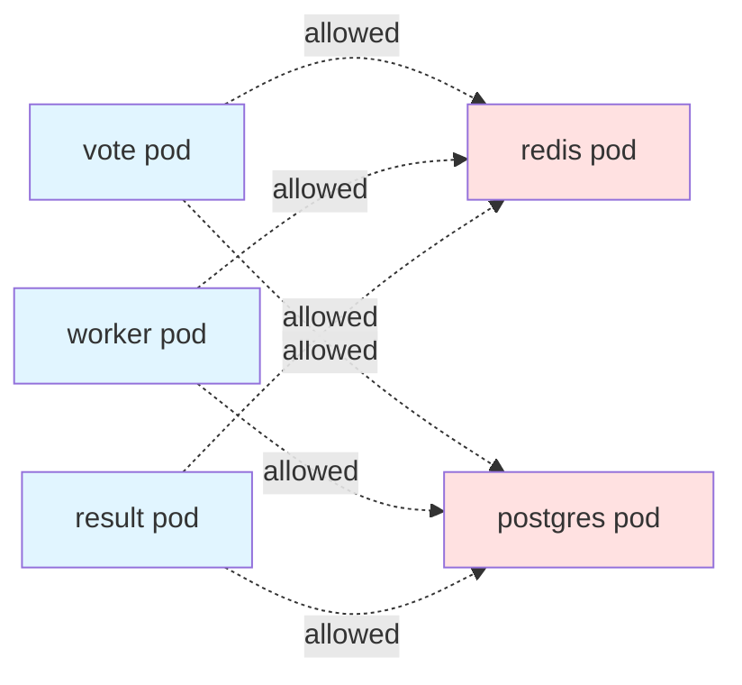
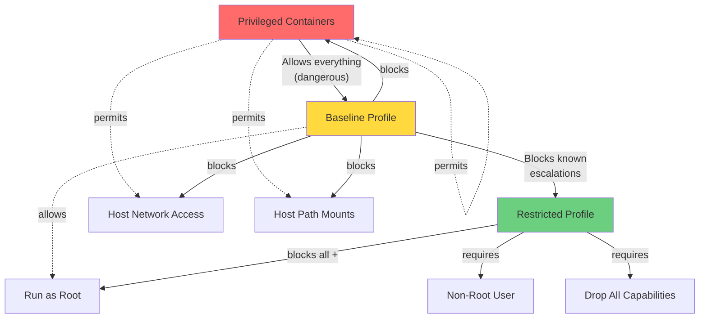
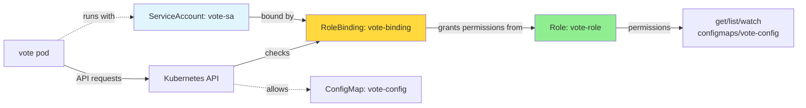

# Module 5: Security (NetworkPolicy, PSA, RBAC)

## Overview

The security problem with your Voting App is invisible but critical. Every pod can reach every other pod on the network. Any container can run as root. Service accounts have default permissions that might be excessive. Database credentials live in environment variables where anyone with kubectl describe access can see them.

These aren't theoretical risks. In production Kubernetes clusters, security breaches happen because teams focus on making applications work without considering the security boundaries between components. A compromised vote service shouldn't be able to reach postgres directly. A worker pod shouldn't have permission to delete cluster resources. Leaked credentials shouldn't be visible in pod descriptions.

This module teaches defense-in-depth security for Kubernetes applications. You'll build multiple layers of protection, each addressing different attack vectors. NetworkPolicy controls traffic at the network level. Pod Security Admission prevents privilege escalation at the pod level. RBAC limits API access. Secrets management protects credentials. Together, these layers create a security posture that's resilient even when individual components are compromised.

## NetworkPolicy: Controlling Pod Communication

By default, Kubernetes networking is completely open. Any pod can communicate with any other pod on any port. This "flat network" model makes development easy but creates security risks in production. NetworkPolicy gives you firewall-like control over pod-to-pod traffic.

### The Default Behavior Problem

When you deploy the Voting App without NetworkPolicy, the network looks like this:



Notice the problem? Vote can reach postgres directly, bypassing redis. Result could talk to redis even though it only needs postgres. If an attacker compromises the vote service, they have direct database access. This violates the principle of least privilege.

### NetworkPolicy Requires CNI Support

Here's the number one gotcha with NetworkPolicy: it requires a Container Network Interface (CNI) plugin that actually enforces policies. KIND uses Flannel by default, and Flannel silently ignores NetworkPolicy resources. You'll create policies, kubectl will accept them, but they won't do anything.

:::danger[Flannel Does Not Enforce NetworkPolicy]
KIND's default Flannel CNI provides networking but does NOT implement NetworkPolicy enforcement. Policies you create will exist in the cluster but have no effect on traffic. Always use a NetworkPolicy-capable CNI like Calico or Cilium when working with network policies.
:::

For this module, you'll create a fresh KIND cluster with Calico CNI installed. Calico implements NetworkPolicy using iptables rules on each node, giving you real traffic control.

### Default Deny Pattern

The recommended approach to NetworkPolicy is default deny. Block everything first, then explicitly allow what's needed. This ensures you don't accidentally leave holes in your security.

Here's a default deny policy for the voting-app namespace:

```yaml title="default-deny-all.yaml"
apiVersion: networking.k8s.io/v1
kind: NetworkPolicy
metadata:
  name: default-deny-all
  namespace: voting-app
spec:
  podSelector: {}  # Empty selector matches all pods
  policyTypes:
  - Ingress
  - Egress
```

The empty `podSelector: {}` means this policy applies to every pod in the namespace. With `policyTypes` including both Ingress and Egress, and no allow rules defined, all traffic is blocked.

### The DNS Allowlist Requirement

After applying default-deny, your app will break completely. Pods won't be able to reach services even when you add specific allow rules. Why? Because they can't resolve service names to IP addresses. DNS queries to kube-dns are blocked.

:::caution[Always Allow DNS]
A default-deny NetworkPolicy blocks DNS resolution. Pods query the kube-dns service (in kube-system namespace) on UDP port 53 to resolve service names like "redis" to ClusterIP addresses. Without DNS, service discovery breaks and your application can't function.
:::

Here's the critical DNS allow rule:

```yaml title="allow-dns.yaml"
apiVersion: networking.k8s.io/v1
kind: NetworkPolicy
metadata:
  name: allow-dns
  namespace: voting-app
spec:
  podSelector: {}  # All pods need DNS
  policyTypes:
  - Egress
  egress:
  - to:
    - namespaceSelector:
        matchLabels:
          kubernetes.io/metadata.name: kube-system
    ports:
    - protocol: UDP
      port: 53
```

This allows all pods in voting-app to make UDP queries to port 53 in the kube-system namespace, where kube-dns runs.

### Selective Allow Rules

With default-deny and DNS in place, you can add specific allow rules for your application architecture. Here's how to allow vote to communicate with redis:

```yaml title="vote-to-redis.yaml"
apiVersion: networking.k8s.io/v1
kind: NetworkPolicy
metadata:
  name: vote-to-redis
  namespace: voting-app
spec:
  podSelector:
    matchLabels:
      app: redis
  policyTypes:
  - Ingress
  ingress:
  - from:
    - podSelector:
        matchLabels:
          app: vote
    ports:
    - protocol: TCP
      port: 6379
```

This policy applies to pods with label `app: redis`. It allows ingress traffic from pods with label `app: vote` on TCP port 6379. No other pods can reach redis.

For the worker service, which needs both redis and postgres, you'll create egress rules from worker and ingress rules on both backends. The result is a locked-down network matching your application architecture:

```mermaid
graph LR
    Vote[vote pod] -->|6379/TCP| Redis[redis pod]
    Worker[worker pod] -->|6379/TCP| Redis
    Worker -->|5432/TCP| Postgres[postgres pod]
    Result[result pod] -->|5432/TCP| Postgres
    External[External Traffic] -->|80/TCP| Vote
    External -->|80/TCP| Result

    Vote -.x|blocked| Postgres
    Result -.x|blocked| Redis

    style Vote fill:#e1f5ff
    style Worker fill:#e1f5ff
    style Result fill:#e1f5ff
    style Redis fill:#90EE90
    style Postgres fill:#90EE90
```

:::tip[Test Your Policies]
Always test NetworkPolicy enforcement by trying to reach unauthorized services. Use `kubectl exec` to shell into a vote pod and try to connect to postgres directly. The connection should fail or timeout. If it succeeds, your policies aren't being enforced (likely a CNI issue).
:::

## Pod Security Admission (PSA)

NetworkPolicy controls network traffic, but it doesn't prevent pods from running with dangerous privileges. A container running as root, with access to the host filesystem, or with privileged mode enabled can escape its isolation and compromise the node or cluster.

Pod Security Admission (PSA) enforces security baselines at the pod level. It replaced the older PodSecurityPolicy feature, which was removed in Kubernetes 1.25 due to usability problems.

### Three Security Profiles

PSA defines three security profiles, each progressively more restrictive:

**Privileged** - Unrestricted. Allows all pod configurations including dangerous settings. Use only for system-level infrastructure pods that genuinely need host access.

**Baseline** - Minimally restrictive. Blocks known privilege escalations like running as privileged, using host namespaces (network, PID, IPC), or mounting host paths. This is the recommended starting point for most applications.

**Restricted** - Heavily restricted. Enforces hardening best practices like requiring non-root users, dropping all capabilities, and disallowing privilege escalation. This is the most secure but may break applications not designed for it.



### Three Enforcement Modes

PSA can operate in three modes simultaneously:

**enforce** - Blocks pod creation if it violates the policy. This is your actual security boundary.

**audit** - Allows pod creation but logs violations to the audit log. Use this to detect violations without blocking.

**warn** - Allows pod creation but shows warnings to users. Use this to give teams feedback without breaking deployments.

You can set different profiles for each mode. Common pattern: enforce baseline, audit and warn on restricted. This lets you enforce basic security while collecting data on what would break with stricter policies.

### Namespace-Level Application

PSA policies are applied via namespace labels, not pod-level configuration:

```yaml title="voting-app-namespace.yaml"
apiVersion: v1
kind: Namespace
metadata:
  name: voting-app
  labels:
    pod-security.kubernetes.io/enforce: baseline
    pod-security.kubernetes.io/enforce-version: latest
    pod-security.kubernetes.io/audit: restricted
    pod-security.kubernetes.io/audit-version: latest
    pod-security.kubernetes.io/warn: restricted
    pod-security.kubernetes.io/warn-version: latest
```

This enforces baseline (blocks dangerous configurations), while auditing and warning about restricted violations (non-root user requirements, capability drops).

### PSA Timing: Creation Only

Here's a critical detail that confuses many users: PSA evaluates pods only at CREATE time. Existing pods are grandfathered in. If you apply PSA labels to a namespace with running pods, those pods continue running even if they violate the policy.

:::caution[Existing Pods Are Grandfathered]
Pod Security Admission enforces policies when pods are created. It does not evaluate or evict existing pods. After adding PSA labels to a namespace, you must restart your Deployments to trigger pod recreation: `kubectl rollout restart deployment -n voting-app`
:::

To enforce PSA on existing workloads, you must trigger pod recreation. The cleanest way is `kubectl rollout restart` for Deployments, which performs a rolling restart creating new pods under the new policy.

### Testing PSA

To verify PSA is working, try creating a privileged pod:

```bash
kubectl run privileged-test --image=nginx --privileged -n voting-app
```

Expected error with baseline enforcement:

```
Error from server (Forbidden): pods "privileged-test" is forbidden:
violates PodSecurity "baseline:latest": privileged (container "privileged-test"
must not set securityContext.privileged=true)
```

If the pod creates successfully, either PSA isn't enabled for that namespace or you're running Kubernetes older than 1.23 (when PSA became available).

## RBAC for Application Teams

NetworkPolicy controls network access. PSA controls pod privileges. RBAC (Role-Based Access Control) controls Kubernetes API access. It ensures that application pods can only perform the API operations they actually need.

### ServiceAccounts: Pod Identity

Every pod runs with a ServiceAccount. By default, pods use the "default" ServiceAccount in their namespace, which typically has minimal permissions. However, in some clusters, default ServiceAccounts have been granted excessive permissions "to make things work."

Creating dedicated ServiceAccounts for each application component follows the principle of least privilege:

```yaml title="vote-serviceaccount.yaml"
apiVersion: v1
kind: ServiceAccount
metadata:
  name: vote-sa
  namespace: voting-app
```

Then reference it in your Deployment:

```yaml
apiVersion: apps/v1
kind: Deployment
metadata:
  name: vote
spec:
  template:
    spec:
      serviceAccountName: vote-sa
      containers:
      - name: vote
        image: schoolofdevops/vote:v1
```

### Role vs ClusterRole

Roles define permissions within a namespace. ClusterRoles define cluster-wide permissions or access to cluster-scoped resources (like nodes).

For application teams, use Roles. Your voting app components don't need cluster-wide access.

Here's a minimal Role for the vote service:

```yaml title="vote-role.yaml"
apiVersion: rbac.authorization.k8s.io/v1
kind: Role
metadata:
  name: vote-role
  namespace: voting-app
rules:
- apiGroups: [""]
  resources: ["configmaps"]
  verbs: ["get", "list", "watch"]
  resourceNames: ["vote-config"]  # Only this specific ConfigMap
```

This grants read-only access to a single ConfigMap named "vote-config". The vote service can read its configuration but cannot create, update, or delete ConfigMaps. It has no access to Secrets, Pods, Services, or any other resource types.

### RoleBinding: Connecting ServiceAccount to Role



RoleBindings connect ServiceAccounts to Roles:

```yaml title="vote-rolebinding.yaml"
apiVersion: rbac.authorization.k8s.io/v1
kind: RoleBinding
metadata:
  name: vote-binding
  namespace: voting-app
subjects:
- kind: ServiceAccount
  name: vote-sa
  namespace: voting-app
roleRef:
  kind: Role
  name: vote-role
  apiGroup: rbac.authorization.k8s.io
```

Now pods using the vote-sa ServiceAccount can read the vote-config ConfigMap. Nothing more.

### Verifying RBAC Permissions

Kubernetes provides a command to check what a ServiceAccount can do:

```bash
kubectl auth can-i --list --as=system:serviceaccount:voting-app:vote-sa -n voting-app
```

This shows all permissions granted to vote-sa. You can also test specific permissions:

```bash
# Should return "yes"
kubectl auth can-i get configmaps --as=system:serviceaccount:voting-app:vote-sa -n voting-app

# Should return "no"
kubectl auth can-i delete pods --as=system:serviceaccount:voting-app:vote-sa -n voting-app
```

:::danger[Never Grant cluster-admin to Applications]
A common anti-pattern is binding application ServiceAccounts to the cluster-admin ClusterRole "to make errors go away." This grants full cluster control to your application pods. A compromised vote service could delete nodes, access secrets from all namespaces, or escalate privileges. Always start with zero permissions and add only what's needed.
:::

### RBAC is Additive

Multiple RoleBindings can grant permissions to the same ServiceAccount. RBAC combines all permissions from all bindings. You can't "remove" permissions granted by another binding. This matters when troubleshooting why a ServiceAccount has unexpected access.

## Secrets Management

Environment variables are convenient for configuration. They're also a security problem when used for credentials. Anyone with kubectl access can view environment variables with `kubectl describe pod`.

Kubernetes Secrets provide a better approach, especially when mounted as volumes.

### The Environment Variable Problem

Here's how the postgres database is typically configured:

```yaml
env:
- name: POSTGRES_PASSWORD
  value: "postgres"
```

Anyone can see this:

```bash
kubectl describe pod postgres-xxx -n voting-app
```

Output includes:

```
Environment:
  POSTGRES_PASSWORD: postgres
```

The password is visible in plain text. If an attacker gains kubectl access (or access to the Kubernetes API server logs), they have database credentials.

### Kubernetes Secrets: Base64 Is Not Encryption

Kubernetes Secrets store sensitive data separately from pod definitions:

```yaml title="postgres-secret.yaml"
apiVersion: v1
kind: Secret
metadata:
  name: postgres-credentials
  namespace: voting-app
type: Opaque
data:
  POSTGRES_USER: cG9zdGdyZXM=      # base64 encoded "postgres"
  POSTGRES_PASSWORD: cG9zdGdyZXM=  # base64 encoded "postgres"
```

Or create from literals without manually encoding:

```bash
kubectl create secret generic postgres-credentials \
  --from-literal=POSTGRES_USER=postgres \
  --from-literal=POSTGRES_PASSWORD=postgres \
  -n voting-app
```

:::caution[Base64 is Encoding, Not Encryption]
Kubernetes Secrets use base64 encoding, which is trivially reversible (`echo cG9zdGdyZXM= | base64 -d` returns "postgres"). This is NOT encryption. Secrets are stored in etcd, and anyone with etcd access can read them. For production, consider Sealed Secrets or External Secrets Operator to encrypt secrets before storing in Git.
:::

### Volume Mounts: Better Than Environment Variables

Mount secrets as files instead of exposing them as environment variables:

```yaml
apiVersion: apps/v1
kind: Deployment
metadata:
  name: postgres
spec:
  template:
    spec:
      containers:
      - name: postgres
        image: postgres:15-alpine
        volumeMounts:
        - name: credentials
          mountPath: /etc/secrets/postgres
          readOnly: true
        env:
        - name: POSTGRES_PASSWORD_FILE
          value: /etc/secrets/postgres/POSTGRES_PASSWORD
      volumes:
      - name: credentials
        secret:
          secretName: postgres-credentials
          defaultMode: 0400  # Read-only for owner
```

Benefits of volume mounts:

1. **Not visible in pod descriptions** - `kubectl describe pod` doesn't show file contents
2. **Automatic updates** - When you update the Secret, mounted files update automatically (environment variables don't)
3. **File permissions** - Can set restrictive permissions (0400 = owner read-only)
4. **Separation** - Application code reads from filesystem, not environment

Many applications support reading credentials from files. Postgres uses `POSTGRES_PASSWORD_FILE` to point to a file containing the password.

## Defense in Depth

Security is not a single layer. Defense-in-depth means applying multiple security controls so that if one fails, others still provide protection.

For the Voting App, here's how the layers work together:

| Layer | Control | What It Protects Against |
|-------|---------|-------------------------|
| **Layer 1: Network** | NetworkPolicy | Lateral movement, unauthorized service access |
| **Layer 2: Pod** | Pod Security Admission | Privilege escalation, container breakout |
| **Layer 3: API** | RBAC with ServiceAccounts | Unauthorized Kubernetes API operations |
| **Layer 4: Secrets** | Secret volumes | Credential exposure, password leaks |

If an attacker compromises the vote service:

- **NetworkPolicy** prevents reaching postgres directly (must go through redis)
- **PSA** prevents container from running as root or accessing host resources
- **RBAC** prevents reading Secrets or modifying other resources via Kubernetes API
- **Secret volumes** mean credentials aren't visible in pod environment variables

No single layer is sufficient. An application running as root (PSA failure) might still be constrained by NetworkPolicy. A pod that can reach any service (NetworkPolicy failure) is still limited by RBAC from accessing cluster resources. Multiple layers create resilience.

## Summary

Key takeaways from this module:

- NetworkPolicy controls pod-to-pod communication, but requires a CNI plugin (like Calico) that enforces policies - KIND's default Flannel does not
- Always include a DNS allowlist with default-deny NetworkPolicy, or service discovery breaks completely
- Pod Security Admission enforces security baselines at the namespace level with three profiles (privileged, baseline, restricted) and three modes (enforce, audit, warn)
- PSA evaluates pods only at creation time - existing pods are grandfathered in and must be restarted to apply new policies
- RBAC with ServiceAccounts implements least-privilege API access - never grant cluster-admin to application pods
- Secrets mounted as volumes are more secure than environment variables because they're not visible in pod descriptions and support file permissions
- Defense-in-depth layering (NetworkPolicy + PSA + RBAC + Secrets) provides resilience when individual controls fail

## Further Reading

- [Kubernetes NetworkPolicy Documentation](https://kubernetes.io/docs/concepts/services-networking/network-policies/)
- [NetworkPolicy Recipes Repository](https://github.com/ahmetb/kubernetes-network-policy-recipes)
- [Pod Security Standards](https://kubernetes.io/docs/concepts/security/pod-security-standards/)
- [Pod Security Admission](https://kubernetes.io/docs/concepts/security/pod-security-admission/)
- [RBAC Authorization](https://kubernetes.io/docs/reference/access-authn-authz/rbac/)
- [Kubernetes Secrets](https://kubernetes.io/docs/concepts/configuration/secret/)
- [Calico NetworkPolicy Documentation](https://docs.tigera.io/calico/latest/network-policy/)

:::info[Next Steps]
You're now ready to apply these security concepts hands-on. The lab walks you through securing the Voting App layer by layer: creating a Calico-enabled cluster, implementing default-deny NetworkPolicy with selective allow rules, applying PSA enforcement, configuring RBAC with least-privilege roles, and migrating credentials to Secret volumes.
:::
