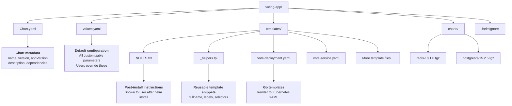
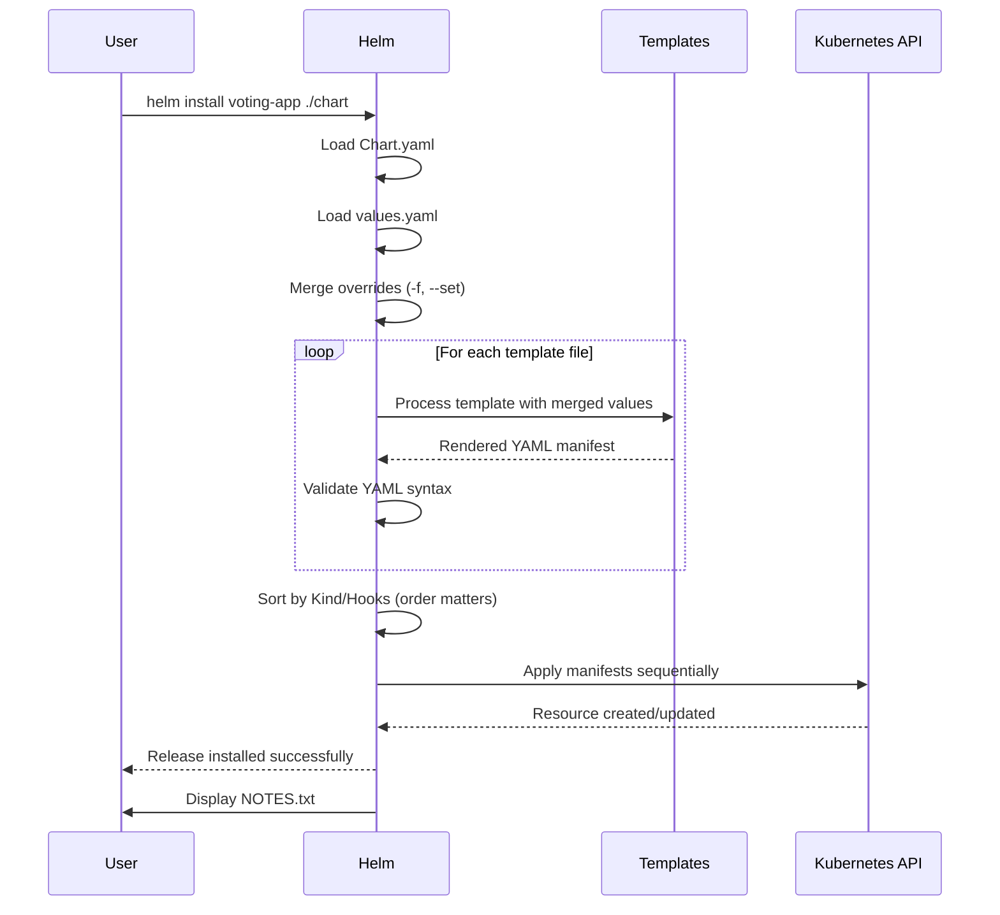
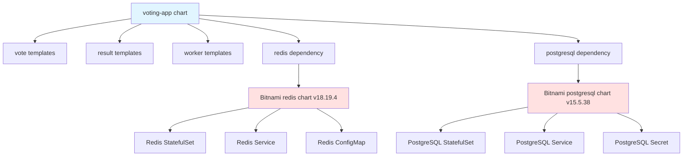

# Writing Helm Charts

## Overview

You have five Deployments, five Services, a few ConfigMaps, and maybe some Secrets for your Voting App. Each lives in its own YAML file. Deploying to staging means editing image tags in three different files. Deploying to production means changing replica counts in five places and adjusting resource limits in another five. This approach does not scale.

Now imagine a single command that deploys everything: `helm install voting-app ./voting-app-chart`. One values file controls all parameters. Change replicas once in values.yaml and it applies everywhere. Deploy to staging with `helm install voting-app ./chart -f values-staging.yaml`. Deploy to production with `helm install voting-app ./chart -f values-production.yaml`. Same chart, different configuration.

That is the power of Helm. It takes your raw Kubernetes manifests and transforms them into templates with configurable values. It packages everything into a versioned unit called a chart. It manages the lifecycle of your deployments: install, upgrade, rollback, uninstall. Helm is the de facto standard for Kubernetes application packaging.

## What is Helm?

Helm is a package manager for Kubernetes, similar to apt for Ubuntu or brew for macOS. Instead of managing individual YAML files, you manage charts. A chart is a collection of templated Kubernetes manifests with default configuration values.

Three big concepts define Helm:

**Charts** are packages. A chart contains everything needed to run an application on Kubernetes: templated manifests, default values, metadata, documentation. Charts are versioned and can be stored in repositories or OCI registries.

**Releases** are instances of charts. When you run `helm install myrelease ./chart`, Helm creates a release named "myrelease". You can have multiple releases of the same chart running in different namespaces or with different configurations.

**Repositories** are chart storage. The community maintains repositories like Artifact Hub where you can find thousands of charts. Companies maintain private repositories for internal applications. Bitnami publishes charts for redis, postgresql, mysql, nginx, and hundreds of other applications.

### Helm 3 vs Helm 2

Helm 3 is the current stable version. The major improvement over Helm 2 is removing Tiller, the server-side component that had cluster-admin permissions. Helm 3 is client-only, using your existing kubeconfig credentials. This fixes the security issues that plagued Helm 2.

Helm 2 reached end-of-life in November 2020. If you encounter Helm 2 in production, plan migration to Helm 3.

:::info[Helm 4 Evolution]
Helm 4 was released in late 2025 with OCI registry support as the default storage mechanism (instead of HTTP-based chart repositories). The core concepts remain identical to Helm 3. Charts, templates, values, and commands work the same way. The main difference is operational: Helm 4 prefers `helm pull oci://registry/chart` over `helm repo add`. This course teaches Helm 3 patterns, which are fully compatible with Helm 4.
:::

## Chart Structure

A Helm chart is a directory with a specific structure. Understanding this structure is the foundation for writing your own charts.



Let's examine each file:

**Chart.yaml** contains metadata about the chart. This is where you define the chart name, version, description, and dependencies. Two version fields matter: `version` tracks the chart itself (increment when templates change), and `appVersion` tracks the application being deployed (the vote image version).

```yaml
apiVersion: v2
name: voting-app
description: Example Voting App - Multi-tier Kubernetes application
type: application
version: 1.0.0        # Chart version (increment on chart changes)
appVersion: "v1"      # Application version (image tag)
```

**values.yaml** defines default configuration. This is where users look to understand what they can customize. Every value in this file can be overridden during installation with `-f custom-values.yaml` or `--set key=value`. Good values.yaml files are well-organized with comments explaining each section.

**templates/** contains Go template files that render to Kubernetes manifests. Each template file typically represents one Kubernetes resource. When you run `helm install`, Helm processes these templates by substituting values, then applies the resulting YAML to your cluster.

**_helpers.tpl** is a special template file for reusable snippets. You define functions here once and use them everywhere. Common helpers include generating consistent names, labels, and selectors across all resources.

**NOTES.txt** is a template that renders post-installation instructions. After `helm install` completes, Helm displays the rendered NOTES.txt. Use it to tell users how to access the application, check status, or perform next steps.

**charts/** stores dependency charts. When you define dependencies in Chart.yaml and run `helm dependency update`, Helm downloads the dependency charts into this directory as .tgz files.

### Chart Version vs App Version

Understanding the difference between chart version and app version is critical:

**Chart version** (version: 1.0.0) changes when you modify the chart itself: new templates, changed values structure, updated dependencies. Users care about chart version when deciding whether to upgrade.

**App version** (appVersion: "v1") changes when you update the application being deployed. If you update from schoolofdevops/vote:v1 to schoolofdevops/vote:v2, increment appVersion but chart version stays the same (unless you also changed templates).

A chart can have version 2.5.0 deploying app version v1, or version 2.5.1 deploying app version v2. They are independent.

## Templates and Values

Helm templates use Go template syntax. The key concept is substitution: you write `{{ .Values.replicaCount }}` in a template, and Helm replaces it with the actual value from values.yaml when rendering.

### Built-in Objects

Templates have access to several built-in objects:

- **`.Values`**: Contents of values.yaml (and any overrides)
- **`.Release`**: Information about the current release (name, namespace, time, revision)
- **`.Chart`**: Contents of Chart.yaml (name, version, appVersion)
- **`.Files`**: Access to non-template files in the chart
- **`.Capabilities`**: Information about the Kubernetes cluster (API versions available)

### Template Functions

Helm provides dozens of template functions. Here are the most commonly used:

**`default`** provides a fallback value: `{{ .Values.replicaCount | default 1 }}` uses 1 if replicaCount is not set.

**`quote`** adds quotes around strings: `{{ .Values.image | quote }}` becomes "schoolofdevops/vote:v1".

**`nindent`** indents and adds newlines: `{{ include "voting-app.labels" . | nindent 4 }}` indents the result by 4 spaces.

**`toYaml`** converts data structures to YAML: `{{ toYaml .Values.resources | nindent 10 }}` renders resources limits/requests properly indented.

**`include`** renders a named template and returns the result as a string (for piping to other functions).

### Whitespace Control

YAML is sensitive to whitespace. Templates produce whitespace, which can break YAML syntax. Helm provides control:

**`{{-`** removes whitespace before the template tag.

**`-}}`** removes whitespace after the template tag.

Example: `{{- if .Values.enabled }}` removes the newline before the if statement, keeping YAML clean.

### Example: Vote Deployment Template

Here is a real template showing how these concepts combine:

```yaml
apiVersion: apps/v1
kind: Deployment
metadata:
  name: {{ include "voting-app.fullname" . }}-vote
  labels:
    {{- include "voting-app.labels" . | nindent 4 }}
    component: vote
spec:
  replicas: {{ .Values.vote.replicaCount }}
  selector:
    matchLabels:
      {{- include "voting-app.selectorLabels" . | nindent 6 }}
      component: vote
  template:
    metadata:
      labels:
        {{- include "voting-app.selectorLabels" . | nindent 8 }}
        component: vote
    spec:
      containers:
      - name: vote
        image: "{{ .Values.vote.image.repository }}:{{ .Values.vote.image.tag | default .Chart.AppVersion }}"
        imagePullPolicy: {{ .Values.vote.image.pullPolicy }}
        ports:
        - containerPort: 80
          name: http
        resources:
          {{- toYaml .Values.vote.resources | nindent 10 }}
```

The matching values.yaml section:

```yaml
vote:
  replicaCount: 2
  image:
    repository: schoolofdevops/vote
    tag: v1
    pullPolicy: IfNotPresent
  resources:
    limits:
      cpu: 200m
      memory: 256Mi
    requests:
      cpu: 100m
      memory: 128Mi
```

When Helm renders this template, it substitutes all `{{ ... }}` expressions with actual values, producing valid Kubernetes YAML.

### Template Rendering Flow

Understanding how templates become manifests helps debug issues:



You can preview rendered templates without installing: `helm template ./chart` outputs the final YAML. Use this to debug template syntax errors before deploying.

### Anti-Pattern: Over-Templatization

The biggest mistake new Helm users make is templatizing everything. Do NOT do this:

```yaml
# BAD: Over-templatized
containers:
- name: {{ .Values.containerName }}
  image: {{ .Values.image }}
  ports:
  - containerPort: {{ .Values.port }}
    protocol: {{ .Values.protocol }}
    name: {{ .Values.portName }}
```

This creates an unmaintainable configuration nightmare. Users must specify every tiny detail. The values.yaml becomes hundreds of lines. Nobody understands what values are safe to change.

**Template what varies between environments.** Replicas, image tags, resource limits, and ingress hosts change between dev, staging, and production. These should be values.

**Hardcode what should be consistent.** Port names, protocol types, health check paths, and container names rarely change. These should be hardcoded in templates.

Better version:

```yaml
# GOOD: Template only what varies
containers:
- name: vote
  image: "{{ .Values.vote.image.repository }}:{{ .Values.vote.image.tag }}"
  ports:
  - containerPort: 80
    protocol: TCP
    name: http
```

### Debugging Templates

Two commands are essential for debugging:

**`helm template`** renders templates locally without installing. Use this to verify template syntax and see the final YAML: `helm template ./voting-app`.

**`helm lint`** checks chart syntax and best practices. Run this before every commit: `helm lint ./voting-app`.

Both commands catch errors before they reach the cluster.

## Dependencies

Real applications depend on backing services. The Voting App needs redis and postgresql. You could maintain redis and postgresql manifests yourself, or you could use the community-maintained Bitnami charts. Dependencies let you reuse proven, well-tested charts instead of maintaining your own.

### Declaring Dependencies

Dependencies go in Chart.yaml:

```yaml
dependencies:
- name: redis
  version: "18.19.4"
  repository: https://charts.bitnami.com/bitnami
  condition: redis.enabled
- name: postgresql
  version: "15.5.38"
  repository: https://charts.bitnami.com/bitnami
  condition: postgresql.enabled
```

**`name`**: Must match the chart name in the repository.

**`version`**: Lock to exact version, not range. Use `18.19.4`, not `18.x` or `~18.19`. Version ranges lead to unpredictable deployments.

**`repository`**: URL of the Helm repository (HTTP-based). Helm 4 also supports OCI registries: `oci://registry.example.com/charts`.

**`condition`**: Optional flag to enable/disable the dependency. Set `redis.enabled: false` in values.yaml to exclude redis.

### Fetching Dependencies

After declaring dependencies, download them:

```bash
helm dependency update ./voting-app
```

This creates .tgz files in the charts/ directory. Helm includes these charts when installing your chart.

Verify dependencies:

```bash
helm dep list ./voting-app
```

Expected output:

```
NAME        VERSION    REPOSITORY                              STATUS
redis       18.19.4    https://charts.bitnami.com/bitnami     ok
postgresql  15.5.38    https://charts.bitnami.com/bitnami     ok
```

### Configuring Dependencies

Dependencies have their own values. Configure them in your values.yaml under the dependency chart name:

```yaml
redis:
  enabled: true
  auth:
    enabled: false  # Simplified for learning (use auth in production!)

postgresql:
  enabled: true
  auth:
    username: postgres
    password: postgres
    database: votes
```

The `redis:` section passes values to the redis chart. The `postgresql:` section passes values to the postgresql chart. Check each chart's documentation to understand available configuration options.

### Dependency Graph

An umbrella chart can have multiple layers of dependencies:



When you install voting-app, Helm installs redis and postgresql as subcharts. Each subchart manages its own resources. This composition pattern lets you build complex applications from simple, reusable pieces.

:::caution[Dependency Version Conflicts]
Lock dependency versions to exact releases. Bitnami regularly updates their charts. Version 18.19.4 might work perfectly, but version 18.20.0 could introduce breaking changes. Locking versions prevents surprises. Check compatibility before updating dependencies.
:::

## Lifecycle Hooks

Helm hooks run jobs before or after installation and upgrade operations. Use hooks for database migrations, cache warming, validation checks, or cleanup tasks.

### Hook Types

Helm defines several hook types:

**`pre-install`**: Runs before any chart resources are created. Use for pre-flight checks or prerequisite setup.

**`post-install`**: Runs after all chart resources are created and in a ready state. Use for initial data loading or configuration.

**`pre-upgrade`**: Runs before chart resources are updated. Use for database schema migrations or backup jobs.

**`post-upgrade`**: Runs after all chart resources are upgraded. Use for smoke tests or cache invalidation.

**`pre-delete`**: Runs before chart resources are deleted. Use for cleanup or backup before uninstall.

**`post-delete`**: Runs after all chart resources are deleted. Use for removing external resources.

**`test`**: Special hook type for `helm test` command. Use for validation and smoke tests.

### Hook Annotations

Define hooks using annotations on Job or Pod resources:

```yaml
apiVersion: batch/v1
kind: Job
metadata:
  name: {{ include "voting-app.fullname" . }}-db-init
  annotations:
    "helm.sh/hook": pre-install
    "helm.sh/hook-weight": "-5"
    "helm.sh/hook-delete-policy": hook-succeeded
spec:
  template:
    spec:
      containers:
      - name: db-init
        image: postgres:15
        command: ["sh", "-c", "echo 'Database initialization would run here'"]
      restartPolicy: Never
```

**`helm.sh/hook`**: Defines when the hook runs (pre-install, post-upgrade, etc.).

**`helm.sh/hook-weight`**: Orders multiple hooks of the same type. Lower weights run first (can be negative).

**`helm.sh/hook-delete-policy`**: Controls when to delete the hook resource. Options: `before-hook-creation` (delete previous runs), `hook-succeeded` (delete on success), `hook-failed` (delete on failure).

### Hook Execution Flow

Hooks run synchronously. Helm waits for hooks to complete before continuing:

1. User runs `helm install`
2. Helm processes pre-install hooks (sorted by weight)
3. Helm waits for all pre-install hooks to complete successfully
4. Helm creates main chart resources (Deployments, Services, etc.)
5. Helm waits for resources to become ready
6. Helm processes post-install hooks (sorted by weight)
7. Helm waits for all post-install hooks to complete
8. Installation is marked successful

If any hook fails, installation fails. The chart resources remain in a pending state.

### Use Cases

**Database migrations** (pre-upgrade): Run schema changes before new application code that depends on them.

**Initial data loading** (post-install): Populate database with seed data after the database is running.

**Health checks** (post-install): Verify the application started correctly and can handle requests.

**Backup** (pre-delete): Save data before uninstalling the chart.

**External resource cleanup** (post-delete): Remove S3 buckets, DNS records, or other external resources not managed by Kubernetes.

Hooks bridge the gap between declarative Kubernetes resources and procedural setup tasks.

## Summary

Key takeaways from this module:

- **Helm packages Kubernetes applications as versioned, reusable charts** with templates and configurable values, eliminating manual YAML editing across environments
- **Chart structure organizes metadata, templates, values, and dependencies** following conventions that make charts easy to understand and maintain
- **Go template syntax lets you parameterize manifests** while avoiding the anti-pattern of over-templatization that makes charts unmaintainable
- **Chart dependencies enable composition** by reusing community-maintained charts like Bitnami's redis and postgresql instead of writing everything yourself
- **Lifecycle hooks automate pre/post installation tasks** like database migrations, health checks, and cleanup that can't be expressed as declarative resources

## Further Reading

- [Helm Official Documentation](https://helm.sh/docs/) - Comprehensive guide to all Helm features
- [Helm Chart Best Practices](https://helm.sh/docs/chart_best_practices/) - Official recommendations for writing maintainable charts
- [Artifact Hub](https://artifacthub.io/) - Discover thousands of community-maintained Helm charts
- [Helm Template Language](https://helm.sh/docs/chart_template_guide/) - Deep dive into Go template syntax and functions
- [Bitnami Chart Repository](https://github.com/bitnami/charts) - Source code for production-ready charts used as dependencies

:::info[Next Steps]
You are now ready to build a Helm chart for the Voting App in the lab. You will start with a single component, add templating, incorporate dependencies, deploy to multiple environments, and add lifecycle hooks. By the end, the entire Voting App will be installable with a single `helm install` command.
:::
