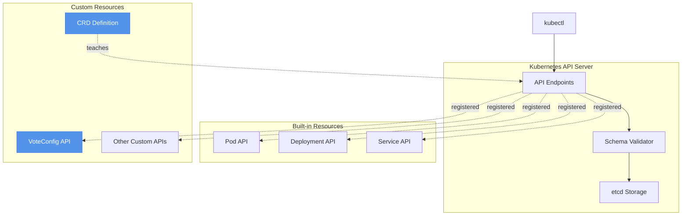
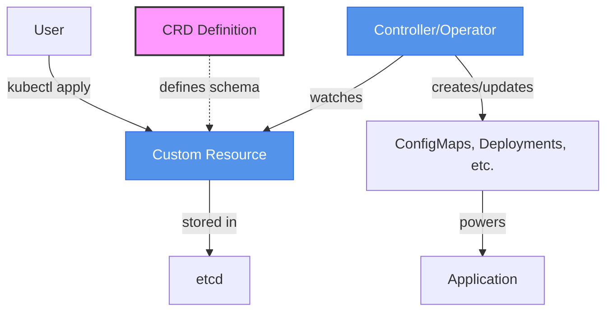

# Module 7: Extending Kubernetes with CRDs

## Overview

Right now, the Example Voting App's configuration lives in environment variables and ConfigMaps. When you want to change which options appear in the vote ("Cats vs Dogs" or "Pizza vs Tacos"), you edit a ConfigMap with generic key-value pairs. ConfigMaps work, but they're generic storage containers—they have no validation, no custom columns in kubectl output, and no standardized lifecycle.

What if you could create a VoteConfig resource that works just like any Kubernetes resource? What if `kubectl get voteconfigs` showed your voting configurations in a clean table? What if the API server rejected invalid configurations before they reached your application? Custom Resource Definitions (CRDs) make this possible by teaching Kubernetes new resource types.

CRDs are the foundation of the Kubernetes extension model. Once you understand CRDs, you unlock Operators (Module 8), Helm patterns, and the entire CNCF ecosystem. The VoteConfig CRD you'll create in this module is a perfect learning case—simple enough to understand quickly, realistic enough to demonstrate production patterns.

## What is a CRD?

A Custom Resource Definition is a way to teach Kubernetes new resource types. Before CRDs, only built-in types existed: Pods, Services, Deployments, ConfigMaps, and a few dozen others. After you install a CRD, you can create any custom type you define.

The entire cloud native ecosystem runs on CRDs. cert-manager uses the Certificate CRD to provision TLS certificates. Prometheus uses the ServiceMonitor CRD to discover scrape targets. Istio uses VirtualService CRDs for traffic routing. Gateway API uses HTTPRoute CRDs for ingress rules. Every custom resource you've encountered in the wild started with someone writing a CRD definition.

Once a CRD is installed in your cluster, kubectl just works. You can `kubectl get voteconfigs`, `kubectl describe voteconfig cats-vs-dogs`, `kubectl delete voteconfig old-config`. The API server validates your resources, stores them in etcd, and serves them through the standard Kubernetes API. From kubectl's perspective, VoteConfig is as real as Pod or Service.



Here's the critical insight: a CRD is a "recipe" that teaches the API server how to handle a new resource type. The CRD itself is a Kubernetes resource (kind: CustomResourceDefinition). You create it with kubectl, just like any other resource. Once created, it extends the API server with new capabilities.

## CRD Anatomy

Let's look at the VoteConfig CRD structure. This CRD teaches Kubernetes about voting configurations:

```yaml title="voteconfig-crd.yaml"
apiVersion: apiextensions.k8s.io/v1
kind: CustomResourceDefinition
metadata:
  # CRITICAL: name must be plural.group
  name: voteconfigs.voting.example.com
spec:
  # Group for API versioning (voting.example.com)
  group: voting.example.com

  # Scope: Namespaced or Cluster
  # Namespaced means each namespace can have its own VoteConfigs
  scope: Namespaced

  # Names for kubectl commands
  names:
    plural: voteconfigs      # kubectl get voteconfigs
    singular: voteconfig     # kubectl get voteconfig cats-vs-dogs
    kind: VoteConfig         # kind: VoteConfig in YAML
    shortNames:
    - vc                     # kubectl get vc (shorthand)

  # API versions (you can have multiple for backwards compatibility)
  versions:
  - name: v1
    served: true             # This version is active
    storage: true            # This is the version stored in etcd

    # OpenAPI v3 schema defines structure and validation
    schema:
      openAPIV3Schema:
        type: object
        properties:
          # spec: desired state (what user wants)
          spec:
            type: object
            required:
            - options            # Options field is mandatory
            properties:
              options:
                type: array
                minItems: 2      # Need at least 2 choices
                maxItems: 10     # Limit to 10 choices
                items:
                  type: object
                  required:
                  - id
                  - label
                  properties:
                    id:
                      type: string
                      pattern: "^[a-z]$"  # Single lowercase letter
                      description: "Single lowercase letter (a-z)"
                    label:
                      type: string
                      minLength: 1
                      maxLength: 50
                      description: "Display label for vote option"
                    color:
                      type: string
                      pattern: "^#[0-9A-Fa-f]{6}$"  # Hex color
                      description: "Hex color code (e.g., #FF0000)"
              title:
                type: string
                default: "Vote Now!"
                description: "Voting page title"
              resultsTitle:
                type: string
                default: "Results"
                description: "Results page title"

          # status: observed state (what actually exists)
          status:
            type: object
            properties:
              configMapRef:
                type: string
                description: "Name of generated ConfigMap"
              lastUpdated:
                type: string
                format: date-time
                description: "Timestamp of last update"
              conditions:
                type: array
                items:
                  type: object
                  properties:
                    type:
                      type: string
                    status:
                      type: string
                    reason:
                      type: string
                    message:
                      type: string

    # Enable status subresource (update status separately from spec)
    subresources:
      status: {}

    # Custom columns in kubectl get output
    additionalPrinterColumns:
    - name: Options
      type: integer
      jsonPath: .spec.options[*].id
      description: Number of vote options
    - name: ConfigMap
      type: string
      jsonPath: .status.configMapRef
      description: Generated ConfigMap name
    - name: Age
      type: date
      jsonPath: .metadata.creationTimestamp
```

Let's break down the key sections:

**Naming Convention:** The metadata.name MUST follow the pattern `plural.group`. For VoteConfig, that's `voteconfigs.voting.example.com`. This naming is how Kubernetes routes API requests to the right handler.

**Group and Version:** The group `voting.example.com` plus version `v1` creates the full API path: `voting.example.com/v1`. This shows up in resources as `apiVersion: voting.example.com/v1`. Groups prevent naming collisions—your VoteConfig won't conflict with someone else's VoteConfig in a different group.

**Scope:** Namespaced means each namespace can have its own VoteConfigs. Cluster scope means VoteConfigs are cluster-wide (like Nodes or PersistentVolumes). Most custom resources are Namespaced because they're tied to applications.

**Names:** The names section controls kubectl behavior. With `plural: voteconfigs` and `kind: VoteConfig`, users write `kubectl get voteconfigs` and YAML files have `kind: VoteConfig`. The shortNames field adds aliases—`vc` lets users type `kubectl get vc` instead of the full name.

## Schema Validation

The `schema.openAPIV3Schema` section is where validation lives. Without validation, the API server accepts any YAML that parses. With validation, the API server enforces rules before storing resources.

OpenAPI v3 schema supports:

**Type Validation:** Ensure fields are strings, integers, booleans, arrays, or objects.

**Required Fields:** Mark fields as mandatory. VoteConfig requires the `options` array—you can't create a voting configuration without vote options.

**Patterns:** Regular expressions validate string formats. VoteConfig uses `pattern: "^[a-z]$"` to ensure option IDs are single lowercase letters (a, b, c, etc.) and `pattern: "^#[0-9A-Fa-f]{6}$"` to ensure colors are valid hex codes.

**Bounds:** Set min/max for numbers and arrays. VoteConfig requires 2-10 options (`minItems: 2, maxItems: 10`) and label length between 1-50 characters.

**Enums:** Restrict values to a specific set. For example, if VoteConfig had a `theme` field, you could use `enum: ["light", "dark"]` to allow only those values.

Here's why validation matters. Without it, someone could create this invalid VoteConfig:

```yaml
apiVersion: voting.example.com/v1
kind: VoteConfig
metadata:
  name: broken-config
spec:
  options:
  - id: "toolong"      # Violates pattern ^[a-z]$ (more than 1 char)
    label: ""          # Violates minLength 1
    color: "notahex"   # Violates hex pattern
```

Without schema validation, the API server stores this garbage. Your operator tries to process it and crashes with a nil pointer exception because it expected valid data. With schema validation, kubectl apply fails immediately with clear errors:

```
The VoteConfig "broken-config" is invalid:
* spec.options[0].id: Invalid value: "toolong": spec.options[0].id in body should match '^[a-z]$'
* spec.options[0].label: Invalid value: "": spec.options[0].label in body should be at least 1 chars long
* spec.options[0].color: Invalid value: "notahex": spec.options[0].color in body should match '^#[0-9A-Fa-f]{6}$'
```

:::caution[Validation is Not Optional]
A CRD without validation is like a REST API that accepts any JSON. It works until someone sends garbage and your controller crashes. Always define validation rules for custom resources. The API server is your first line of defense.
:::

## Status Subresource

Every Kubernetes resource has two parts: spec and status. The spec is what you WANT (desired state). The status is what you HAVE (observed state). This separation is fundamental to the Kubernetes reconciliation model.

For VoteConfig:
- **spec** contains the voting options, title, and colors you want
- **status** reports the ConfigMap that was created, when it was last updated, and any conditions (Ready, Degraded)

Enabling the status subresource (`subresources.status: {}`) creates a separate API endpoint for status updates. Instead of one endpoint for the whole resource, you get two:

- `PUT /apis/voting.example.com/v1/namespaces/{ns}/voteconfigs/{name}` - updates spec
- `PUT /apis/voting.example.com/v1/namespaces/{ns}/voteconfigs/{name}/status` - updates status

Why separate them? It prevents accidental overwrites. If a controller reads a VoteConfig, updates the status, and writes it back, a separate status endpoint ensures the controller doesn't accidentally overwrite spec changes that a user made in the meantime.

Here's the status structure for VoteConfig:

```yaml
status:
  configMapRef: "cats-vs-dogs-config"
  lastUpdated: "2026-02-09T12:34:56Z"
  conditions:
  - type: Ready
    status: "True"
    lastTransitionTime: "2026-02-09T12:34:56Z"
    reason: ConfigMapCreated
    message: "ConfigMap cats-vs-dogs-config successfully created"
```

The `conditions` array follows Kubernetes conventions. Conditions have types (Ready, Progressing, Degraded), status (True, False, Unknown), and human-readable messages. Module 8's operator will populate this status—for now, the status will be empty because no controller is watching VoteConfigs yet.

## Additional Printer Columns

When you run `kubectl get pods`, you see columns like NAME, READY, STATUS, RESTARTS, AGE. Those columns are defined by additionalPrinterColumns in the Pod's CRD (technically, Pods are built-in, but the concept is the same).

For VoteConfig, we define custom columns:

```yaml
additionalPrinterColumns:
- name: Options
  type: integer
  jsonPath: .spec.options[*].id
  description: Number of vote options
- name: ConfigMap
  type: string
  jsonPath: .status.configMapRef
  description: Generated ConfigMap name
- name: Age
  type: date
  jsonPath: .metadata.creationTimestamp
```

The jsonPath expressions extract values from the resource. When you run `kubectl get voteconfigs`, you'll see:

```bash
NAME           OPTIONS   CONFIGMAP                AGE
cats-vs-dogs   2         cats-vs-dogs-config      5m
pizza-tacos    2         pizza-tacos-config       2m
```

Instead of forcing users to `kubectl describe` every resource, additional printer columns surface key information immediately. Think about what users need to know at a glance and expose that in columns.

## Short Names

Short names are quality-of-life improvements. Typing `kubectl get voteconfigs` gets tedious. With `shortNames: [vc]`, users can type `kubectl get vc` instead. This follows Kubernetes conventions: `po` for pods, `svc` for services, `deploy` for deployments.

Choose short names that:
1. Are intuitive (vc for VoteConfig, not vx or vo)
2. Don't conflict with existing shortcuts (check with `kubectl api-resources`)
3. Are short enough to actually save typing (2-3 characters ideal)

## The CRD Ecosystem

CRDs are everywhere in cloud native infrastructure. Here are a few examples:

**cert-manager Certificate CRD:** Represents TLS certificates. Users create Certificate resources, and cert-manager's controller provisions them from Let's Encrypt or other issuers.

**Prometheus ServiceMonitor CRD:** Defines scrape targets for Prometheus. Instead of editing Prometheus config files, users create ServiceMonitor resources, and Prometheus Operator generates the config.

**Gateway API HTTPRoute CRD:** Defines HTTP routing rules for Kubernetes Ingress. Gateway controllers (like NGINX from Module 3) watch HTTPRoute resources and configure routing.

**Crossplane Composition CRD:** Defines cloud infrastructure as Kubernetes resources. Users create RDSInstance resources, and Crossplane provisions AWS RDS databases.

Each of these CRDs follows the same pattern: define a schema, install the CRD, create custom resources. The difference is the controller—some CRDs have simple controllers that create ConfigMaps (like VoteConfig), others have complex controllers that provision cloud infrastructure.

Here's a critical point: **a CRD without a controller is like a form without anyone to process it.** The CRD stores data in etcd, but nothing acts on it. kubectl get works, kubectl describe works, but the resource doesn't DO anything. Module 8 adds the controller that brings VoteConfig to life—watching for changes and updating the Voting App configuration automatically.



## Multi-Version CRDs

As your API evolves, you'll want to add fields or change behavior without breaking existing users. CRDs support multiple versions with automatic conversion.

The pattern:
1. Start with v1 as the storage version
2. Add v2 with new fields, mark storage: false
3. Define conversion logic (webhook-based or automatic for compatible changes)
4. Eventually migrate storage to v2 and deprecate v1

For VoteConfig, you might add a v2 with a `maxVotesPerUser` field:

```yaml
versions:
- name: v1
  served: true
  storage: true    # v1 remains storage version
  schema: [...]

- name: v2
  served: true
  storage: false   # Not stored yet, converted from v1
  schema:
    openAPIV3Schema:
      type: object
      properties:
        spec:
          properties:
            # All v1 fields plus...
            maxVotesPerUser:
              type: integer
              minimum: 1
              description: "Maximum votes per user"
```

Users creating v1 resources get the v1 schema. Users creating v2 resources get the new field. When you're ready, you change v2's storage to true and migrate existing resources.

Version management is complex—we won't implement it in this module, but knowing it exists helps you understand production CRDs that have v1alpha1, v1beta1, and v1 versions coexisting.

## Summary

Key takeaways from this module:

- CRDs extend the Kubernetes API by teaching the API server new resource types—VoteConfig becomes as real as Pod or Service
- Schema validation with OpenAPI v3 prevents invalid resources from entering the cluster, protecting controllers from garbage input
- Status subresources separate desired state (spec) from observed state (status), enabling safe concurrent updates by users and controllers
- Additional printer columns and short names make custom resources feel like built-in resources in kubectl output
- A CRD alone stores data but doesn't act on it—Module 8 adds the operator that watches VoteConfigs and reconciles the Voting App configuration automatically

## Further Reading

- [Kubernetes CRD Documentation](https://kubernetes.io/docs/tasks/extend-kubernetes/custom-resources/custom-resource-definitions/)
- [OpenAPI v3 Schema Validation](https://kubernetes.io/docs/tasks/extend-kubernetes/custom-resources/custom-resource-definitions/#validation)
- [Custom Resource Versioning](https://kubernetes.io/docs/tasks/extend-kubernetes/custom-resources/custom-resource-definition-versioning/)
- [Kubernetes API Conventions](https://github.com/kubernetes/community/blob/master/contributors/devel/sig-architecture/api-conventions.md)

:::info[Next Steps]
You're now ready to create the VoteConfig CRD and custom resources in the lab. You'll define the schema, install the CRD, create VoteConfig instances, test validation, and manually bridge VoteConfigs to ConfigMaps (the process Module 8 automates).
:::
