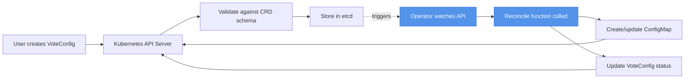
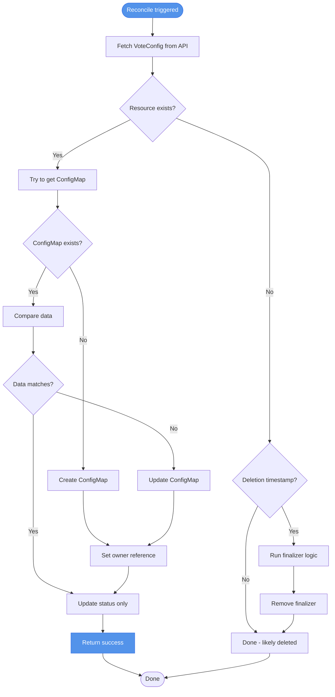
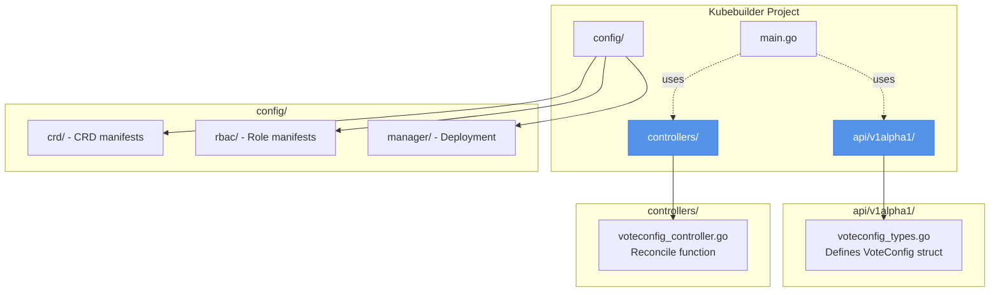
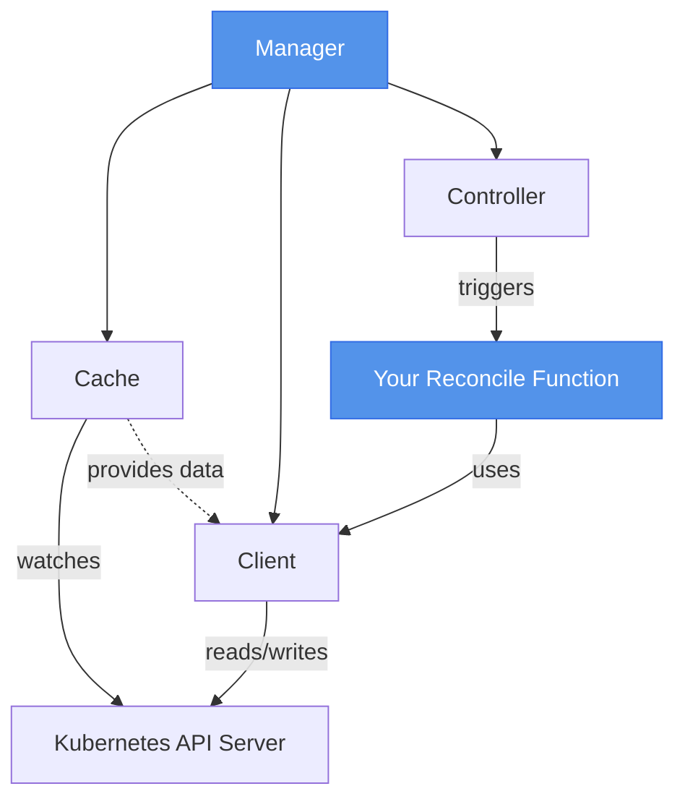

# Module 8: Building Kubernetes Operators

## Overview

In Module 7, you created the VoteConfig CRD to define a custom resource type for voting configurations. You could `kubectl apply` VoteConfig resources, and Kubernetes stored them in etcd. But nothing happened automatically. When you created a VoteConfig, you still had to manually create a ConfigMap with the voting options. When you updated the VoteConfig, you had to remember to update the ConfigMap. The synchronization was entirely manual.

This is where operators come in. An operator is a controller that watches your custom resources and automatically takes action to reconcile them. The VoteConfig operator you'll build watches for VoteConfig changes and automatically creates, updates, or deletes ConfigMaps. You declare what you want (the VoteConfig), and the operator makes it happen. This is the promise of declarative automation in Kubernetes.

Operators power the entire cloud native ecosystem. Database operators (like the PostgreSQL operator) provision databases, create backups, and handle failover. Certificate managers (like cert-manager) request and renew TLS certificates automatically. Service meshes (like Istio) use operators to configure routing rules. Once you understand how to build operators, you unlock the ability to automate any complex operational workflow in Kubernetes.

## The Operator Pattern

The operator pattern combines two things: a Custom Resource Definition (the schema) and a controller (the automation logic). Together, they create a declarative API for managing complex applications.

Think of it this way:
- **CRD** = the form definition (what fields exist, what's required, what's valid)
- **Operator** = the form processor (what to do when someone submits the form)

Without the operator, your CRD is just data storage. The API server validates and stores VoteConfig resources, but nothing acts on them. With the operator, creating a VoteConfig triggers automatic actions—ConfigMap creation, deployment updates, status tracking.



Real-world operators handle complex lifecycle management. A database operator doesn't just create a database pod—it provisions storage, configures replication, sets up backups, monitors health, handles failover, and performs upgrades. All of this is triggered by creating a single custom resource. The user declares "I want a PostgreSQL database with these properties," and the operator handles the entire lifecycle.

The VoteConfig operator is simpler but follows the same pattern. You declare "I want these voting options," and the operator ensures a ConfigMap exists with the correct data. When you change the VoteConfig, the operator updates the ConfigMap. When you delete the VoteConfig, the operator cleans up the ConfigMap. Declarative, automated, and reliable.

## The Reconciliation Loop

The core of every operator is the reconciliation loop. This is the function that gets called whenever a watched resource changes. The reconciliation loop follows a simple pattern: observe, compare, act.

**Observe**: Fetch the current state from the Kubernetes API. What does the VoteConfig say? What ConfigMaps exist?

**Compare**: Compare current state to desired state. Does the ConfigMap have the right data? Does it even exist?

**Act**: Take action to align current state with desired state. Create the ConfigMap if missing. Update it if the data is stale. Delete it if the VoteConfig is being deleted.



Here's the critical insight: the reconciliation loop must be **idempotent**. Running it twice with the same inputs should produce the same result. This is essential because Kubernetes will call your reconcile function repeatedly—on resource creation, updates, deletions, and periodically just to ensure consistency.

Imagine you write a reconcile function that always creates a new ConfigMap, even if one already exists. Every time the reconcile loop runs, you'd create duplicate ConfigMaps, eventually filling up your cluster. Instead, you use "create or update" logic: check if the ConfigMap exists, create it if missing, update it if it exists. Running this logic twice is safe—the second run sees the ConfigMap already exists and either leaves it alone or updates it to match.

The reconciliation loop is also **level-triggered**, not edge-triggered. It doesn't care how many times the VoteConfig was updated or what the previous values were. It only cares about the current desired state (what the VoteConfig says now) and the current actual state (what resources exist now). This makes operators resilient to missed events—if the operator crashes and restarts, it observes the current state and reconciles it, without needing to replay the history of changes.

## Kubebuilder Workflow

Building an operator from scratch requires writing a lot of boilerplate: setting up the controller manager, configuring watches, generating CRDs, creating RBAC rules, building Docker images, deploying to clusters. Kubebuilder automates all of this.

Kubebuilder is the official Kubernetes project for scaffolding operators. It generates the project structure, provides libraries for interacting with the Kubernetes API (controller-runtime), and includes tools for building and deploying operators. When you run `kubebuilder init`, it creates a complete operator project with sensible defaults.

Here's what Kubebuilder generates:

**api/**: Contains your API type definitions (the Go structs that map to your CRD schema). You define VoteConfigSpec and VoteConfigStatus here.

**controllers/**: Contains your reconciliation logic. This is where you write the code that creates ConfigMaps from VoteConfigs.

**config/**: Contains Kubernetes manifests for deploying your operator—the CRD definition, RBAC roles, deployment manifests, and more.

**main.go**: Sets up the controller manager, registers your controllers, and starts watching for resources.



The workflow for building an operator with Kubebuilder is:

1. **Scaffold**: Run `kubebuilder init` to create the project, then `kubebuilder create api` to generate API types and controller stubs.

2. **Define API**: Edit `api/v1alpha1/voteconfig_types.go` to define your custom resource's spec and status fields.

3. **Implement Controller**: Edit `controllers/voteconfig_controller.go` to write the reconciliation logic.

4. **Generate Manifests**: Run `make manifests` to regenerate the CRD YAML from your Go types.

5. **Test Locally**: Run `make run` to test the operator locally (it connects to your cluster but runs on your machine).

6. **Build and Deploy**: Run `make docker-build` to create an operator image, then `make deploy` to deploy it to your cluster.

This workflow is battle-tested and follows Kubernetes best practices. You're not reinventing controller patterns—you're using the same libraries (controller-runtime) that power Kubernetes's own controllers.

## Implementing the VoteConfig Operator

Let's walk through what the VoteConfig operator does. The goal is simple: watch VoteConfig resources and automatically manage ConfigMaps.

When a VoteConfig is created, the operator:
1. Fetches the VoteConfig from the API
2. Builds ConfigMap data from the VoteConfig spec (converts vote options to a format the vote app understands)
3. Creates a ConfigMap with the voting options
4. Sets an owner reference so the ConfigMap is deleted if the VoteConfig is deleted
5. Updates the VoteConfig status to record the ConfigMap name and timestamp

When a VoteConfig is updated, the operator:
1. Detects the change (Kubernetes triggers the reconcile function)
2. Fetches the current ConfigMap
3. Compares the ConfigMap data to the VoteConfig spec
4. Updates the ConfigMap if the data doesn't match
5. Updates the VoteConfig status

When a VoteConfig is deleted, the operator:
1. Runs finalizer logic (if configured) to perform cleanup
2. Removes the finalizer
3. Kubernetes automatically deletes the ConfigMap (because of the owner reference)

The reconcile function looks like this (simplified pseudocode):

```go
func (r *VoteConfigReconciler) Reconcile(ctx context.Context, req ctrl.Request) (ctrl.Result, error) {
    // 1. Fetch the VoteConfig
    voteConfig := &VoteConfig{}
    if err := r.Get(ctx, req.NamespacedName, voteConfig); err != nil {
        // Resource not found - likely deleted
        return ctrl.Result{}, client.IgnoreNotFound(err)
    }

    // 2. Handle deletion (finalizer logic)
    if !voteConfig.DeletionTimestamp.IsZero() {
        // Resource is being deleted - run cleanup
        return r.handleDeletion(ctx, voteConfig)
    }

    // 3. Generate ConfigMap data from VoteConfig spec
    configData := r.buildConfigMapData(voteConfig)

    // 4. Create or update ConfigMap
    configMap := &ConfigMap{Name: voteConfig.Name + "-config"}
    op, err := controllerutil.CreateOrUpdate(ctx, r.Client, configMap, func() error {
        configMap.Data = configData
        // Set owner reference for garbage collection
        return controllerutil.SetControllerReference(voteConfig, configMap, r.Scheme)
    })

    // 5. Update VoteConfig status
    voteConfig.Status.ConfigMapName = configMap.Name
    voteConfig.Status.LastUpdated = time.Now()
    r.Status().Update(ctx, voteConfig)

    return ctrl.Result{}, nil
}
```

The key patterns:

**controllerutil.CreateOrUpdate()**: This helper function checks if the ConfigMap exists. If it doesn't, it creates it. If it does, it updates it. This is idempotent—running it multiple times is safe.

**controllerutil.SetControllerReference()**: This sets an owner reference on the ConfigMap pointing to the VoteConfig. When the VoteConfig is deleted, Kubernetes automatically deletes owned resources (garbage collection).

**r.Status().Update()**: This updates the status subresource separately from the spec. Status reflects observed state, not desired state. The operator sets status to report what it has done.

**client.IgnoreNotFound()**: When a resource is deleted, `r.Get()` returns a NotFound error. This is expected behavior, not a failure. The helper ignores this specific error.

## Finalizers and Cleanup

Sometimes you need to perform cleanup actions when a resource is deleted. For example, if your operator provisions external resources (like S3 buckets or DNS records), you need to delete those external resources when the custom resource is deleted. Finalizers provide a hook for this cleanup logic.

A finalizer is just a string in the `metadata.finalizers` array. When a resource has finalizers, Kubernetes sets the `deletionTimestamp` but doesn't actually delete the resource yet. The operator sees the deletion timestamp, runs its cleanup logic, then removes the finalizer. Only after all finalizers are removed does Kubernetes actually delete the resource from etcd.

The pattern looks like this:

```go
const finalizerName = "voting.schoolofdevops.com/finalizer"

func (r *VoteConfigReconciler) Reconcile(ctx context.Context, req ctrl.Request) (ctrl.Result, error) {
    voteConfig := &VoteConfig{}
    if err := r.Get(ctx, req.NamespacedName, voteConfig); err != nil {
        return ctrl.Result{}, client.IgnoreNotFound(err)
    }

    // Check if resource is being deleted
    if !voteConfig.DeletionTimestamp.IsZero() {
        if controllerutil.ContainsFinalizer(voteConfig, finalizerName) {
            // Run cleanup logic
            if err := r.cleanup(ctx, voteConfig); err != nil {
                return ctrl.Result{}, err
            }

            // Remove finalizer
            controllerutil.RemoveFinalizer(voteConfig, finalizerName)
            if err := r.Update(ctx, voteConfig); err != nil {
                return ctrl.Result{}, err
            }
        }
        return ctrl.Result{}, nil
    }

    // Add finalizer if not present
    if !controllerutil.ContainsFinalizer(voteConfig, finalizerName) {
        controllerutil.AddFinalizer(voteConfig, finalizerName)
        if err := r.Update(ctx, voteConfig); err != nil {
            return ctrl.Result{}, err
        }
    }

    // Normal reconciliation logic...
}
```

For the VoteConfig operator, you might not need finalizers because the ConfigMap cleanup happens automatically via owner references. But finalizers are essential when you manage external resources that Kubernetes doesn't know about.

:::caution[Test Finalizers Carefully]
If your finalizer logic has a bug and never completes, the resource gets stuck in a "deleting" state forever. You can't delete it because the finalizer never gets removed. Always test finalizer logic thoroughly, and provide a way to manually remove finalizers if things go wrong (`kubectl patch` can remove finalizers in emergencies).
:::

## Controller-Runtime Components

Kubebuilder uses the controller-runtime library, which provides the building blocks for operators. Understanding the main components helps you reason about how operators work.

**Manager**: The top-level component that coordinates everything. It starts controllers, manages the cache, and provides the client. When you run your operator, you're starting the manager.

**Controller**: Watches resources and calls your reconcile function when changes occur. You register controllers with the manager.

**Client**: The interface for interacting with the Kubernetes API. Use `client.Get()` to fetch resources, `client.Create()` to create resources, `client.Update()` to update them.

**Cache**: A local cache of resources that reduces load on the API server. When you call `client.Get()`, it reads from the cache (which is kept up-to-date via watches).

**Reconciler**: Your code that implements the reconciliation logic. This is the `Reconcile()` function you write.



The setup code in `main.go` wires these components together:

```go
// Create manager
mgr, err := ctrl.NewManager(ctrl.GetConfigOrDie(), ctrl.Options{
    Scheme: scheme,
})

// Register your controller
if err := (&VoteConfigReconciler{
    Client: mgr.GetClient(),
    Scheme: mgr.GetScheme(),
}).SetupWithManager(mgr); err != nil {
    return err
}

// Start manager (blocks until stopped)
mgr.Start(ctx)
```

The `SetupWithManager()` function tells the controller what to watch:

```go
func (r *VoteConfigReconciler) SetupWithManager(mgr ctrl.Manager) error {
    return ctrl.NewControllerManagedBy(mgr).
        For(&VoteConfig{}).           // Watch VoteConfig resources
        Owns(&corev1.ConfigMap{}).    // Watch ConfigMaps owned by VoteConfig
        Complete(r)
}
```

This configuration means:
- When a VoteConfig is created, updated, or deleted, call Reconcile()
- When a ConfigMap owned by a VoteConfig changes, call Reconcile() for the owner

This way, if someone manually edits a ConfigMap, the operator detects the change and reconciles it back to match the VoteConfig spec.

## Testing and Deployment

Kubebuilder provides a streamlined workflow for testing and deploying operators.

**Local Testing**: Run `make run` to test the operator locally. The operator runs on your machine but connects to your cluster. This is the fastest way to iterate during development. You can see logs in your terminal, set breakpoints in your IDE, and quickly test changes without building container images.

**Unit Testing**: Kubebuilder generates test scaffolding using envtest, which runs a lightweight API server and etcd for testing. You can write unit tests for your reconcile function without a full cluster.

**Building Images**: Run `make docker-build IMG=yourrepo/voteconfig-operator:v1` to build a container image. Kubebuilder generates a Dockerfile that uses multi-stage builds for efficiency.

**Deploying to Cluster**: Run `make deploy IMG=yourrepo/voteconfig-operator:v1` to deploy the operator to your cluster. This creates:
- The CRD (so VoteConfig resources are recognized)
- A namespace for the operator
- RBAC roles and bindings (so the operator has permissions)
- A Deployment for the operator pod

For KIND clusters, you need to load the image into KIND since it can't pull from remote registries:

```bash
make docker-build IMG=schoolofdevops/voteconfig-operator:v1
kind load docker-image schoolofdevops/voteconfig-operator:v1
make deploy IMG=schoolofdevops/voteconfig-operator:v1
```

Once deployed, you can watch the operator logs to see reconciliation in action:

```bash
kubectl logs -n voteconfig-operator-system deployment/voteconfig-operator-controller-manager -f
```

Create a VoteConfig and watch the operator automatically create the ConfigMap. Update the VoteConfig and see the ConfigMap update. Delete the VoteConfig and verify the ConfigMap is cleaned up. This is declarative automation in practice.

## When to Use Operators

Operators are powerful, but they add complexity. Not every problem needs an operator. Here's when operators make sense and when simpler approaches are better.

**Use operators when:**
- You're managing complex stateful applications (databases, message queues, caches)
- You need to automate multi-step operational workflows (backup, restore, upgrade)
- You want a declarative API for application-specific operations
- You're building a platform that others will use (internal developer platforms, SaaS)
- The operational knowledge is valuable to encode (you're automating expertise, not just YAML)

**Don't use operators when:**
- Simple ConfigMaps or Deployments are sufficient
- The "automation" is just copying values from one resource to another (use Kustomize or Helm)
- You're solving a one-time problem (write a script, not an operator)
- The application has no complex operational needs (stateless microservices)
- You don't have Go expertise and can't maintain the operator code

The VoteConfig operator you're building is a learning example. In production, you might just use ConfigMaps directly. But the patterns you learn—reconciliation loops, idempotency, finalizers, status updates—apply to real operators managing databases, certificates, service meshes, and more.

Think of operators as codified operational knowledge. If you have complex runbooks for managing an application, an operator can automate those runbooks. If your application is simple and just needs to run, stick with standard Kubernetes resources.

## Production Considerations

Building an operator for learning is one thing. Running it in production is another. Here are key considerations:

**RBAC**: Your operator needs permissions to watch and modify resources. Follow the principle of least privilege. Don't give your operator cluster-admin. Kubebuilder generates RBAC rules from markers in your code:

```go
// +kubebuilder:rbac:groups=voting.schoolofdevops.com,resources=voteconfigs,verbs=get;list;watch;create;update;patch;delete
// +kubebuilder:rbac:groups="",resources=configmaps,verbs=get;list;watch;create;update;patch;delete
```

**Resource Limits**: Set resource requests and limits for the operator pod. An operator that consumes too much memory or CPU can destabilize the cluster.

**Monitoring**: Expose metrics (controller-runtime provides built-in Prometheus metrics). Monitor reconciliation latency, error rates, and queue depth.

**Error Handling**: Don't crash on errors. Return the error from Reconcile() and let controller-runtime retry with exponential backoff. Log errors for debugging but keep the operator running.

**Upgrade Strategy**: Support multiple API versions for backwards compatibility. Use conversion webhooks when changing CRD schemas. Test upgrades carefully—operators manage critical resources.

**Testing**: Write comprehensive tests. Use envtest for integration tests. Test upgrade paths, error handling, and edge cases (what happens if the API server is temporarily unavailable?).

The operator you build in the lab is production-quality in structure but simplified in functionality. Real operators handle more edge cases, include comprehensive tests, and provide better observability.

## Summary

Key takeaways from this module:

- **Operators combine CRDs and controllers** to create declarative APIs for complex applications
- **The reconciliation loop follows observe-compare-act** and must be idempotent to handle repeated calls safely
- **Kubebuilder scaffolds operator projects** following Kubernetes best practices and generating boilerplate code
- **controller-runtime provides the building blocks** for interacting with the Kubernetes API efficiently
- **Finalizers enable cleanup logic** when resources are deleted, essential for managing external resources
- **Operators add value for complex operational workflows** but add unnecessary complexity for simple applications

## Further Reading

- [Kubebuilder Book](https://book.kubebuilder.io/) - Official tutorial and reference
- [Controller-Runtime Documentation](https://pkg.go.dev/sigs.k8s.io/controller-runtime) - API reference
- [Operator Pattern (Kubernetes Docs)](https://kubernetes.io/docs/concepts/extend-kubernetes/operator/) - Conceptual overview
- [School of DevOps Operator Tutorial](https://kubernetes-tutorial.schoolofdevops.com/adv_operator_go/) - Alternative learning sequence

:::info[Next Steps]
Now it's time to build the VoteConfig operator yourself. The lab will walk you through scaffolding the project, implementing the reconciliation logic, and deploying the operator to your cluster.
:::
