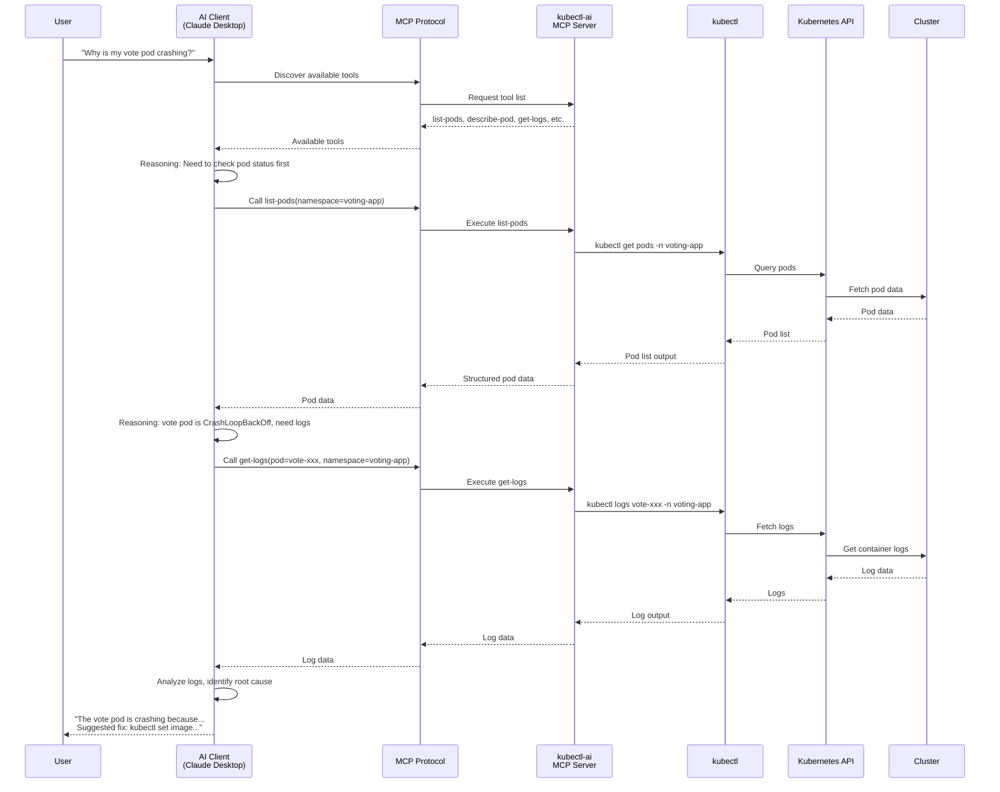
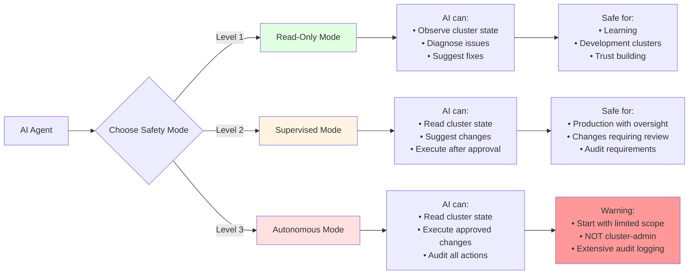

# Module 9: Intro to Agentic Kubernetes

## Overview

You've spent this entire course becoming a better Kubernetes operator. You learned to schedule pods strategically, scale workloads automatically, secure traffic with network policies, package applications with Helm, and extend the API with operators. Each module made you more capable, but also more responsible. Every kubectl command was yours to craft, every configuration decision yours to make, every troubleshooting session yours to navigate.

The shift to AI-assisted operations doesn't change that fundamental responsibility. It changes the tools you have to meet it.

Agentic Kubernetes is not about autonomous AI running your cluster unattended. That's a future state, and a controversial one. Agentic Kubernetes today is about AI that can observe, reason about, and suggest actions for your Kubernetes workloads. Think of it as a very knowledgeable teammate who can read logs faster than you, correlate events across services, and suggest kubectl commands based on the issue - but who always asks for your approval before making changes.

This is the difference between automation and augmentation. Automation replaces human decision-making. Augmentation enhances it. You're still the operator. The AI is the assistant.

## What is Agentic AI?

Agentic AI refers to AI systems that can observe, reason, and act on external systems. Unlike chatbots that only answer questions, agentic systems can execute operations in the real world - query databases, call APIs, modify configurations. The "agentic" part means the AI has agency: the ability to take action, not just provide information.

For Kubernetes, this translates to three levels of capability:

**Level 1: Chatbot** - The AI answers questions about Kubernetes concepts. "What's the difference between a Deployment and a StatefulSet?" It has knowledge but no connection to your cluster. This is helpful for learning but limited for operations.

**Level 2: Tool-using agent** - The AI can query your cluster state via kubectl. "Show me all pods in CrashLoopBackOff." It reads real data from your cluster, analyzes it, and explains what it finds. This is where AI assistance becomes operationally valuable.

**Level 3: Autonomous agent** - The AI can make changes with approval workflows. "Fix the ImagePullBackOff in the vote deployment." It suggests a kubectl command, explains why, and executes it after you approve. This is the frontier of agentic Kubernetes today.

This module focuses on Level 2 with glimpses of Level 3: AI that can READ your cluster state and SUGGEST changes, but needs YOUR approval to WRITE. Think of it as a junior ops engineer who knows Kubernetes very well, can investigate issues thoroughly, and brings you well-reasoned suggestions. You still make the decisions.

## Model Context Protocol (MCP)

Before MCP, connecting AI models to external tools was custom work. Every AI assistant needed bespoke integration code for every tool it used. Want your AI to query Kubernetes? Write custom code. Want it to check Prometheus metrics? More custom code. Want it to read GitHub issues? Even more custom code. This didn't scale.

Model Context Protocol solves this by standardizing how AI models interact with tools. Think of MCP as USB for AI: a universal interface that lets any MCP-compatible AI client connect to any MCP-compatible tool server.

**What MCP provides:**

- **Tool discovery**: Clients can ask servers "What tools do you offer?" and receive a list with descriptions
- **Input/output schemas**: Every tool declares what parameters it accepts and what data it returns
- **Error handling**: Standardized error responses when tools fail
- **Security modes**: Servers can enforce read-only access, require approval for writes, or audit all operations

**How MCP works:**

The beauty of this architecture is separation of concerns. The AI client (Claude Desktop, Cursor, VS Code) knows nothing about Kubernetes. The MCP server (kubectl-ai) knows nothing about language models. The protocol in between lets them work together without tight coupling.

**MCP servers for Kubernetes:**

Several implementations exist, each with different design philosophies:

- **kubectl-ai** (Google Cloud Platform) - Multi-LLM support, Apache 2.0 license, 7.2k+ GitHub stars, active development. Supports Gemini, OpenAI, Azure OpenAI, and Ollama local models. This module uses kubectl-ai for its stability and broad compatibility.
- **mcp-kubernetes** (Azure) - Python-based, tight Azure integration, focus on enterprise scenarios
- **containers/kubernetes-mcp-server** (Podman team) - Container-native approach, emphasis on Podman/Kubernetes interoperability

This ecosystem is young but growing rapidly. The core pattern - MCP protocol connecting AI clients to Kubernetes tools - is the durable innovation.

## AI-Assisted Kubernetes Operations

What does AI assistance look like in practice? Let's walk through four operational scenarios where AI augments human capabilities.

### Use Case 1: Diagnostics

**Human task:** "Why is my pod crashing?"

**Without AI:** You run `kubectl get pods`, identify the failing pod, run `kubectl describe pod`, read events, run `kubectl logs`, correlate the signals, form a hypothesis, verify it.

**With AI:** You ask "Why is my vote pod crashing?" The AI performs the same sequence automatically, analyzes the correlation between events and logs, and explains: "The vote pod is crashing because the container cannot connect to Redis. The error 'Connection refused on redis:6379' appears in logs. The redis service exists but has 0 endpoints, indicating the redis pod is not running. Root cause: redis deployment has 0 replicas."

The AI didn't replace your judgment. It compressed 5 kubectl commands and 3 minutes of log reading into 10 seconds. You still decide whether to scale redis up, investigate why it scaled to 0, or check for resource constraints.

### Use Case 2: Troubleshooting

**Human task:** "Fix the ImagePullBackOff error."

**Without AI:** You describe the pod, identify the wrong image tag, look up the correct one, craft the kubectl command to update it, verify the fix.

**With AI:** You ask "Fix the ImagePullBackOff on vote." The AI describes the pod, identifies the image "schoolofdevops/vote:doesnotexist", suggests: "The image tag 'doesnotexist' is invalid. Try: `kubectl set image deployment/vote vote=schoolofdevops/vote:v1 -n voting-app --dry-run=client` to preview the change." You review, approve, and execute.

The AI handled the investigation. You made the change after verifying the suggestion was safe and correct.

### Use Case 3: Exploration

**Human task:** "Show me services with high latency."

**Without AI:** You query Prometheus, write PromQL queries, filter results, format output. Or you don't, because it's too much overhead for a quick check.

**With AI:** You ask "Which services are slow?" The AI queries metrics, applies latency thresholds, and presents: "The worker service has p99 latency of 2.3 seconds (normally 200ms). The postgres service has 15 slow queries logged in the last hour. Other services are within normal parameters."

The AI lowered the activation energy for investigation. You're more likely to check metrics if checking is a sentence, not a script.

### Use Case 4: Knowledge with Context

**Human task:** "What's the difference between RollingUpdate and Recreate strategy?"

**Without AI:** You read Kubernetes documentation, understand the concepts abstractly.

**With AI:** You ask the same question. The AI explains the concepts, then adds: "Your vote deployment uses RollingUpdate with maxUnavailable: 1. This means during updates, at least 2 of your 3 replicas stay available. If you switched to Recreate, all 3 replicas would terminate before new ones start, causing 10-20 seconds of downtime."

The AI explained the general concept AND analyzed your specific cluster configuration. This is knowledge grounded in your reality, not generic documentation.

Here's the workflow for AI-assisted troubleshooting:

```mermaid
flowchart TD
    Start([User reports issue]) --> Question[User asks AI:<br/>'Why is vote pod failing?']
    Question --> AI_Reason{AI reasoning:<br/>What tools needed?}

    AI_Reason -->|Need pod status| Tool1[MCP: Execute<br/>get-pods tool]
    Tool1 --> Kubectl1[kubectl get pods<br/>-n voting-app]
    Kubectl1 --> Result1[Returns: vote pod<br/>status CrashLoopBackOff]

    Result1 --> AI_Reason2{AI reasoning:<br/>Need more data?}
    AI_Reason2 -->|Need logs| Tool2[MCP: Execute<br/>get-logs tool]
    Tool2 --> Kubectl2[kubectl logs vote-xxx<br/>-n voting-app]
    Kubectl2 --> Result2[Returns: Connection<br/>refused to redis:6379]

    Result2 --> AI_Reason3{AI reasoning:<br/>Need redis status?}
    AI_Reason3 -->|Verify redis| Tool3[MCP: Execute<br/>get-endpoints tool]
    Tool3 --> Kubectl3[kubectl get endpoints<br/>redis -n voting-app]
    Kubectl3 --> Result3[Returns: No endpoints<br/>redis pod not running]

    Result3 --> Analysis[AI analyzes:<br/>Root cause identified]
    Analysis --> Suggest[AI suggests fix:<br/>'kubectl scale deployment<br/>redis --replicas=1']

    Suggest --> Human{Human reviews:<br/>Is this safe?<br/>Is this correct?}
    Human -->|Approve| Execute[Human executes:<br/>kubectl scale...]
    Human -->|Reject| Manual[Human investigates<br/>further manually]

    Execute --> Verify[Verify fix worked]
    Manual --> Verify
    Verify --> End([Issue resolved])

    style Question fill:#e1f5ff
    style Suggest fill:#fff4e1
    style Human fill:#ffe1e1
    style Execute fill:#e1ffe1
```

Notice the human decision gate. The AI can investigate thoroughly, but the human approves the action. This is human-in-the-loop by design.

## Safety and Human-in-the-Loop

AI can hallucinate kubectl commands. This is not theoretical. It happens. An AI might suggest `kubectl delete pod <pod-name> --force` to fix CrashLoopBackOff. The pod will delete, restart, and crash again with the same issue. The AI doesn't understand that deleting a pod doesn't fix the underlying problem - wrong image, missing config, insufficient resources. You do.

Safety in agentic Kubernetes requires multiple layers:

**Layer 1: Start read-only**

Configure your MCP server to only allow read operations. No apply, no delete, no scale, no patch. The AI can observe and diagnose but cannot modify anything. This is training wheels. You learn how the AI reasons, what suggestions it makes, where it fails. Only after building trust do you enable write operations.

**Layer 2: Require approval for destructive operations**

When you enable writes, enforce approval workflows. The AI suggests a command. You review it. You execute it manually or confirm via a prompt. Never let the AI auto-execute delete, scale to 0, force restart, or any operation that causes downtime.

**Layer 3: Use --dry-run for previews**

AI should suggest commands with `--dry-run=client` first. This previews changes without applying them. You see what would happen, verify it's correct, then run without dry-run. This catches errors before they affect your cluster.

**Layer 4: Audit logging**

Record every AI-suggested action: what it suggested, why, whether you approved it, the outcome. When something goes wrong, you need this paper trail to understand what happened and prevent recurrence.

Here's the safety model visualized:

:::caution Never Give AI Cluster-Admin
Never give an AI agent cluster-admin permissions on a production cluster. Start with read-only access to a development cluster. Graduate to supervised mode only after building trust. Autonomous mode with write access is an advanced pattern requiring extensive safeguards.
:::

**Anti-pattern: Trusting AI without verification**

Here's what can go wrong. You ask "Why is my app slow?" The AI investigates and suggests: `kubectl delete pod worker-xxx --force --grace-period=0`. This is a real suggestion an AI might make. It's also wrong.

Force-deleting a pod with zero grace period skips cleanup. If the worker was processing a job, that job is lost. The replacement pod will start clean, and the job won't be retried. Data loss from AI suggestion.

The correct approach: `kubectl describe pod worker-xxx` to understand why it's slow, then address the root cause (CPU throttling? I/O wait? Network latency?). Deleting the pod treats the symptom, not the disease.

AI does not understand consequences the way you do. Always review. Always ask "What happens if this command runs?" Always verify the AI's reasoning before executing.

## The Emerging Ecosystem

Agentic Kubernetes is early-stage. The tools are maturing, the patterns are forming, but this is not yet a solved problem. That said, several production-grade frameworks are emerging:

**Kagent** - A CNCF sandbox project focused on production agentic workflows for Kubernetes. It provides orchestration for multi-step AI operations, approval gates, audit logging, and integration with existing CI/CD pipelines. Kagent treats AI agents as first-class cluster resources with their own RBAC policies.

**Kubeagentics** - An event-driven framework where AI agents respond to cluster events (pod crashes, resource exhaustion, security violations) and take automated remediation actions within predefined policies. It emphasizes autonomous response within guardrails rather than human-in-the-loop.

**Custom MCP servers** - Organizations are building domain-specific MCP servers that combine Kubernetes operations with proprietary tools. For example, an MCP server that can query Kubernetes, correlate with Datadog metrics, check PagerDuty incidents, and suggest fixes based on company runbooks.

These frameworks share common principles:

- **Policy enforcement**: AI actions are constrained by policies (RBAC, admission controllers, custom validators)
- **Audit trails**: Every AI action is logged with reasoning and outcome
- **Gradual autonomy**: Systems start in supervised mode and graduate to autonomy only after proving reliability
- **Fail-safe defaults**: When AI is uncertain, it asks humans rather than guessing

This field is evolving rapidly. The concepts you learned today - MCP protocol, human-in-the-loop, safety modes, tool-using agents - are durable. The specific tools will mature and change. New MCP servers will emerge. Better AI models will improve reasoning. The frameworks will consolidate.

Stay focused on principles:

- AI assists, humans decide (until proven otherwise)
- Read-only first, writes with approval, autonomy last
- Audit everything
- Start small, expand gradually
- Trust, but verify

## Summary

Key takeaways from this module:

- **Agentic AI for Kubernetes means AI that can observe, reason about, and suggest actions for your cluster** - not autonomous agents running unattended, but assistants that augment human operators
- **Model Context Protocol (MCP) standardizes how AI models interact with Kubernetes tools** - enabling any MCP client to connect to any MCP server without custom integration code
- **AI-assisted operations compress investigation time** - AI performs routine kubectl sequences, correlates signals, and presents findings, letting humans focus on decisions
- **Human-in-the-loop is a safety requirement, not a limitation** - AI can hallucinate dangerous commands, so humans must review and approve suggestions before execution
- **The agentic ecosystem is emerging rapidly** - production frameworks like Kagent and Kubeagentics are establishing patterns for safe, auditable AI operations at scale

## Further Reading

- [Model Context Protocol Specification](https://spec.modelcontextprotocol.io/) - Official MCP protocol documentation
- [kubectl-ai on GitHub](https://github.com/GoogleCloudPlatform/kubectl-ai) - Google Cloud Platform's MCP-enabled Kubernetes tool
- [Kagent Project](https://github.com/kagent-dev/kagent) - CNCF sandbox project for production agentic workflows
- [Anthropic MCP Documentation](https://www.anthropic.com/model-context-protocol) - Context and examples for MCP implementations
- [Kubernetes Operators and AI Agents](https://kubernetes.io/blog/2024/01/ai-operators/) - How operators and agents differ

:::info Next Steps
Install kubectl-ai and try AI-assisted Kubernetes operations in the [lab](/section-9/lab). You'll perform diagnostics, troubleshoot a deliberately broken deployment, and evaluate AI suggestions with safety awareness.
:::
