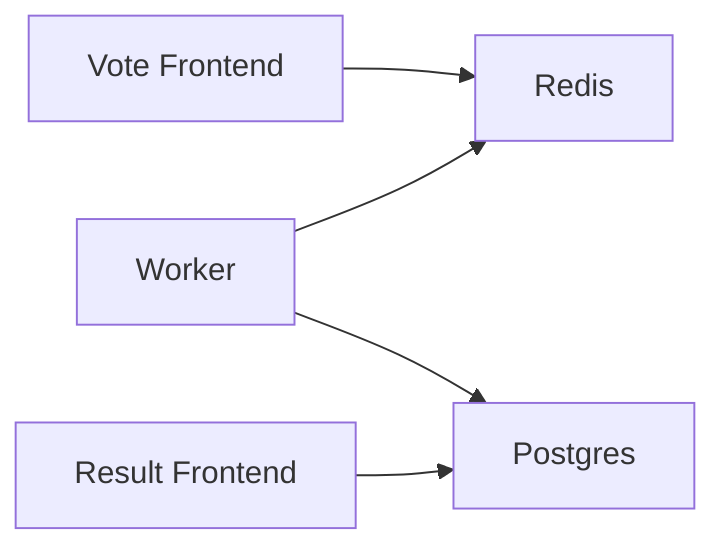

# Content Authoring Guide

This guide is the single source of truth for all content conventions, project structure, and deployment workflow for the Kubernetes Intermediate (SFD301) course.

## Templates Overview

This directory contains three reusable templates for consistent content creation:

- **[lab-template.md](./lab-template.md)** - Hands-on lab structure with 8 required sections (Objectives, Prerequisites, Setup, Tasks, Verification, Cleanup, Troubleshooting, Key Takeaways)
- **[content-template.md](./content-template.md)** - Flexible reading material framework with suggested sections, admonition examples, and code block patterns
- **[quiz-template.md](./quiz-template.md)** - Quiz preparation format demonstrating all 3 question types (Multiple Choice, True/False, Scenario) for TutorLMS spreadsheet conversion

Use these templates as starting points for creating module content. They follow locked user decisions and established conventions.

## Voice and Tone

**Style: Conversational and Friendly**

- **Direct address**: Use "you" and "we" to engage learners
- **Approachable teaching**: Explain concepts clearly without condescension
- **Simple language**: Prefer clarity over jargon. Use analogies when helpful
- **No emojis**: Keep content clean, minimal, and professional
- **Intermediate audience**: Assume learners completed Kubernetes Essentials - focus on depth, not basics
- **Target reading time**: 10-20 minutes per module

**Examples**:

Good: "You'll configure the HorizontalPodAutoscaler to monitor CPU usage. When load increases, Kubernetes automatically adds more vote pods."

Bad: "The HPA resource facilitates dynamic replica adjustment based on observed metrics." (too formal)

Bad: "Let's set up HPA! 🚀 This is so cool! 😎" (emojis not allowed)

## Code Block Conventions

**Language Tags - ALWAYS REQUIRED**

Every code block MUST specify a language tag. Never use plain triple backticks.

**Available languages**: `yaml`, `bash`, `json`, `typescript`, `docker`, `go`, `python`, `hcl`

**Examples**:

```yaml
# Correct - language tag specified
apiVersion: v1
kind: Pod
```

```bash
# Correct - bash commands tagged
kubectl get pods -n voting-app
```

Never use:
```
# Wrong - no language tag
kubectl apply -f file.yaml
```

**Title Attribute for Filenames**

Use the title attribute to show filenames, making it clear what file users are working with:

```yaml title="deployment.yaml"
apiVersion: apps/v1
kind: Deployment
metadata:
  name: vote
```

**Line Highlighting**

Prefer magic comments over metadata ranges for highlighting important lines:

```yaml
apiVersion: apps/v1
kind: HorizontalPodAutoscaler
spec:
  # highlight-next-line
  maxReplicas: 10
  minReplicas: 2
```

**Copy-Friendly Commands**

- **Single lines when possible**: Easier to copy-paste
- **Backslash continuation**: For long commands, use backslash for readability

```bash
# Good - single line for short commands
kubectl get pods -n voting-app

# Good - backslash continuation for long commands
kubectl create deployment vote \
  --image=schoolofdevops/vote:v1 \
  --replicas=3 \
  --namespace=voting-app
```

**Line Length**

- **Recommended maximum**: 80 characters for code blocks
- **Purpose**: Prevents horizontal scrolling, improves readability on mobile
- **Exception**: URLs and long resource names can exceed if necessary

**Indentation**

- **YAML**: 2 spaces (Kubernetes standard)
- **Consistency**: Match existing project style

```yaml
# Correct - 2-space indentation
apiVersion: v1
kind: Pod
metadata:
  name: vote
spec:
  containers:
  - name: vote
    image: schoolofdevops/vote:v1
```

**Commenting in Code**

- **Selective commenting**: Annotate non-obvious operations only
- **Explain "why", not "what"**: Intermediate learners understand basic K8s YAML
- **Comment placement**: Above the relevant line or inline for short notes

```yaml
apiVersion: apps/v1
kind: Deployment
metadata:
  name: vote
spec:
  replicas: 3
  selector:
    matchLabels:
      app: vote
  template:
    spec:
      containers:
      - name: vote
        image: schoolofdevops/vote:v1
        resources:
          requests:
            # Baseline for scheduler - ensures node has 100m CPU available
            cpu: 100m
            memory: 128Mi
          limits:
            # Maximum allowed - pod throttled at 200m CPU, OOMKilled if exceeds 256Mi
            cpu: 200m
            memory: 256Mi
```

## Admonition Usage

Docusaurus supports five built-in admonition types. Use them to highlight important information without disrupting reading flow.

### Admonition Types

**`note`** - Background information, context, additional details

```markdown
:::note
Kubernetes uses etcd as its backing store for all cluster data. Understanding etcd's consistency model helps you reason about how Kubernetes handles state.
:::
```

**`tip`** - Best practices, shortcuts, pro tips

```markdown
:::tip[Pro Tip]
Use `kubectl explain <resource>.<field>` to quickly reference API documentation without leaving the terminal. For example: `kubectl explain pod.spec.containers`
:::
```

**`info`** - Version notes, compatibility information, FYI content

```markdown
:::info[Version Note]
The Gateway API graduated to beta in Kubernetes 1.26. If you're running an older version, you'll need to install the CRDs manually from the Gateway API repository.
:::
```

**`caution`** - Potential issues, deprecated features, things to watch out for

```markdown
:::caution[Watch Out]
Removing resource limits entirely can lead to resource contention. One misbehaving pod could consume all available CPU or memory on a node, affecting other workloads.
:::
```

**Note**: Use `caution` instead of `warning` - the `warning` type is deprecated in Docusaurus v4.

**`danger`** - Critical warnings, data loss risks, security implications

```markdown
:::danger[Data Loss Risk]
Deleting a PersistentVolume with `persistentVolumeReclaimPolicy: Delete` will permanently delete the underlying storage. Always verify the reclaim policy before removing PVs in production.
:::
```

### Admonition Rules

1. **Custom titles**: Use bracket syntax for custom titles: `:::note[Custom Title]`
2. **Blank lines**: Always add blank lines before and after admonitions (Prettier compatibility)
3. **Limit usage**: 1-2 admonitions per section maximum to avoid callout fatigue
4. **Content**: Keep admonition content concise - 1-3 sentences typically

## Diagram Embedding

For comprehensive diagram workflow documentation, see [diagrams/README.md](../diagrams/README.md).

### Quick Reference

**Mermaid Diagrams** (rendered natively):

```markdown

```

**Excalidraw/Image Diagrams** (exported as SVG/PNG):

```markdown

```

**Important**: Never hardcode base URLs like `https://schoolofdevops.github.io/kubernetes-intermediate/` - use relative paths to avoid GitHub Pages base path issues.

## Quiz Conventions

Quizzes are created in Markdown format for manual conversion to TutorLMS spreadsheet import. They are NOT displayed in Docusaurus.

**Reference**: [quiz-template.md](./quiz-template.md)

**Key Points**:
- **Volume**: 10-15 questions per module
- **Question types**: Mix of Multiple Choice (60%), Scenario (25%), True/False (15%)
- **Storage location**: `docs/section-N/quiz.md` (co-located with module content)
- **Purpose**: TutorLMS import preparation, not Docusaurus rendering
- **Format**: Each question includes type, question text, options, correct answer, and explanation

**TutorLMS Conversion**: The user will provide conversion instructions later. Focus on creating well-structured Markdown quizzes following the template format.

## Project Structure

Complete Docusaurus project layout for course replication:

```
kubernetes-intermediate/
├── .github/
│   └── workflows/
│       └── deploy.yml              # GitHub Actions deployment to GitHub Pages
├── .planning/                      # GSD planning artifacts (not part of course template)
│   ├── PROJECT.md                  # Project vision and decisions
│   ├── ROADMAP.md                  # Phase breakdown
│   ├── STATE.md                    # Current progress tracking
│   ├── config.json                 # GSD configuration
│   └── phases/                     # Per-phase planning documents
├── diagrams/                       # Centralized diagram source files
│   ├── README.md                   # Diagram workflow documentation
│   ├── section-0/ through section-9/  # Module-specific diagrams (flat structure)
│   └── shared/                     # Cross-module reusable diagrams
├── docs/                           # Course content (auto-generates sidebar)
│   ├── index.mdx                   # Course homepage (slug: /, routeBasePath: /)
│   └── section-N/                  # One folder per module (N = 0-9)
│       ├── _category_.json         # Sidebar label, position, collapsible setting
│       ├── 01-overview.mdx         # Module overview page (summary, learning path)
│       ├── 02-reading.md           # Main content (use content-template.md)
│       ├── 03-lab.md               # Hands-on lab (use lab-template.md)
│       └── quiz.md                 # Quiz preparation (use quiz-template.md, not displayed)
├── src/
│   ├── css/
│   │   └── custom.css              # CSS variable overrides, responsive styles
│   └── pages/                      # Custom non-doc pages (rarely used in docs-only mode)
├── static/
│   └── img/                        # Static images (favicon, social card, logos)
│       ├── favicon.ico
│       ├── logo.svg
│       └── kubernetes-social-card.jpg
├── templates/                      # Content authoring templates (this guide)
│   ├── AUTHORING-GUIDE.md          # This file
│   ├── lab-template.md             # Lab template
│   ├── content-template.md         # Reading material template
│   └── quiz-template.md            # Quiz preparation template
├── .gitignore                      # Standard Node.js + Docusaurus ignores
├── docusaurus.config.ts            # Main site configuration
├── sidebars.ts                     # Sidebar config (autogenerated from filesystem)
├── package.json                    # Dependencies and scripts
├── package-lock.json               # Locked dependency versions
├── tsconfig.json                   # TypeScript configuration
└── README.md                       # Repository introduction
```

### Key Configuration Files

**`docusaurus.config.ts`** (rarely changed after initial setup):
- Site metadata: title, tagline, favicon, URL, baseUrl
- Theme configuration: color mode, navbar, footer, Prism language support
- Plugins: Mermaid theme, local search plugin
- Mermaid theme: `{ light: 'neutral', dark: 'dark' }` for automatic light/dark mode
- docs preset: `routeBasePath: '/'` for docs-only mode (no blog)

**`sidebars.ts`** (minimal config needed):
- Sidebars are auto-generated from filesystem structure
- `_category_.json` files in each `docs/section-N/` folder control sidebar labels and ordering
- Rarely needs manual editing

**`package.json`** (key scripts):
- `npm start` - Development server with hot reload (no search index built)
- `npm run build` - Production build (outputs to `build/` directory)
- `npm run serve` - Serve production build locally for testing (includes search)
- `npm run clear` - Clear Docusaurus cache (use if encountering build issues)

**`tsconfig.json`** (no changes needed):
- Extends `@docusaurus/tsconfig`
- Standard TypeScript configuration for Docusaurus projects

### Content vs. Configuration

**Content files** (edited frequently per module):
- `docs/section-N/*.md` and `docs/section-N/*.mdx` - Module content pages
- `docs/section-N/_category_.json` - Sidebar labels for each module
- `diagrams/section-N/*` - Diagram source files and exports
- `src/css/custom.css` - Custom styling (if needed for specific modules)

**Configuration files** (set once, rarely changed):
- `docusaurus.config.ts` - Site-wide settings
- `sidebars.ts` - Sidebar structure
- `package.json` - Dependencies and scripts
- `.github/workflows/deploy.yml` - Deployment automation

## Build and Deploy Workflow

### Local Development

**Development server** (fast, hot reload, no search):

```bash
npm start
```

Opens `http://localhost:3000` with live reload on file changes. Search functionality is not available in dev mode.

**Production preview** (with search):

```bash
npm run build
npm run serve
```

Builds the static site to `build/` directory, then serves it at `http://localhost:3000`. This is the exact output that will be deployed to GitHub Pages.

**Clear cache** (if encountering issues):

```bash
npm run clear
npm run build
```

### GitHub Actions Deployment

Deployment is fully automated via GitHub Actions. See [.github/workflows/deploy.yml](../.github/workflows/deploy.yml) for the complete workflow.

**Workflow Triggers**:
- **Push to `main` branch**: Builds and deploys to GitHub Pages
- **Pull requests**: Builds only (validates changes without deploying)

**Workflow Jobs**:

1. **Build Job**:
   - Checkout repository with `fetch-depth: 0` (full history for git metadata)
   - Setup Node.js 20 with npm cache
   - Install dependencies: `npm ci` (clean install from lock file)
   - Build site: `npm run build`
   - Upload `build/` directory as GitHub Pages artifact

2. **Deploy Job** (only on push to main):
   - Uses `actions/deploy-pages@v4` for deployment
   - OIDC authentication (no personal access tokens needed)
   - Deploys uploaded artifact to GitHub Pages

**Permissions Required**:

```yaml
permissions:
  contents: read    # Read repository contents
  pages: write      # Deploy to GitHub Pages
  id-token: write   # OIDC authentication
```

**Concurrency Control**:

```yaml
concurrency:
  group: "pages"
  cancel-in-progress: false
```

Prevents multiple simultaneous deployments. New deployments queue until the current one completes.

### GitHub Pages Setup (One-Time)

1. **Repository Settings** → **Pages**
2. **Source**: Select "GitHub Actions" (NOT "Deploy from a branch")
3. No personal access tokens or secrets needed - OIDC handles authentication automatically

**Important Configuration**:

In `docusaurus.config.ts`, the `url` and `baseUrl` must match your GitHub Pages URL:

```typescript
url: 'https://schoolofdevops.github.io',
baseUrl: '/kubernetes-intermediate/',
```

Format: `https://<org>.github.io/<repo>/`

### Deployment Verification

After deployment completes:

1. GitHub Actions workflow shows green checkmark
2. Visit the deployed site: `https://schoolofdevops.github.io/kubernetes-intermediate/`
3. Test key functionality:
   - Navigation between modules works
   - Search finds content
   - Diagrams render correctly
   - Links are not broken

### Troubleshooting Deployment

**Issue: 404 errors after deployment**

**Cause**: Incorrect `baseUrl` in `docusaurus.config.ts`

**Solution**: Verify `baseUrl` matches repository name: `/kubernetes-intermediate/`

---

**Issue: Broken assets (CSS, JS, images don't load)**

**Cause**: Hardcoded absolute URLs instead of relative paths

**Solution**: Use relative paths for all internal assets. Never hardcode `https://schoolofdevops.github.io/kubernetes-intermediate/` in content.

---

**Issue: Workflow fails with "Resource not accessible by integration" error**

**Cause**: Insufficient permissions in workflow or Pages not enabled

**Solution**:
1. Verify workflow has `pages: write` and `id-token: write` permissions
2. Confirm GitHub Pages is enabled in repository settings with "GitHub Actions" source

---

**Issue: Deployment succeeds but site shows outdated content**

**Cause**: Browser cache or CDN delay

**Solution**:
1. Hard refresh: `Ctrl+Shift+R` (Windows/Linux) or `Cmd+Shift+R` (Mac)
2. Wait 1-2 minutes for GitHub Pages CDN to update
3. Check deployment timestamp in workflow logs

## Per-Module File Organization

For each module (section-N), authors create these files:

### Required Files

**1. `docs/section-N/_category_.json`** (already exists from Phase 1):

```json
{
  "label": "Module N: Topic Name",
  "position": N,
  "collapsible": true
}
```

**2. `docs/section-N/01-overview.mdx`** (already exists from Phase 1):

Module overview with learning objectives and navigation. Uses MDX for potential component imports.

**3. `docs/section-N/02-reading.md`** (create using content-template.md):

Main instructional content covering concepts, patterns, and best practices. Plain Markdown with admonitions and code examples.

**4. `docs/section-N/03-lab.md`** (create using lab-template.md):

Hands-on lab with 8 required sections. Step-by-step instructions for applying concepts using the Example Voting App.

**5. `docs/section-N/quiz.md`** (create using quiz-template.md):

10-15 quiz questions for TutorLMS import. Not displayed in Docusaurus.

### Diagram Files

**6. `diagrams/section-N/NN-topic-description.{mmd,excalidraw,svg,png}`**:

- Mermaid diagrams: Save `.mmd` source (optional), embed code blocks in docs
- Excalidraw diagrams: Save `.excalidraw` source and export `.svg`/`.png`
- Follow naming convention: `NN-topic-description`

See [diagrams/README.md](../diagrams/README.md) for complete workflow.

### File Naming

- **Overview**: `01-overview.mdx` (MDX format)
- **Reading**: `02-reading.md` (Markdown)
- **Lab**: `03-lab.md` (Markdown)
- **Quiz**: `quiz.md` (Markdown, not numbered - not displayed)

Numeric prefixes control display order in sidebar. Files are sorted alphabetically.

## Example Voting App Continuity

The Example Voting App threads through all 10 modules as a continuous use case. This creates story-based learning instead of isolated examples.

**App Components**:
- **vote**: Frontend for casting votes (Python/Flask)
- **redis**: In-memory cache for storing votes
- **worker**: Background processor (.NET)
- **db**: PostgreSQL database for permanent storage
- **result**: Frontend for viewing results (Node.js)

**Story Progression**:
- Each module builds on the previous module's app state
- Early modules: deploy basic app, add resource management
- Middle modules: implement autoscaling, networking, security
- Later modules: package with Helm, extend with CRDs/Operators

**Author Responsibility**:
- Reference previous module changes in Prerequisites
- Show how current module's concepts improve/extend the app
- Maintain consistency in namespace, labels, configuration across modules
- Each lab should end with a working app (not broken state)

## Content Creation Checklist

Use this checklist when authoring a new module:

### Before Starting

- [ ] Read this authoring guide completely
- [ ] Review the three templates: lab, content, quiz
- [ ] Understand the Example Voting App state from the previous module
- [ ] Review `docs/section-N/01-overview.mdx` (already exists from Phase 1)

### Creating Reading Content (02-reading.md)

- [ ] Use [content-template.md](./content-template.md) as starting point
- [ ] Adapt template sections to module needs (flexible framework)
- [ ] Include 2-3 practical examples using Example Voting App
- [ ] Add 1-2 admonitions per major section (don't overuse)
- [ ] All code blocks have language tags (yaml, bash, json, etc.)
- [ ] Code examples are copy-friendly (single lines or proper backslash continuation)
- [ ] Target 10-20 minute reading time
- [ ] Voice is conversational and friendly (no emojis)
- [ ] Include "Further Reading" section with official K8s docs links

### Creating Lab (03-lab.md)

- [ ] Use [lab-template.md](./lab-template.md) as starting point
- [ ] All 8 sections present: Objectives, Prerequisites, Setup, Tasks, Verification, Cleanup, Troubleshooting, Key Takeaways
- [ ] Prerequisites reference previous module completion
- [ ] Setup verifies Example Voting App from previous module
- [ ] Tasks are numbered with clear step-by-step instructions
- [ ] All bash commands are copy-pasteable
- [ ] YAML configs include `title` attribute with filename
- [ ] Expected outputs shown for key commands
- [ ] Verification section confirms success criteria
- [ ] Cleanup removes resources created in lab
- [ ] Troubleshooting covers 2-3 common issues
- [ ] Lab ends with working Example Voting App (not broken)

### Creating Quiz (quiz.md)

- [ ] Use [quiz-template.md](./quiz-template.md) as starting point
- [ ] 10-15 questions total
- [ ] Mix of types: 60% Multiple Choice, 25% Scenario, 15% True/False
- [ ] Each question includes: type, question text, options, correct answer, explanation
- [ ] 2-3 questions specifically reference Example Voting App
- [ ] Questions test understanding, not memorization
- [ ] Explanations clarify reasoning (2-4 sentences)

### Creating Diagrams

- [ ] Plan diagrams for video animation (incremental build-up)
- [ ] Use module-prefixed naming: `NN-topic-description.{mmd,svg,png}`
- [ ] For Mermaid: embed directly in content using code blocks
- [ ] For Excalidraw: save source (.excalidraw) and export (.svg or .png)
- [ ] Commit both source and exported images for Excalidraw
- [ ] Use relative paths for embedding: `../../diagrams/section-N/file.svg`
- [ ] Follow [diagrams/README.md](../diagrams/README.md) workflow

### Final Review

- [ ] Run `npm start` and verify content displays correctly
- [ ] All links work (internal and external)
- [ ] No broken images or diagrams
- [ ] Code blocks render with proper syntax highlighting
- [ ] Admonitions render correctly (proper blank line spacing)
- [ ] Reading time is 10-20 minutes (test with actual reading)
- [ ] Lab can be completed successfully on KIND cluster
- [ ] Run `npm run build` to verify no build errors
- [ ] No emojis anywhere in content

## Questions and Support

For questions about this authoring guide or the course structure:

1. Review this guide and the three templates thoroughly
2. Check [diagrams/README.md](../diagrams/README.md) for diagram workflow
3. Reference [.planning/PROJECT.md](../.planning/PROJECT.md) for project vision and decisions
4. Consult existing module content (section-0, section-1) for examples

---

**Version:** 1.0
**Last Updated:** 2026-02-08
**Course:** Kubernetes Intermediate (SFD301)
**Platform:** Docusaurus 3.9.2
